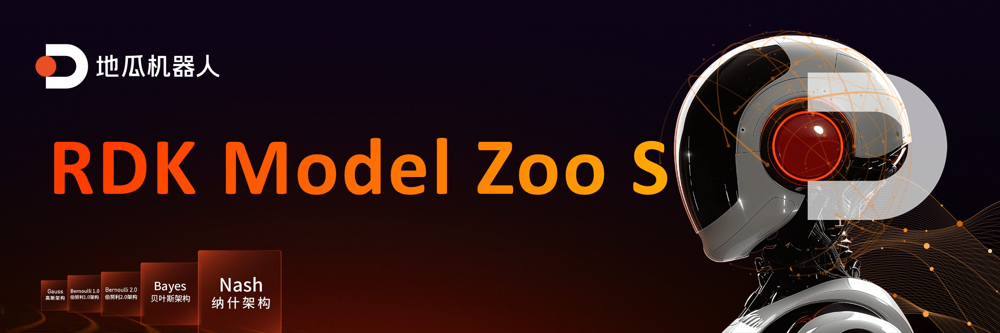

English| [简体中文](./README_cn.md)

# ⭐️ Give a Star for Guidance, Thanks for Your Attention ⭐️

## Introduction to RDK Model Zoo S

RDK Model Zoo S is developed based on [RDK S Series](https://d-robotics.cc/rdkRobotDevKit), providing deployment routines for most mainstream algorithms. These routines include exporting D-Robotics *.bin models, and using APIs such as Python to infer D-Robotics *.bin models. Some models also include data collection, model training, exportation, transformation, and deployment processes.

**Currently, RDK Model Zoo offers reference models of the following types.**

```bash
samples/
|-- LLM
|   `-- DeepSeek_R1_Distill_Qwen
|-- Multi-model
|   `-- InternVL2
|-- Planning
|   `-- LeRobot_ACTpolicy
|-- Speech
|   |-- ASR
|   |-- KWS
|   `-- TTS
`-- Vision
    |-- ResNet
    |-- YOLOv5_Detect
    |-- ultralytics_YOLO_Detect
    |-- ultralytics_YOLO_Pose
    `-- ultralytics_YOLO_Seg
```

**RDK Model Zoo S supports the following platforms.**
 - Supports [RDK S100 / RDK S100P](https://developer.d-robotics.cc/rdks100) platform (Nash)

**RDK Model Zoo supports the following platforms.**
 - Supports [RDK X5](https://developer.d-robotics.cc/rdkx5), [RDK Ultra](https://developer.d-robotics.cc/rdkultra) platforms (Bayse)
 - Partially supports [RDK X3](https://developer.d-robotics.cc/rdkx3) platform (Bernoulli2)

GitHub: https://github.com/d-Robotics/rdk_model_zoo

**Recommended System Version**
- RDK S100: RDK OS 4.0.0, Based on Ubuntu 22.04 aarch64, TROS-Humble.

## ⭐️ Preparation of RDK Board

Refer to the [RDK User Manual](https://developer.d-robotics.cc/information) to ensure that the board can normally access the internet, ensuring one of the following conditions is met.

 - Use SSH to connect to the RDK board, input commands through Terminal knowing the IP address of the RDK board. Including but not limited to MobaXtern, Windows Terminal, etc.
 - Utilize VSCode Remote SSH plugin to remotely connect to the RDK board, use VSCode normally, or use other IDEs.
 - Access the board via VNC, operate the board through the xfce graphical interface.
 - Connect to the board via HDMI, operate the board through the xfce graphical interface.


## ⭐️ FAQ

### The Precision of Self-trained Models Does Not Meet Expectations

- Please check if both the Docker version of the OpenExplore toolchain and the version of libdnn.so on the board are the latest released versions.
- When exporting models, ensure that you follow the requirements specified in the README files within the corresponding examples folders.
- Ensure that the cosine similarity of each output node reaches above 0.999 (a minimum of 0.99).

### The Speed of Self-trained Models Does Not Meet Expectations

- The inference performance using Python APIs is weaker; please test performance using C/C++ APIs.
- Performance data does not include preprocessing and postprocessing steps, which differ from the total time taken by complete demos. Generally, models with nv12 input can achieve end-to-end throughput equal to BPU throughput.
- Ensure that the board has been set to the highest frequency specified in the corresponding README.
- Check if other applications are occupying CPU/BPU and DDR bandwidth resources, as this can degrade inference performance.

### How to Address Model Quantization Loss of Precision

- According to the platform version, first refer to the relevant documentation for the specific platform, particularly the PTQ section on precision debugging, to debug precision issues.
- If int8 quantization leads to a loss of precision due to model structure characteristics or weight distribution, consider using hybrid quantization or QAT quantization.

### Can't Reshape 1354752 in (1,3,640,640)
Please modify the resolution in the preprocess.py file located in the same directory to match the resolution of the ONNX model you intend to convert. Delete all calibration datasets and rerun script 02 to regenerate the calibration dataset. Currently, the calibration dataset for this example comes from the ../../../01common/calibration data/coco directory and is generated in the ./calibration_data_rgb_f32 directory.

### Why Are There No Demos for Other Models? Is It Because They Are Not Supported?

Hello, no.

- Due to project scheduling constraints, we have selected frequently asked models as demo examples to cater to the needs of most D-Robotics developers. If you have better model recommendations, feel free to provide feedback on the D-Robotics Developer Community.
- Additionally, BPU and algorithm toolchain-related resources have already been released on the developer community, allowing custom models to be converted independently.

### mAP Precision Is Lower Compared to Ultralytics Official Results

- Ultralytics measures mAP using dynamic shape models, whereas BPU uses fixed shape models, resulting in lower mAP test results compared to dynamic shapes.
- It's normal for the precision calculated by RDK Solutions using pycocotools to be slightly lower than that calculated by Ultralytics due to minor differences in calculation methods. We focus on using the same calculation method to test the precision of quantized and floating-point models to assess precision loss during quantization.
- After quantization and converting NCHW-RGB888 input to YUV420SP(nv12) input, BPU models also experience some precision loss.

### Can ONNX Exported Without Modifying YOLO Model Structure Be Used?

Yes, but it's not recommended.

- For public model structures or self-designed output head structures, you need to design the post-processing code yourself.
- The adjustments made to model structures in the RDK Solutions repository have been considered for both precision and performance. Other modifications have not been tested yet, but we welcome explorations of more high-performance and high-precision modification methods.

### Do Models Need to Be Converted to ONNX First Before Quantization/How to Use Horizon Toolchain?
Under the PTQ scheme, models need to be exported to ONNX or Caffe first, then converted to bin models. Under the QAT scheme, a new Torch model needs to be built for quantization-aware training, converting from pt models to hbm models.

### Is It Necessary to Modify Output Heads During Training?
During training, follow the public version entirely and only modify when exporting. This ensures that the training loss function calculations align, and deployment will match the post-processing code running on the board.

### Does Model Inference Involve CPU Processing?
During model conversion, operators that cannot be quantized or do not meet BPU constraints will fallback to CPU computation. Specifically, for a fully BPU operator-based bin model, there will be quantization and dequantization nodes before and after the model, responsible for converting float to int and vice versa, which are computed by the CPU.