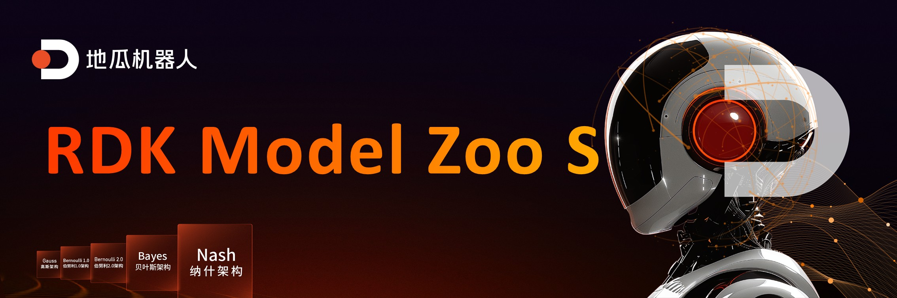

[English](./README.md) | 简体中文

# ⭐️ 点个Star不迷路, 感谢您的关注 ⭐️

## RDK Model Zoo S 简介

RDK Model Zoo S 基于[RDK S系列](https://d-robotics.cc/rdkRobotDevKit)开发, 提供大多数主流算法的部署例程. 例程包含导出D-Robotics *.bin模型, 使用 Python 等 API 推理 D-Robotics *.bin模型的流程. 部分模型还包括数据采集, 模型训练, 导出, 转化, 部署流程.

**RDK Model Zoo S 目前提供以下类型模型参考.**

```bash
samples/
|-- LLM
|   `-- DeepSeek_R1_Distill_Qwen
|-- Multi-model
|   `-- InternVL2
|-- Planning
|   `-- LeRobot_ACTpolicy
|-- Speech
|   |-- ASR
|   |-- KWS
|   `-- TTS
`-- Vision
    |-- ResNet
    |-- YOLOv5_Detect
    |-- ultralytics_YOLO_Detect
    |-- ultralytics_YOLO_Pose
    `-- ultralytics_YOLO_Seg
```

**RDK Model Zoo S 支持如下平台.**
 - 支持 [RDK S100 / RDK S100P](https://developer.d-robotics.cc/rdks100) 平台 (Nash)

**RDK Model Zoo 支持如下平台.**
 - 支持 [RDK X5](https://developer.d-robotics.cc/rdkx5), [RDK Ultra](https://developer.d-robotics.cc/rdkultra) 平台 (Bayse)
 - 部分支持 [RDK X3](https://developer.d-robotics.cc/rdkx3) 平台 (Bernoulli2)

GitHub: https://github.com/d-Robotics/rdk_model_zoo

**推荐系统版本**
- RDK S100: RDK OS 4.0.0, Based on Ubuntu 22.04 aarch64, TROS-Humble.

## ⭐️ RDK板卡准备

参考[RDK用户手册](https://developer.d-robotics.cc/information), 使得板卡能正常访问互联网从, 确保能做到以下条件之一.

 - 利用ssh连接RDK板卡, 可以通过Termianl向RDK板卡输入命令, 知道RDK板卡的IP地址. 包括但是不限于MobaXtern, Windows Terminal等.
 - 利用VSCode Remote SSH插件远程连接RDK板卡, 可以正常的使用VSCode, 也可使用其他的IDE.
 - 利用VNC访问板卡, 能通过xfce的图形化界面操作板卡.
 - 利用HDMI连接板卡, 能通过xfce的图形化界面操作板卡.


## ⭐️ FAQ

### 自己训练模型的精度不满足预期

- 请检查OpenExplore工具链Docker, 板端libdnn.so的版本是否均为目前发布的最新版本.
- 请检查在导出模型时，是否有按照对应examples的文件夹内的README的要求进行。
- 每一个输出节点的余弦相似度是否均达到0.999以上(保底0.99).

### 自己训练模型的速度不满足预期

- Python API 的推理性能会较弱一些，请基于 C/C++ API 测试性能。
- 性能数据不包含前后处理，与完整demo的耗时是存在差异的，一般来说采用nv12输入的模型可以做到end2end吞吐量等于BPU吞吐量。
- 板子是否已经定频到对应README内的最高频率。
- 是否有其他应用占用了 CPU/BPU 及 DDR 带宽资源，这会导致推理性能减弱。

### 如何解决模型量化掉精度问题

- 根据平台版本，先参考对应平台的文档，参考PTQ章节的精度debug章节进行精度debug。
- 如果是模型结构特性、权重分布导致 int8 量化掉精度，请考虑使用混合量化或QAT量化。

### Can't reshape 1354752 in (1,3,640,640)
您好，请修改同级目录下preprocess.py文件中的分辨率，修改为准备转化的onnx一样大小的分辨率，并删除所有的校准数据集，再重新运行02脚本，生成校准数据集。
目前这个示例的校准数据集来自../../../01common/calibration data/coco目录，生成在./calibration_data_rgb_f32目录

### 为什么其他模型没有demo，是因为不支持吗

你好，不是。

- 受限于项目排期，为了照顾大部分地瓜开发者的需求，我们挑选了提问频率较高的模型作为demo示例。如果有更好的模型推荐，欢迎前往地瓜开发者社区反馈。
- 同时，BPU及算法工具链相关资源均已经在开发者社区进行释放，自定义的模型完全可以自己进行转化。

### mAP 精度相比ultralytics官方的结果低一些

- ultralytics官方测mAP时，使用动态shape模型, 而BPU使用了固定shape模型，map测试结果会比动态shape的低一些。
- RDK Solutions使用pycocotools计算的精度比ultralytics计算的精度会低一些是正常现象, 主要原因是两者计算方法有细微差异, 我们主要是关注同样的一套计算方式去测试定点模型和浮点模型的精度, 从而来评估量化过程中的精度损失.
- BPU 模型在量化和NCHW-RGB888输入转换为YUV420SP(nv12)输入后, 也会有一部分精度损失。

### 不修改YOLO模型结构直接导出的ONNX可以使用吗

可以，但不推荐。

- 公版的模型结构或者自己设计的输出头结构，需要自行对后处理代码进行程序设计。
- RDK Solutions仓库提供的模型结构的调整方式是经过了精度和性能的考虑, 其他的修改方法暂未经过测试，也欢迎大家探索更多的高性能和高精度的修改方法。

### 模型要先转onnx才能量化吗/地平线工具链如何使用
PTQ方案下需要先导出为onnx或者caffe，将onnx或者caffe转化为bin模型。QAT方案下需要重新搭建torch模型进行量化感知训练，从pt模型转为hbm模型。

### 训练的时候需要修改输出头吗？
训练的适合全部按照公版的来，只有导出的时候再修改，这样训练的适合和训练的损失函数计算那套就能对上，部署的适合就能和板子上跑的代码的后处理那套对上。

### 模型进行推理时会进行cpu处理吗
你好，在模型转化的过程中，无法量化的算子或者不满足BPU约束，不满足被动量化逻辑的算子会回退到CPU计算。特别的，对于一个全部都是BPU算子的bin模型，bin模型的前后会有量化和反量化节点，负责将float转int，和int转float，这两种节点是由CPU来计算的。