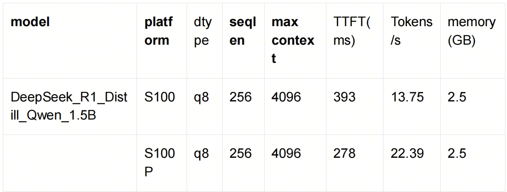

English| [简体中文](./README_cn.md)

# 1. Introduction

This LLM example is a use case for DeepSeek R1 Distill Qwen 1.5B. This example uses OpenExplorer-LLM, a tool that provides large model quantization and edge-side deployment capabilities for Sweet Potato Robot users. 

The memory usage of the performance metrics for this model is as follows: 




# 2. Quick Experience

## 2.1 Environment Preparation

To experience this LLM example, we first need to create a workspace on the RDK S100 board: 

```
mkdir -p ~/llm
cd ~/llm
```

Then we download the OpenExplorer - LLM deployment package : 

```
wget -c ftp://oeftp@sdk.d-robotics.cc/oe_llm_v0.9.0/OpenExplorer_LLM_0.9.0.tar.gz --ftp-password=Oeftp~123$%
tar -xvf OpenExplorer_LLM_0.9.0.tar.gz
```

## 2.2 Running Example

Download the DeepSeek_R1_Distill_Qwen_1.5B model: 

```
wget -c ftp://oeftp@sdk.d-robotics.cc/oe_llm_v0.9.0/DeepSeek_R1_Distill_Qwen_1.5B_4096.hbm --ftp-password='Oeftp~123$%'
```

Then, we run the following command under the path ~/llm/OpenExplorer_LLM_0.9.0/runtime: 

```
sh set_permorfance_mode.sh

lib=~/llm/OpenExplorer_LLM_0.9.0/runtime/lib
export LD_LIBRARY_PATH=${lib}:${LD_LIBRARY_PATH}

./bin/xlm_demo \
  --hbm_path ~/llm/DeepSeek_R1_Distill_Qwen_1.5B_4096.hbm \
  --tokenizer_dir ./config/DeepSeek_R1_Distill_Qwen_1.5B_config/ \
  --template_path ./config/DeepSeek_R1_Distill_Qwen_1.5B_config/DeepSeek_R1_Distill_Qwen_1.5B.jinja \
  --model_type 3
```

The following is a simple conversation test: 

```
[User] <<< 简短描述人工智能的未来发展
<｜begin▁of▁sentence｜><｜User｜>简短描述人工智能的未来发展<｜
Assistant｜><think>

[Assistant] >>> 嗯，用户问的是“简短描述人工智能的未来发展”。首先，我得
理解用户的需求。他们可能是在准备一个演讲稿或者写一篇简短的报告，需要一个
快速而简洁的概述。所以，我需要抓住人工智能的当前状态和未来趋势，用简洁的
语言表达出来。

接下来，我应该考虑人工智能的现状。现在 AI 已经应用在很多领域，比如医疗、
交通、教育，甚至艺术。这些都是很好的例子，能说明 AI 的广泛影响。然后，未
来的发展方向，比如更强大的模型、更复杂的算法，还有更广泛的应用，这些都是
关键点。

另外，AI 的伦理问题也不能忽视，比如隐私和数据安全，这些都是需要提到的。还
有，AI 在推动创新方面的作用，比如药物研发和设计，这些都是 AI 带来的积极影
响。

最后，我需要把这些点组织起来，用简洁的语言表达出来，确保信息全面但不冗长。这样用户就能快速了解 AI 的现状和未来方向了。
</think>

人工智能（AI）的未来发展主要体现在以下几个方面：
1. **更强大的模型和算法**：AI 技术正在不断优化，模型的复杂度和处理能力不
断提升，能够解决更复杂和规模更大的问题。
2. **更广泛的应用**：AI 正在扩展到更多领域，如医疗、交通、教育、金融、环
境科学等，推动了社会的全面进步。
3. **更智能的决策**：AI 能够处理海量数据并做出更准确、更全面的决策，为人
类提供更高效的服务。
4. **伦理与安全**：AI 的快速发展带来了伦理和安全问题，如隐私保护、数据安
全、算法偏见等，需要持续关注和解决。
5. **推动创新**：AI 为科学研究和创新提供了强大工具，如药物研发、设计优
化、医疗诊断等，推动了科学进步。
总之，人工智能的未来发展将更加广泛、深入，同时伴随着伦理和安全问题的挑
战，但其潜力巨大，为人类社会带来深远影响。
```