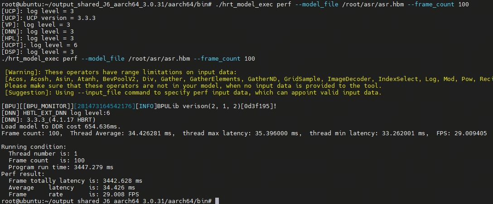

English| [简体中文](./README_cn.md)

# Algorithm background

Hugging Face is an open-source technology company specializing in artificial intelligence fields such as natural language processing (NLP), automatic speech recognition, and Computer Vision. It is known for building high-quality AI toolchains and an active open-source community. Its core product is the Transformers library, which brings together thousands of pre-trained models such as BERT, GPT, T5, Wav2Vec2, etc. It supports deep learning frameworks such as PyTorch, TensorFlow, and JAX, and provides a unified API and preprocessing tools, making model loading, fine-tuning, and deployment simple and efficient.

The Hub includes:

1. Open-source model hosting platform that allows developers to upload, download, and share models.
2. Includes weights, configuration files, preprocessing scripts, etc.

Wav2Vec2 is an end-to-end automatic speech recognition model proposed by Facebook AI Research. It uses self-supervised learning methods to pre-train on a large amount of unlabeled raw audio, and then fine-tunes it on supervised speech data. The model takes the original waveform as input, first extracts low-level features through convolution neural networks, then uses Transformer to encode contextual information, and uses masking prediction mechanism to improve learning ability. Wav2Vec2 does not rely on traditional acoustic models and language models, significantly simplifying the architecture of automatic speech recognition systems. At the same time, it has achieved excellent performance on standard datasets such as LibriSpeech, especially in low-resource and multilingual scenarios, demonstrating strong transfer capabilities. Currently, HuggingFace has fully integrated Wav2Vec2 into its model library. Users can load pre-trained models with a few simple lines of code and achieve high-precision speech-to-text function, greatly reducing the development threshold of automatic speech recognition systems.


# Quick experience

## Environment dependency

After we owned an RDK S100, we logged into its environment.

We first clone the code repository.

```
git clone https://github.com/D-Robotics/rdk_model_zoo_s.git
```

We then switched to the following directory:

```
cd samples\Speech\ASR\python
```

Install relevant dependencies:

```
pip install -r requirements.txt
```

Download model:

```
wget https://archive.d-robotics.cc/downloads/rdk_model_zoo/rdk_s100/asr/asr.hbm
```

## Effect verification

After completing the installation of the relevant dependencies, we see a chi_sound in the current directory, and this .wav audio file contains a Chinese voice.

We verify the .wav audio file.

```
python main.py
```

We see the following echo:


The above echoed behavior loads the corresponding resources of the BPU inference library.

The last line is the result of ASR on the first three seconds of the audio segment chi_sound. Wav.

## Speed verification

We use the following command to verify the speed of the sweet potato heterogeneous model.hbm

```
hrt_model_exec perf --model_file asr.hbm --frame_count 100
```

We get the following results



* **Frames**: 100
* **Average Latency**: 34.426ms
* **FPS**: 29.008