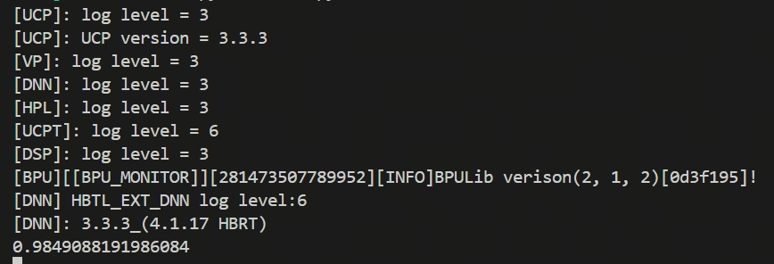

English| [简体中文](./README_cn.md)

# Algorithm background

PaddlePaddle is a powerful open-source deep learning platform independently developed by Baidu. Its full name is PArallel Distributed Deep LEarning. It supports the development, training, and deployment of rich deep learning models and has the following characteristics:

1. Support large-scale distributed training
2. Provide dual modes of dynamic and static images
3. Suitable for industrial applications, widely used in voice, image, natural language processing and other scenarios
4. Have a complete ecosystem, such as: PaddleOCR, PaddleSpeech, PaddleNLP, etc

PaddleAudio is an audio processing and modeling library in the PaddleSpeech ecosystem, mainly used for preprocessing, feature extraction, and modeling of audio tasks. Its functions include audio loading and enhancement (such as noise and reverb), feature extraction (such as Mel frequency cepstral coefficient MFCC, Log-Mel), audio classification, keyword recognition, Speaker Identification, and other model support, making it easy to build an audio data preprocessing pipeline.

PaddleAudio is equipped with a Keyword Spotting algorithm (KWS) called MDTC. MDTC (Multi-Scale Dynamic Temporal Convolution) is a multi-scale dynamic temporal convolution network mainly used in keyword recognition (KWS) scenarios. Its key idea is:

1. Using multi-scale convolution to capture audio features at different time scales
2. Dynamic convolution mechanism enhances robustness to keyword variants
3. It can maintain high accuracy under low computing resources and is suitable for deployment on edge devices (such as mobile phones and IoT devices)

Compared to traditional CNN or RNN architectures, MDTC is more efficient and has stronger temporal modeling capabilities, and is one of the important algorithms in the PaddleSpeech KWS model.

# Quick experience

## Environment dependencies

After we owned an RDK S100, we logged into its environment.

We first clone the code repository.

```
git clone https://github.com/D-Robotics/rdk_model_zoo_s.git
```

We then switched to the following directory:

```
cd samples\Speech\KWS\python
```

Install relevant dependencies:

```
pip install -r requirements.txt
```

## Effect verification

After completing the installation of the relevant dependencies, we see a sample.wav in the current directory, and this .wav audio file contains the wake-up keyword: hey snips

We verify the .wav audio file.

```
python main.py
```

We see the following echo:



The last displayed number is the Confidence Level of the keyword in this audio.

Under the current audio, the Confidence Level with the keyword hey snips is~ 98.5%.

## Speed verification

We use the following command to verify the speed of the sweet potato heterogeneous model.hbm

```
hrt_model_exec perf --model_file /root/kws/kws.hbm --frame_count 100
```

We get the following results

* **Frames**: 100
* **Average Latency**: 1.176ms
* **FPS**: 830.875