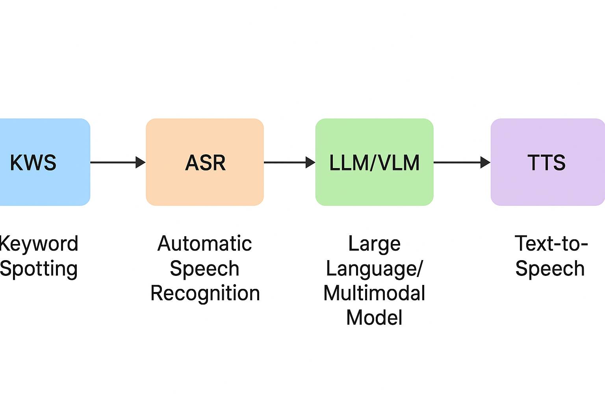

[English](./README.md) | 简体中文

# 1. 简介

说到语音算法，我们通常会想到一个完整的语音交互技术链路。这一条技术链路通常是指，用户语音输入（可以是一个提问，或者是一个指令），随后机器或边缘设备会通过一整套语音处理算法对输入信号进行分层解析与响应。首先，系统前端的 KWS（关键词唤醒） 模块常驻运行，持续监听环境声音，用于检测特定唤醒词（如“你好助手”或“Hey Siri”）。只有当检测到唤醒信号时，后续的语音识别模块才会被激活，从而有效降低计算开销与能耗，实现低延迟且高可靠的交互启动。接下来，ASR（自动语音识别） 模块接收用户的语音流，将声波信号转化为可理解的文本信息。这一阶段通常依托深度神经网络模型（如 HuggingFace上的Wav2Vec2大模型），通过对声学特征与语言特征的联合建模，获得高精度、鲁棒性的语音转写结果。

当文本被成功识别后，系统会将结果输入至 LLM/VLM（大语言/多模态模型） 模块。该模块是整个链路的“语义核心”，负责理解用户的意图、执行推理任务并生成自然语言回应。借助大语言模型（如通过 Ollama 调用的 Llama3、Mistral 或 Qwen2-VL 等），系统不仅能够理解复杂指令、回答问题，还能进行上下文联想、多轮对话甚至多模态信息处理，如用户输入的一段文字，配合相机采集的图片，进行相应的响应。最后，生成的文本结果被送入 TTS（文本转语音） 模块，通常由如 Kokoro TTS、FastSpeech2 这样的高效语音合成模型完成。该模型能够将文字内容转化为自然流畅的语音输出，使机器“开口说话”，从而实现从“听懂”到“会说”的完整闭环。

这一语音交互链路的重要性在于，它将听觉输入、语义理解与语言输出高度融合，构建出一种最贴近人类交流方式的交互形态。它不仅让人与机器的沟通更加自然、高效与沉浸，还使得语音在智能家居、车载系统、智能客服、教育辅助等场景中具备了核心价值。换言之，从 KWS 到 TTS 的完整语音链路，不只是算法堆叠的产物，而是人机理解与表达的桥梁，是实现真正自然智能交互的关键基础。

总而言之，整套流程可以被总结为如下图片：



# 2. KWS

对于KWS算法，在RDK S100上的部署我们以百度飞浆的PaddleSpeech中的MDTC算法为例。

## 2.1 算法介绍

PaddlePaddle（飞桨） 是百度自主研发的、功能强大的 开源深度学习平台，全名是 PArallel Distributed Deep LEarning。它支持丰富的深度学习模型开发、训练与部署，具备如下特点:

1. 支持大规模分布式训练
2. 提供动态图与静态图双模式
3. 适用于工业级应用，广泛应用于语音、图像、自然语言处理等场景
4. 拥有完整的生态，如：PaddleOCR、PaddleSpeech、PaddleNLP 等

PaddleAudio 是飞桨生态中的一个 音频处理与建模库，是 PaddleSpeech 的一部分，主要用于音频任务的预处理、特征提取和建模。其功能包括音频加载与增强（如噪声、混响）、特征提取（如梅尔频率倒谱系数 MFCC、Log-Mel）、音频分类、关键词识别、说话人识别等模型支持、便于音频数据预处理流水线搭建。

PaddleAudio搭载一个语音唤醒算法（KWS）名为MDTC。MDTC（Multi-Scale Dynamic Temporal Convolution） 是一种 多尺度动态时序卷积网络，主要应用于 关键词识别（KWS，Keyword Spotting） 场景。其关键思想：

1. 使用多尺度卷积捕捉不同时间尺度下的音频特征
2. 动态卷积机制增强对关键词变体的鲁棒性
3. 能够在低计算资源下保持高精度，适合部署在边缘设备（如手机、IoT 设备）上

相比传统 CNN 或 RNN 架构，MDTC 更高效且具有更强的时序建模能力，是 PaddleSpeech KWS 模型中的重要算法之一。

## 2.2 部署数据

我们首先在RDK S100上测试该模型的性能。我们使用如下命令：

```
hrt_model_exec perf --model_file kws.hbm --frame_count 100 --thread_num 1
```

对语音唤醒模型的性能进行测试。对于这条命令，我们可以通过修改`thread_num`参数修改线程数。我们将帧数`frame_count`参数设置为100帧。可以得到如下表格：

最终得到如下表格：

| 线程数 | 总帧数 | 总时延（ms）   | 平均时延（ms） | FPS  |
| --- | --- | --------- | -------- | ---- |
| 1   | 100 | 76.71  | 0.77   | 1279.28 |
| 2   | 100 | 82.73  | 0.83   | 2363.93 |
| 4   | 100 | 139.11  | 1.39   | 2779.77 |
| 8   | 100 | 270.97 | 2.71  | 2755.80 |

**ION占用：25.2MB**
**带宽（读）：2160**
**带宽（写）：557**

# 3. ASR

对于ASR算法，我们选用HuggingFace上的Wav2vec2大模型。

## 3.1 算法介绍

Hugging Face 是一家专注于自然语言处理（NLP）、语音识别、计算机视觉等人工智能领域的开源技术公司，以构建高质量的 AI 工具链和活跃的开源社区而闻名。其核心产品是 Transformers 库，该库汇集了成千上万种预训练模型，如 BERT、GPT、T5、Wav2Vec2 等，支持 PyTorch、TensorFlow 和 JAX 等深度学习框架，并提供统一的 API 和预处理工具，使模型的加载、微调与部署变得简单高效。

其中Hub包括：

1. 开源模型托管平台，允许开发者上传、下载、分享模型。
2. 包含权重、配置文件、预处理脚本等。

Wav2Vec2 是由 Facebook AI Research 提出的端到端语音识别模型，使用自监督学习方法在大量未标注的原始音频上进行预训练，然后在有监督语音数据上进行微调。该模型以原始波形为输入，先通过卷积神经网络提取低级特征，再利用 Transformer 编码上下文信息，并使用掩蔽预测机制提升学习能力。Wav2Vec2 不依赖传统的声学模型和语言模型，显著简化了语音识别系统的架构，同时在如 LibriSpeech 等标准数据集上取得了优异表现，尤其在低资源、多语言场景中展现出强大的迁移能力。目前，HuggingFace 已将 Wav2Vec2 完整集成到其模型库中，用户可通过简单的几行代码加载预训练模型并实现高精度的语音转文字功能，大大降低了语音识别系统的开发门槛。

## 3.2 部署数据

我们在RDK S100上使用相同的命令测试该模型的性能。我们使用如下命令：

```
hrt_model_exec perf --model_file kws.hbm --frame_count 100 --thread_num 1
```

对模型的性能进行测试。对于这条命令，我们可以通过修改`thread_num`参数修改线程数。我们将帧数`frame_count`参数设置为100帧。可以得到如下表格：

最终得到如下表格：

| 线程数 | 总帧数 | 总时延（ms）   | 平均时延（ms） | FPS  |
| --- | --- | --------- | -------- | ---- |
| 1   | 100 | 3455.35  | 34.55   | 28.92 |
| 2   | 100 | 6731.75  | 67.31   | 29.55 |
| 4   | 100 | 13327.17  | 133.21   | 29.56 |
| 8   | 100 | 26107.02 | 260.37  | 29.56 |

**ION占用：376.4MB**
**带宽（读）：17420**
**带宽（写）：1662**

# 4. LLM/VLM

对于LLM/VLM部分的部署，可以参考ModelZoo的LLM部分，使用OELLLM进行相关的部署。

# 5. TTS

