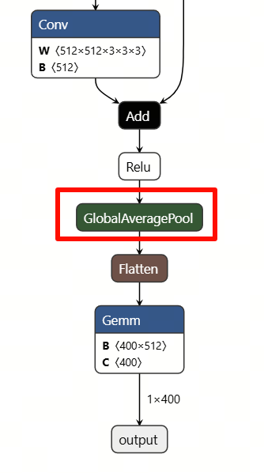
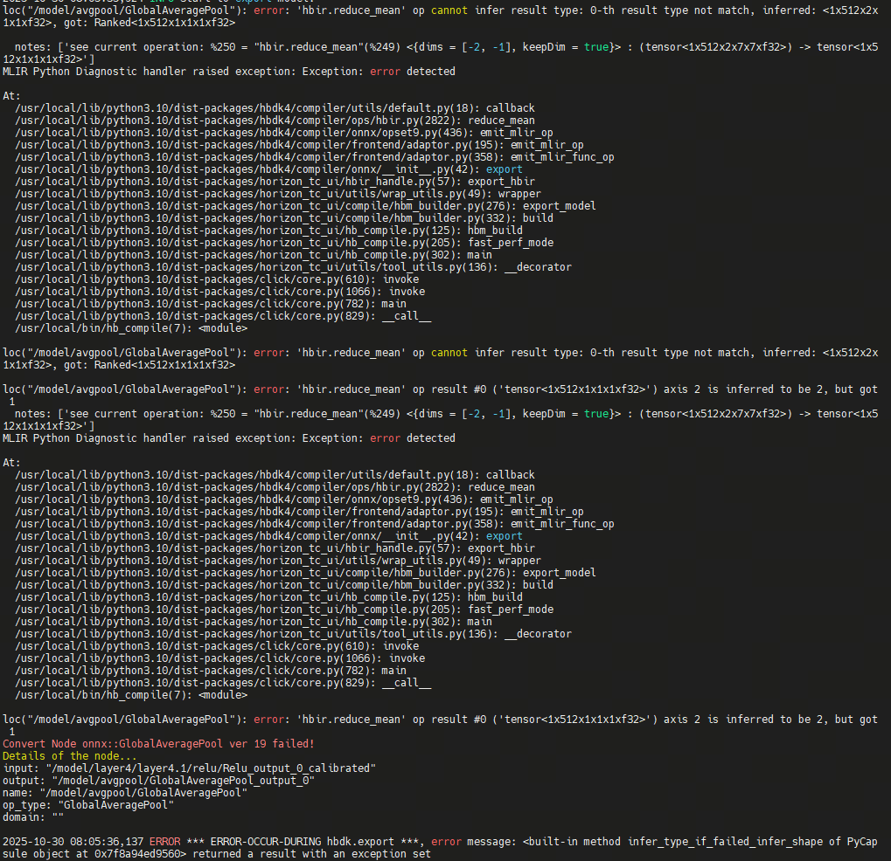
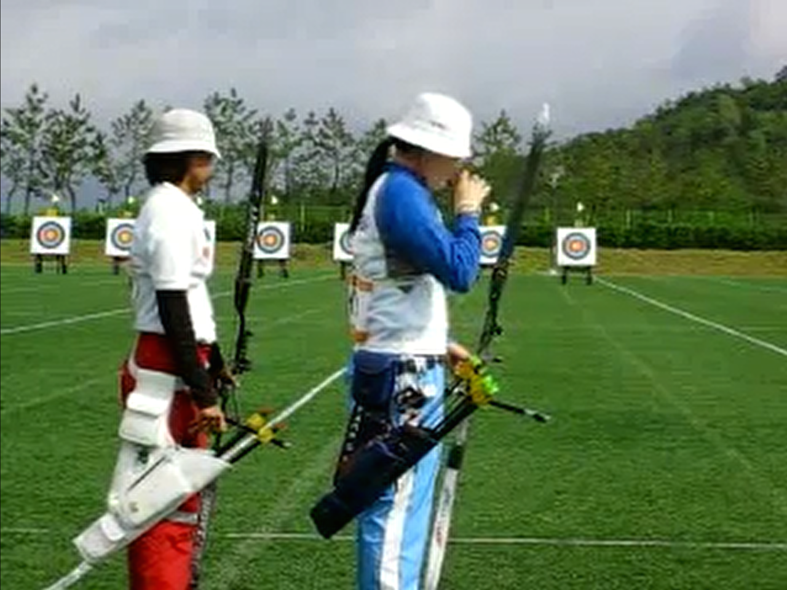
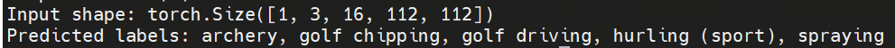

English| [简体中文](./README_cn.md)

# 1. Model Introduction

As is well known, the ResNet residual network is a good application in image classification. However, in many cases, we not only need to classify images but also need to classify videos.

Video classification often requires the model to receive an entire video as input. In this case, the 2D convolution kernels in ResNet are often insufficient, so 3D convolution kernels are introduced.

The 3D convolution method divides a video into multiple fixed-length clips. Compared with 2D convolution, 3D convolution can extract motion information between consecutive frames. This is achieved by fusing multiple frames of the video, enabling the model to better understand the spatio-temporal features in the video.&#x20;

Taking C3D (3D Convolutional Networks) as an example, C3D is a deep learning model that uses 3D convolution to process video data. It extracts spatio-temporal features from videos by extending 3×3 convolution to 3×3×3 convolution and 2×2 pooling to 2×2×2 pooling. Experiments have shown that C3D has achieved remarkable results in tasks such as video classification and action recognition.&#x20;

In C3D, the settings of parameters such as convolution kernel size, stride, and zero-padding have a significant impact on the performance of the model. For example, through comparative experiments, it was found that a convolution kernel size of 3 in the temporal direction yields the best results. Additionally, C3D also employs multiple convolutional layers and pooling layers to construct a deep [ network ](https://cloud.baidu.com/product/et.html) structure to extract more abundant features.&#x20;

The current model focuses on R3D-18, where 3D ResNet-18 (R3D-18) is a deep learning model specifically designed for video understanding tasks. By introducing 3D convolutional kernels, it successfully extends the classic image recognition model ResNet-18 to the spatio-temporal domain. Different from 2D convolution, which processes static images, 3D convolution operations can directly extract features simultaneously in the spatial dimensions (height and width) and the temporal dimension of video frames, thereby effectively capturing temporal information such as object motion and action evolution. The model retains the core idea of ResNet - residual connections, which ensures that the network can still be stably trained when reaching 18 layers deep, avoiding the layer vanishing problem. Typically, the model receives a short video clip consisting of 16 frames (e.g., 112x112 pixels) and outputs the probability of action categories predicted on large datasets (e.g., Kinetics-400, containing 400 human actions). Due to its good balance between recognition accuracy and computational efficiency, R3D-18 has become a widely adopted basic model in the field of video action recognition.&#x20;

# 2. ONNX Model

We exported the R3D-18 model to ONNX and observed the operators it contains.&#x20;

Its model takes a video input and outputs probabilities for 400 categories. During model inference, similar to the regular ResNet, we select the category with the highest probability as the final inference result. It can be seen that although the names of the operators are relatively conventional and the model structure is basically a residual structure, each Conv convolution operator is a 3D convolution, all being 5D. For example, the kernel size of one of them is 512x512x3x3x3. This results in the model being still large, even though it is not deep itself, because each layer contains a relatively large number of operator parameters.&#x20;

# 3. Model Quantization

For model quantization, we choose the S100/S100P algorithm toolchain OpenExplorer 3.5.0.&#x20;

We use the following command:

Subsequently, an error message was obtained:

The error message indicates that although the toolchain supports the conversion of the Conv3D operator, it does not support the 3D operation of GlobalAveragePooling. Therefore, in order to convert the 3D convolution model, we need to replace the pooling operator Pooling. The following figure shows the 3D pooling operator before replacement.&#x20;

We replaced it with the 2D ReduceMean operator:&#x20;

After another toolchain conversion, the following results were obtained:&#x20;

It can be seen that the quantization accuracy of most operators is greater than 0.99, and the final quantization accuracy is \~0.99&#x20;

# 4. RDK S100 Model Deployment&#x20;

## 4.1 Model Upper Plate Precision

To test the accuracy, we selected the video archery.mp4 for testing. Below is one of the screenshots of this video:

The video content is the athlete performing archery operations.&#x20;

We save the video as a numpy array in npy format, and then use it as input for the r3d\_18.hbm model to perform inference. After inference, we print the Top5 categories with the highest probabilities in descending order, which are as follows:

It can be seen that the category with the Top1 probability is Archery, which means archery. This confirms that in this test case, the accuracy of the quantized model does not have significant issues.&#x20;

## 4.2 Performance of the upper board of the model

After completing the steps of the toolchain, we obtain a model in.hbm format, which is a heterogeneous model that can be deployed on the RDK S100 and supports the use of BPU computing power.&#x20;

We use the hrt\_model\_exec tool to conduct model performance testing.

We use the parameter thread\_num to adjust the number of threads and obtain different results&#x20;

Finally, the following table is obtained:

| Number of threads | Total frame number | Total Delay (ms) | Average Delay (ms)  | FPS   |
| ----------------- | ------------------ | ---------------- | ------------------- | ----- |
| 1                 | 100                | 18267.76         | 182.68              | 5.47  |
| 2                 | 100                | 18291.76         | 182.93              | 10.82 |
| 4                 | 100                | 18501.06         | 185.03              | 21.07 |
| 8                 | 100                | 24743.56         | 249.19              | 30.74 |

We use the command:

Get other metrics

BPU Occupancy: 5.2%

ION Memory Usage: \~91.9M

Bandwidth read: \~533

Bandwidth write: \~304

## 4.3 Model Upper Plate Operation

To experience this model, please refer to the README of the Model Zoo of RDK S100 before operating the model

Download and install hbm\_runtime on the RDK S100 board,&#x20;

Next, we install the corresponding dependencies:

After completing the installation of relevant dependencies, we can execute&#x20;

Obtain the above Top5 categories with the highest probabilities,&#x20;
