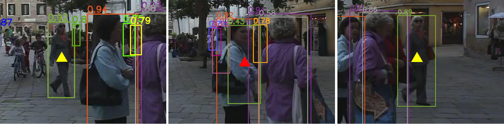
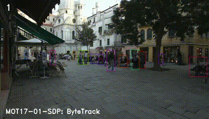

[English](./README.md) | 简体中文

# ByteTrack

## 1. ByteTrack 简介

多目标跟踪（MOT）旨在估计视频中物体的边界框和身份。目前，大多数方法通过关联那些分数高于特定阈值的检测框来获得身份。而那些检测分数较低的物体（例如被遮挡的物体）则被简单地丢弃，这带来了不可忽略的真实物体丢失和轨迹碎片化问题。

为了解决这个问题，ByteTrack 论文提出了一种简单、有效且通用的关联方法——**BYTE (Tracking By associating Almost Every Detection Box)**，即通过关联几乎每一个检测框（而不仅仅是高分框）来进行跟踪。对于低分数的检测框，ByteTrack 利用它们与已有轨迹（tracklets）的相似性来恢复真实物体，并过滤掉背景检测。


**ByteTrack 的核心思想**可以概括为：

* **保留几乎所有检测框**：不同于以往方法粗暴地丢弃低分检测框，ByteTrack 认为低分框也可能指示了真实物体的存在（如严重遮挡或运动模糊的目标）。
* **两阶段匹配策略**：
    1.  **第一次关联**：将高置信度的检测框与现有的跟踪轨迹进行匹配。这一步主要依赖运动模型（如卡尔曼滤波器预测的位置）和外观相似性（如果使用Re-ID特征）。未匹配上的轨迹将进入下一阶段。
    2.  **第二次关联**：将第一次关联中未匹配的轨迹（通常是那些对应物体被遮挡导致检测分数降低的轨迹）与低置信度的检测框进行匹配 。这一步主要依赖 IoU 作为相似度度量，因为低分框的外观特征通常不可靠。通过这种方式，可以有效地找回被遮挡的物体，保持轨迹的连续性，同时滤除作为背景的低分检测框。
* **新轨迹的初始化**：仅从未匹配的高分检测框中初始化新的轨迹。

ByteTrack 通过这种精细化处理不同分数检测框的策略，在多个标准MOT基准测试（如MOT17, MOT20）上取得了领先的性能，例如在MOT17测试集上达到了80.3的MOTA和77.3的IDF1，且在单个V100 GPU上能以30 FPS的速度运行。

原始论文：[ByteTrack: Multi-Object Tracking by Associating Every Detection Box](https://arxiv.org/abs/2110.06864)



## 2. 快速体验

本节将指导您如何在您的RDK S100平台上快速运行一个预配置的、仅针对行人进行检测和跟踪的 YOLO + ByteTrack示例。这假设您已经拥有在RDK S100上运行YOLO的基础环境和能力。

### 2.1 准备工作

* **硬件**: RDK S100 开发板。
* **软件**:
    * RDK S100的嵌入式Linux系统。
    * Python 3 环境。
    * 已安装 `hobot_dnn` Python接口。
    * 已安装 `numpy`, `opencv-python`, `scipy` 等基础Python库。
    * 已安装 `lap` 和 `cython_bbox` 库。`
    * YOLO 检测模型 (`.hbm`格式，可以从 `ultralytics_YOLO_Detect` 仓库下载，在 `source/reference_hbm_models` 中提供的模型即使用 `ultralytics_YOLO_Detect` 获得)。
    * ByteTrack跟踪代码 (确保 `byte_tracker.py`, `kalman_filter.py`, `matching.py`, `basetrack.py` 在正确的 `tracker` 路径下)。
* **示例代码**: 主程序脚本 `ultralytics_YOLO_ByteTrack.py` ，该脚本集成了YOLO推理和ByteTrack跟踪逻辑。

### 2.2 配置与运行

1.  **代码组织**:
    确保项目目录结构大致如下：
    ```
    ByteTrack/
    ├── python/
    │   └──ultralytics_YOLO_ByteTrack.py  # 主程序脚本
    ├── source/
    │   ├──hbm_models/
    │   │   └── yolo_person_model.hbm   # 您的 YOLO 检测模型
    │   └──track_test.mp4               # 用于测试的输入视频
    └── tracker/                        # ByteTrack核心代码目录
        ├── byte_tracker.py
        ├── kalman_filter.py
        ├── matching.py
        └── basetrack.py
    ```

    其中，`tracker`目录下包含 ByteTrack 的核心代码，代码原始仓库：[ByteTrack](https://github.com/FoundationVision/ByteTrack)。

2.  **运行**:
    ```bash
    python3 ultralytics_YOLO_ByteTrack.py \
        --model-path ./models/yolo_person_model.hbm \
        --input ./test_video.mp4 \
        --output ./output_tracked_video.avi 
        # --score-thres 0.25  # YOLO的检测置信度阈值
        # --track-thresh 0.3 
    ```
    观察输出视频 `output_tracked_video.avi` 中的跟踪效果。

    tracker 参数说明：
    * `--score-thres`: YOLO的检测置信度阈值，默认为0.25。
    * `--track-thresh`: ByteTrack的轨迹匹配阈值，默认为0.3。
    * `--match-thresh`: IoU匹配的严格程度，默认为0.7。
    * `--track-buffer`: 轨迹丢失缓冲时长，默认为30。

3. **结果**: 运行成功后，会生成一个名为 `output_tracked_video.avi` 的视频文件，该视频将显示YOLO检测到的目标框和ByteTrack跟踪的轨迹。
   
4. **性能**: 在RDK S100上，ByteTrack 跟踪器平均更新一次耗时 = 2.37 ms ，模型检测性能参考 `ultralytics_YOLO_Detect` 仓库即可。
   

### 2.3 预期效果与问题排查

* **预期效果**: 视频中的行人会被稳定地框出，并且每个行人框旁边会有一个唯一的ID标识。
* **常见问题排查**:
    * **检测框很少**:
        1.  检查YOLO的 `score_thres` 是否过高。
        2.  **重点检查**ByteTrack的 `args.track_thresh` 和其内部的 `self.det_thresh`（即 `args.track_thresh + 0.1`）是否设置过高，导致YOLO输出的很多有效检测被ByteTrack过滤掉了。尝试逐步降低 `args.track_thresh` (例如到0.25-0.4之间)。
    * **ID频繁切换**: 与 `args.match_thresh` (IoU匹配的严格程度) 或 `args.track_buffer` (丢失缓冲时长) 有关。

## 3. 进阶开发

在快速体验的基础上，您可以进行以下进阶开发和优化：

### 3.1 参数调优

* **系统性调优**：针对您的具体场景（如光照、人群密度、摄像头角度、目标运动速度等），系统性地调整YOLO的检测阈值和ByteTrack的 `track_thresh`, `det_thresh` (间接通过`track_thresh`), `match_thresh`, `track_buffer` 等参数，以达到最佳的平衡（例如，在MOTA, IDF1等指标上，或者主观视觉效果上）。
* **可视化辅助**：在调试过程中，可以将中间结果可视化，例如：
    * YOLO检测到的所有行人框（应用 `score_thres` 后）。
    * ByteTrack筛选出的高分检测框和低分检测框。
    * ByteTrack输出的最终轨迹框。
    这有助于理解参数变化对每一阶段的影响。

### 3.2 性能优化 (RDK S100)

* **预处理/后处理优化**: 检查OpenCV操作（如resize, cvtColor等）是否有优化空间，例如使用更高效的插值算法，或者利用TROS图像处理库。
* **NumPy操作优化**: 避免不必要的循环，多使用NumPy的向量化操作。
* **并行处理**: 考虑是否可以将检测和跟踪的某些部分放入不同的线程中（需要注意数据同步和Python GIL的限制）。

### 3.3 功能扩展

* **多类别跟踪**:
    * 当前只跟踪行人。若要扩展到多类别，您需要：
        1.  YOLO模型本身支持多类别检测。
        2.  决定如何将多类别检测结果传递给ByteTrack：
            * **方案A (简单)**：为每个感兴趣的类别维护一个独立的 `BYTETracker` 实例。在YOLO输出后，按类别ID分发检测结果给对应的跟踪器。
            * **方案B (更整合，可能需改动ByteTrack)**：修改您当前的 `STrack` 类以包含 `class_id` 属性，并在 `BYTETracker` 的 `update` 和 `init_track` 逻辑中处理和传递类别信息。然后 `tracker.update` 的输出中就能直接获得每个轨迹的类别ID。 (可以参考Ultralytics版本的ByteTrack代码)。
* **Re-ID特征融合 (高级)**:
    * ByteTrack论文指出，虽然其核心BYTE关联方法不强制依赖Re-ID，但在某些场景下（如长时间遮挡后的重识别或低帧率、大运动场景），结合Re-ID特征可以进一步提升性能。
    * 在RDK S100上实现Re-ID需要一个轻量级的Re-ID模型（同样需要 `.hbm` 格式），并修改ByteTrack的相似度计算和匹配逻辑（例如在第一次关联 `Similarity#1` 中加入Re-ID特征距离）。这会增加计算复杂度，需要权衡性能。

### 3.4 交互与应用

* **特定事件检测**: 基于跟踪到的轨迹，开发更高级的应用，例如人群计数、区域入侵检测、特定行为识别等。
* **数据统计与分析**: 对跟踪结果进行统计，如目标平均停留时间、流量等。

