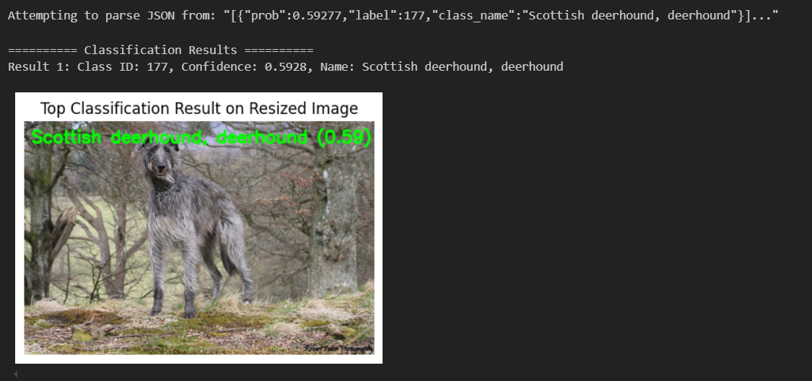

English | [简体中文](./README_cn.md)

# EfficientNet_lite4

- [EfficientNet\_lite4](#efficientnet_lite4)
  - [1. Introduction](#1-introduction)
  - [2. Model Performance Data](#2-model-performance-data)
  - [3. Model Download](#3-model-download)
  - [4. Deployment Test](#4-deployment-test)
  - [5. Quantization Experiments](#5-quantization-experiments)
    - [Dataset Preparation](#dataset-preparation)
    - [Calibration Data Processing](#calibration-data-processing)
    - [Model Verification](#model-verification)
    - [Model Compilation](#model-compilation)
    - [Model Inference](#model-inference)

## 1. Introduction

- **Paper**: [EfficientNet: Rethinking Model Scaling for Convolutional Neural Networks](https://arxiv.org/abs/1905.11946)

- **Github Repository**: [tensorflow/tpu/models/official/efficientnet](https://github.com/tensorflow/tpu/tree/master/models/official/efficientnet)


**EfficientNet Model Features**:

- **Compound Scaling Method**: Maximizes model performance and efficiency by uniformly scaling resolution, depth, and width, rather than adjusting a single dimension.
- **AutoML Technology**: Uses AutoML to automatically search for the best combination of network parameters, significantly reducing parameter count and computational resources while maintaining high accuracy.
- **Efficient and Lightweight Network Structure**: Through an optimized compound scaling strategy, EfficientNet achieves fewer parameters and faster inference speed, though it may consume more memory when handling larger models.

EfficientNet is an innovative convolutional neural network (CNN) architecture that balances resolution, depth, and width. Its core feature is the compound scaling method, which systematically optimizes network performance and efficiency. Traditional network designs usually adjust only one dimension, such as width, depth, or input image resolution. EfficientNet, however, uses a simple and efficient compound coefficient to uniformly scale these three key dimensions. This method determines the optimal ratio for each dimension through grid search, maximizing overall network performance within given resource constraints.

EfficientNet combines AutoML technology to automatically search for the best network parameter combinations, greatly reducing parameter count and computational resources while maintaining high accuracy. For example, EfficientNet-B7 achieves 84.3% top-1 accuracy on the ImageNet dataset, with only 1/8.4 the parameters of GPipe and 6.1 times faster inference speed.

EfficientNet-lite is a set of image classification models suitable for mobile devices and IoT. Notably, while EfficientNet-EdgeTPU is designed specifically for Coral EdgeTPU, these EfficientNet-lite models run well on all mobile CPUs/GPUs/EdgeTPUs.

To meet the needs of edge devices, the following main modifications were made to the original EfficientNets:

* Removed Squeeze-and-Excitation (SE) modules: Some mobile accelerators do not support SE modules well.
* Replaced all Swish activation functions with RELU6: To facilitate post-quantization.
* Fixed the beginning and end parts of the network when scaling the model: To keep the model small and fast.
    
Below are the checkpoints for each model, along with their accuracy, parameter count, FLOPs, and latency on Pixel4 devices (CPU/GPU/EdgeTPU):

|**Model** | **params** | **MAdds** | **FP32 accuracy** | **FP32 CPU  latency** | **FP32 GPU latency** | **FP16 GPU latency** |**INT8 accuracy** | **INT8 CPU latency**  | **INT8 TPU latency**|
|------|-----|-------|-------|-------|-------|-------|-------|-------|-------|
|efficientnet-lite4 [ckpt](https://storage.googleapis.com/cloud-tpu-checkpoints/efficientnet/lite/efficientnet-lite4.tar.gz) | 4.7M | 407M |  75.1% |  12ms | 9.0ms | 6.0ms  | 74.4% |  6.5ms | 3.8ms |
|efficientnet-lite1 [ckpt](https://storage.googleapis.com/cloud-tpu-checkpoints/efficientnet/lite/efficientnet-lite1.tar.gz) | 5.4M | 631M |  76.7% |  18ms | 12ms | 8.0ms  |  75.9% | 9.1ms | 5.4ms |
|efficientnet-lite2 [ckpt](https://storage.googleapis.com/cloud-tpu-checkpoints/efficientnet/lite/efficientnet-lite2.tar.gz) | 6.1M | 899M |  77.6% |  26ms | 16ms | 10ms | 77.0% | 12ms | 7.9ms |
|efficientnet-lite3 [ckpt](https://storage.googleapis.com/cloud-tpu-checkpoints/efficientnet/lite/efficientnet-lite3.tar.gz) | 8.2M | 1.44B |  79.8% |  41ms | 23ms | 14ms  | 79.0% | 18ms | 9.7ms |
|efficientnet-lite4 [ckpt](https://storage.googleapis.com/cloud-tpu-checkpoints/efficientnet/lite/efficientnet-lite4.tar.gz) |13.0M | 2.64B |  81.5% |  76ms | 36ms | 21ms  | 80.2% | 30ms | - |

## 2. Model Performance Data

The following table shows the actual performance data tested on the RDK S100 platform.

| Model                | Input Size (pixels) | Classes | Params (M) | FP32 Top-1 | INT8 Top-1 | Latency/Throughput (Single Thread) | Latency/Throughput (Multi Thread) | FPS         |
|----------------------|--------------------|---------|------------|------------|------------|-------------------------------------|------------------------------------|-------------|
| EfficientNet_lite4   | 380x380            | 1000    | 13.0       | 81.5       | 80.1          | 0.915 ms                            | 1.979 ms                           | 1487.055 FPS |

Notes:
1. The S100 was tested under optimal conditions.
2. Single-thread latency refers to the latency per frame using a single thread and a single BPU core, representing the ideal inference scenario for one task on the BPU.
3. FP32/INT8 Top-1: FP32 Top-1 is the inference accuracy of the ONNX model before quantization, while INT8 Top-1 is the actual inference accuracy after quantization.

## 3. Model Download

**.hbm File Download**:

You can use the [download.sh](./model/download.sh) script to download the .hbm model file for this model structure with one click, making it easy to switch models. Or use the following command line to download:

```shell
wget https://archive.d-robotics.cc/downloads/rdk_model_zoo/rdk_s100/EfficientNet/efficientnet_lite4_380x380_nv12.hbm
```

**ONNX File Download**:

The ONNX model is converted from the timm library (PyTorch Image Models). Install the required packages with:

```shell
pip install timm onnx
```

After installing the necessary libraries, you can use the [get_efficientnet_lite4_onnx.py](python/get_efficientnet_lite4_onnx.py) script in the python folder to download the ONNX file.

* Note: You need to configure a terminal proxy and log in to Huggingface using the following command:
```shell
huggingface-cli login
```

* If you do not want to configure a terminal proxy, you can manually download the model from [timm/tf_efficientnet_lite4.in1k](https://huggingface.co/timm/tf_efficientnet_lite4.in1k) and use the [python/timm2onnx.py](python/timm2onnx_local.py) script to convert to ONNX.
    
After exporting the ONNX file, the script will output model input, mean, std, path, parameters, etc., in the following format:

```shell
input: (3, 380, 380)
mean (0.5, 0.5, 0.5)
std (0.5, 0.5, 0.5)
Simplified model is valid.
Simplified model saved to tf_efficientnet_lite4.onnx
Total number of parameters in the model: 12950386
```

## 4. Deployment Test

After downloading the .hbm file, you can run 'test_EfficientNet_lite4.ipynb' or 's100_inference.py' in the python folder to test the model on the board.

If you need to change the test image, you can download the dataset, put it in the data folder, and modify the image path in the Jupyter notebook or Python script.



* Deployment performance test:
```shell
hrt_model_exec perf --model_file ./model/efficientnet_lite4_380x380_nv12.hbm \
                                     --core_id=0 \
                                     --frame_count=200 \
                                     --perf_time=0 \
                                     --thread_num=1
```
thread_num = 1
```
Running condition:
- Thread number is: 1
- Frame count is: 200
Perf result:
- Frame totally latency is: 183.056 ms
- Average latency is: 0.915 ms
- Frame rate is: 1064.339 FPS
```
thread_num = 3
```
Running condition:
- Thread number is: 3
- Frame count is: 200
Perf result:
- Frame totally latency is: 395.802 ms
- Average latency is: 1.979 ms
- Frame rate is: 1487.055 FPS
```

## 5. Quantization Experiments

### Dataset Preparation

The model uses the [ImageNet](https://image-net.org/) dataset.
* Dataset: ILSVRC2012

| Dataset Name | Number of Classes | Number of Images |
| -- | -- | -- |
| ILSVRC2012 Training Set | 1000 classes | ~1.2 million images |
| ILSVRC2012 Validation Set | 1000 classes | 50,000 images |
| ILSVRC2012 Test Set | 1000 classes | 100,000 images |

It is recommended to extract the downloaded dataset into the following structure:

```shell
imagenet/ 
 ├── calibration_data 
 │   ├── ILSVRC2012_val_00000001.JPEG 
 │   ├── ... 
 │   └── ILSVRC2012_val_00000100.JPEG 
 ├── ILSVRC2017_val.txt 
 ├── val 
 │   ├── ILSVRC2012_val_00000001.JPEG 
 │   ├── ... 
 │   └── ILSVRC2012_val_00050000.JPEG 
 └── val.txt
```

### Calibration Data Processing

After preparing 100 calibration images, run the following command to generate calibration data, which will be saved in the /calibration_data_rgb directory:

```shell
python3 python/get_calibration_data.py
```

### Model Verification

After preparing the ONNX model, you can quickly verify the model with the following command:

```shell
hb_compile --model tf_efficientnet_lite4.onnx --march nash-e
```

### Model Compilation

After model verification, you can perform quantization compilation using the calibration dataset. A reference yaml file is provided in the yaml folder. Run the following command:

```shell
hb_compile --config yaml/efficientnet_lite4_config.yaml
```

After compilation, you will find the output in the model_output directory. The file needed for deployment is efficientnet_lite4_380x380_nv12.hbm.

* Cosine similarity after model quantization:

```shell
 +------------+-------------------+------------------+
 | TensorName | Calibrated Cosine | Quantized Cosine |
 +------------+-------------------+------------------+
 | output     | 0.997189          | 0.997863         |
 +------------+-------------------+------------------+
```

* Toolchain performance reference:

```bash
Summary:
FPS (1 core): 4258.32
latency: 0.23 ms (234.8 us)
BPU conv original OPs per run: 770,375,104
```

### Model Inference

The python directory provides demos for quick inference on both X86 and S100 platforms:
* [x86_inference.py](python/x86_inference.py) supports ONNX, HBIR (.bc), and HBM formats for inference on X86.
* [s100_inference.py](python/s100_inference.py) supports HBM format for inference on the board.

x86_inference.py requires -m and -i to specify the model and image paths, for example:

```shell
python3 python/x86_inference.py -m model_output/efficientnet_lite4_380x380_nv12_quantized_model.bc -i data/zebra_cls.jpg
```

To perform accuracy validation with `x86_inference.py`, use the `--validate` option to enable validation mode. Example:

```shell
python3 python/x86_inference.py -m model_output/efficientnet_lite4_380x380_nv12_quantized_model.bc --validate -d ../../../imagenet/val -l ../../../imagenet/val.txt
```

s100_inference.py requires modifying the model and image paths in the main function.