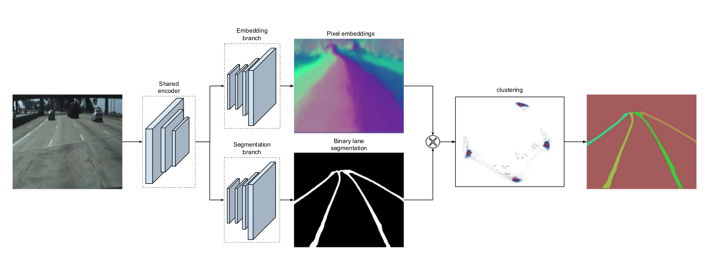
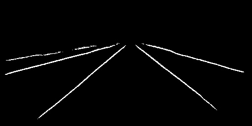
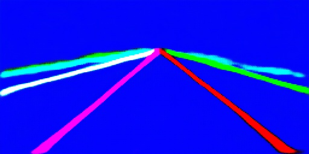
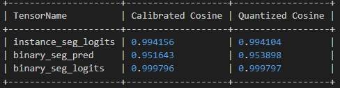

[English](./README.md) | 简体中文

# 算法简介
LaneNet是一种先进的深度学习模型，专门用于实时车道线检测。它的主要目标是准确地识别出道路上的每一条车道线，即使在车道线模糊、被遮挡或光照条件不佳的情况下也能有效工作。本项目基于论文 "Towards End-to-End Lane Detection: an Instance Segmentation Approach"，实现了实时车道线检测的深度神经网络。网络结构主要包括 ENet/UNet/DeepLabv3+ 编码器和解码器，采用 discriminative loss 进行实例分割。  
LaneNet的网络框架:

源码地址：[lanenet-lane-detection-pytorch](https://github.com/IrohXu/lanenet-lane-detection-pytorch)  
参考论文：[Towards End-to-End Lane Detection: an Instance Segmentation Approach](https://arxiv.org/abs/1802.05591)


---

# 快速体验


## 模型下载
转化后的模型可使用以下命令下载
```
wget -P $(dirname $0) https://archive.d-robotics.cc/downloads/rdk_model_zoo/rdk_s100/Lanenet/lanenet256x512.hbm
```
## 算法验证
1. 下载好模型后修改代码lanenet_s100_infer.py中模型和输入图片存放的路径,然后运行代码，即可看到ouput目录下输出的结果
```
python lanenet_s100_infer.py
```



# 模型量化

## 环境准备
建议环境：
- python >= 3.6
- torch >= 1.2
- torchvision >= 0.4.0
- numpy >= 1.7
- opencv-python
- pandas
- matplotlib

安装依赖：
```
pip install torch torchvision numpy opencv-python pandas matplotlib
```

## ONNX模型导出
执行以下命令下载预训练模型
```
wget -P $(dirname $0) https://archive.d-robotics.cc/downloads/rdk_model_zoo/rdk_s100/Lanenet/best_model.pth
```
在 test.py 中已实现onnx导出接口，运行即可导出onnx模型：
```
python test.py --img ../source/data/source_image/input.jpg --model best_model.pth
```
### 模型量化
1. 下载量化数据集-> [Tusimple](https://github.com/TuSimple/tusimple-benchmark/issues/3) 数据集，并使用如下命令转化成npy文件，注意要先修改代码中的dataset_dir参数改成你Tusimple存放的文件夹
```
python get_calibration_data.py
```
2. 运行OE工具链docker ，并把目录挂载到lannet开发文件夹下，在dockers终端中输入以下命令即可开始模型转化
```
hb_compile -c source/yaml/config.yaml
```
# 效果验证

## 速度验证
可在s100上运行以下代码进行速度验证
```
hrt_model_exec perf --model_file lanenet256x512.hbm 
```
```
root@ubuntu:~/lanenet# hrt_model_exec perf --model_file lanenet256x512.hbm 
[UCP]: log level = 3
[UCP]: UCP version = 3.3.3
[VP]: log level = 3
[DNN]: log level = 3
[HPL]: log level = 3
[UCPT]: log level = 6
[DSP]: log level = 3
hrt_model_exec perf --model_file lanenet256x512.hbm

 [Warning]: These operators have range limitations on input data: 
 [Acos, Acosh, Asin, Atanh, BevPoolV2, Div, Gather, GatherElements, GatherND, GridSample, ImageDecoder, IndexSelect, Log, Mod, Pow, Reciprocal, RoiAlign, ScatterElements, ScatterND, Slice, Sqrt, Tan, Tile, Topk, Upsample]. 
 Please make sure that these operators are not in your model, when no input data is provided to the tool. 
 [Suggestion]: Using --input_file command to specify perf input data, which can appoint valid input data.  

[BPU][[BPU_MONITOR]][281473344962784][INFO]BPULib verison(2, 1, 2)[0d3f195]!
[DNN] HBTL_EXT_DNN log level:6
[DNN]: 3.3.3_(4.1.17 HBRT)
Load model to DDR cost 475.583ms.
Frame count: 200,  Thread Average: 14.245405 ms,  thread max latency: 38.879002 ms,  thread min latency: 13.900000 ms,  FPS: 69.897171

Running condition:
  Thread number is: 1
  Frame count   is: 200
  Program run time: 2861.473 ms
Perf result:
  Frame totally latency is: 2849.081 ms
  Average    latency    is: 14.245 ms
  Frame      rate       is: 69.894 FPS
```
## 精度验证
模型量化后余弦相似度如下图所示，可见三输出个余弦相似度都非常高

