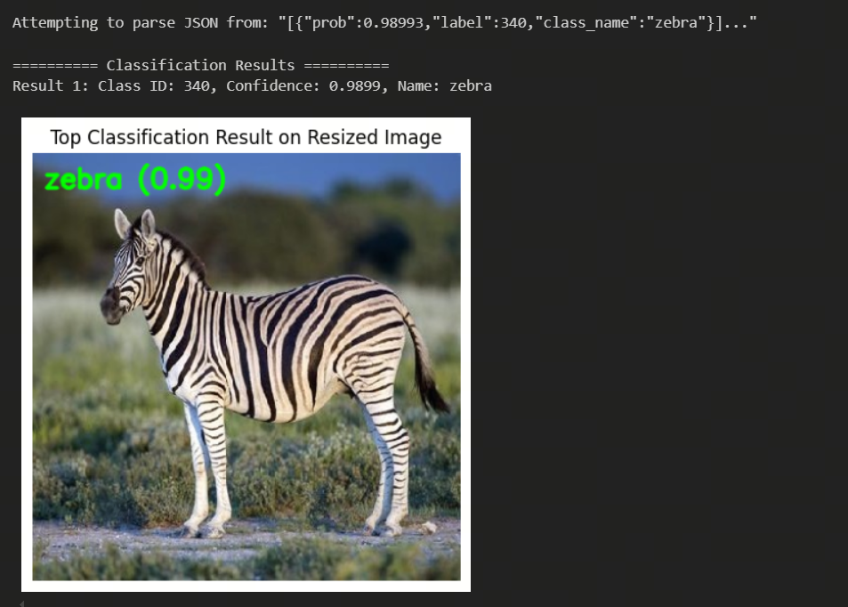

[English](./README.md) | 简体中文

# MobileNetV1

- [MobileNetV1](#mobilenetv1)
  - [1. 简介](#1-简介)
  - [2. 模型性能数据](#2-模型性能数据)
  - [3. 模型下载](#3-模型下载)
  - [4. 部署测试](#4-部署测试)

## 1. 简介

- **论文地址**: [MobileNets: Efficient Convolutional Neural Networks for Mobile Vision Applications](https://arxiv.org/abs/1704.04861)

- **Github 仓库**: [models/research/slim/nets/mobilenet_v1.md at master · tensorflow/models (github.com)](https://github.com/tensorflow/models/blob/master/research/slim/nets/mobilenet_v1.md)

Mobilenetv1 提出了一种用于嵌入式设备的轻量级神经网络。利用深度可分离卷积构造轻量级深度神经网络。其核心思想是巧妙地将标准卷积分解为 **深度可分类卷积（depthwise convolution）** 和 **点态卷积（pointwise convolution）** 。通过分离标准卷积，可以减少两步卷积操作的中间输出特征映射的数量，从而有效地减少网络参数。


**MobilenetV1 模型特点**：

- **深度可分离卷积**：MobileNet 模型是基于深度可分离卷积，这是一种**因式分解卷积**的形式，它将一个标准卷积分解为深度卷积和一种称为点态卷积的 1×1 卷积，最早出现在 InceptionV3 中
- **超参数**。通过宽度因子 $\alpha$ 和分辨率因子 $\rho$ 降低计算量和参数量。

## 2. 模型性能数据

以下表格是在 RDK S100 上实际测试得到的性能数据


| 模型          | 尺寸(像素)  | 类别数  | 参数量(M) | 浮点Top-1  | 量化Top-1  | 延迟/吞吐量(单线程) | 延迟/吞吐量(多线程) | 帧率     |
| -----------  | ------- | ---- | ------ | ----- | ----- | ----------- | ----------- | ------ |
| MobileNetV1   | 224x224 | 1000 | 4.7    | 70.8 | - | -       | -        | - |


说明: 
1. S100的状态为最佳状态
2. 单线程延迟为单帧，单线程，单BPU核心的延迟，BPU推理一个任务最理想的情况。
3. 浮点/定点Top-1：浮点Top-1使用的是模型未量化前onnx的 Top-1 推理精度，量化Top-1则为量化后模型实际推理的精度。


## 3. 模型下载

**.hbm 文件下载**：

进入model文件夹，使用以下命令行中对 MobileNetV1 模型进行下载：

```shell
wget https://archive.d-robotics.cc/downloads/rdk_model_zoo/rdk_s100/mobilenetv1_224x224_nv12.hbm
```

此模型是由地平线参考算法进行模型量化后得到的产出物。

模型转换使用的是Caffe model: https://github.com/shicai/MobileNet-Caffe

若需要 MobileNetV1 模型量化转换步骤，可以参考 MobileNet 其他模型的转换步骤或是直接使用 OE 开发包中的 samples/ai_toolchain/horizon_model_convert_sample/03_classification/01_mobilenetv1


## 4. 部署测试

在下载完毕 .hbm 文件后，可以执行 test_MobileNetV1.ipynb MobileNetV1 模型 jupyter 脚本文件，在板端实际运行体验实际测试效果。需要更改测试图片，可额外下载数据集后，放入到data文件夹下并更改 jupyter 文件中图片的路径



在 python 目录下提供了在 X86 平台和 S100 平台快速进行推理的 demo， 其中：
* [x86_inference.py](python/x86_inference.py) 支持 ONNX , HBIR(.bc) 和 HBM 格式在 X86 平台的推理以及在val数据集上的精度验证
* [s100_inference.py](python/s100_inference.py) 支持 HBM 格式在板端的推理。

x86_inference.py 需要通过 -m , -i 传入模型路径和图像路径，示例
```shell
python3 python/x86_inference.py -m model_output/mobilenetv1_224x224_nv12_quantized_model.bc -i data/zebra_cls.jpg
```

x86_inference.py 使用精度验证需要设置 --validate 启动精度验证模式，示例

```shell
python3 python/x86_inference.py -m model_output/mobilenetv1_224x224_nv12_quantized_model.bc --validate -d ../../../imagenet/val -l ../../../imagenet/val.txt
```

s100_inference.py 需要修改 main 函数中模型和图像路径