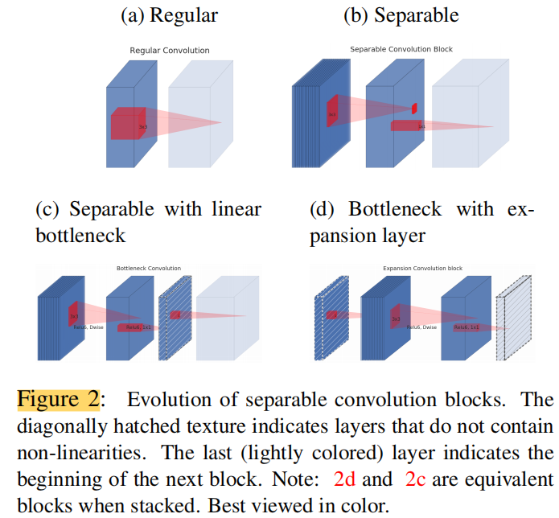
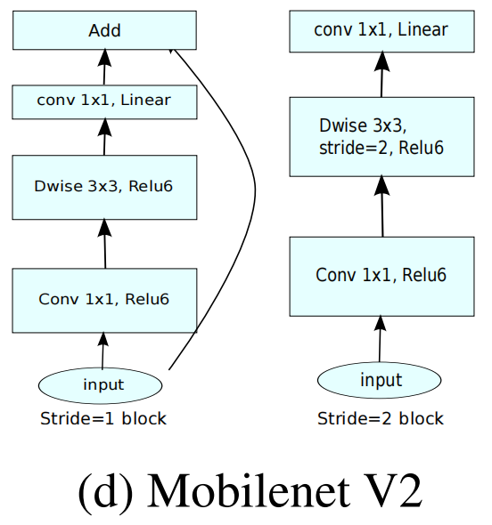
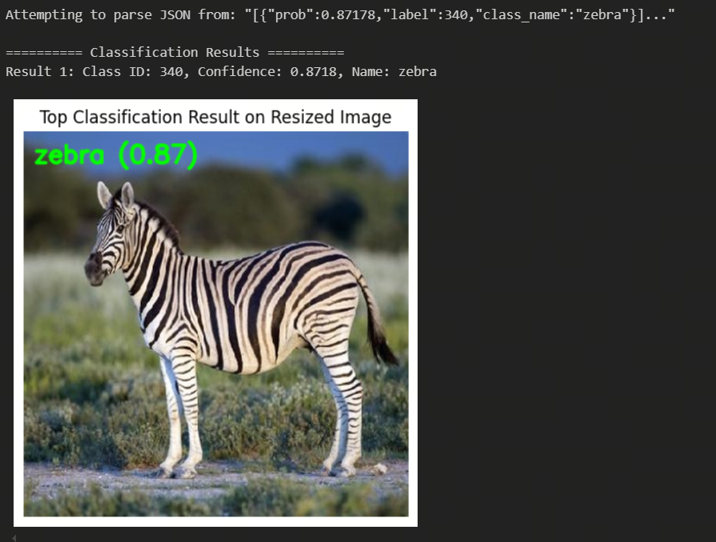

English | [简体中文](./README_cn.md)

# MobileNetV2

- [MobileNetV2](#mobilenetv2)
  - [1. Introduction](#1-introduction)
  - [2. Model Performance Data](#2-model-performance-data)
  - [3. Model Download](#3-model-download)
    - [Option 1](#option-1)
    - [Option 2](#option-2)
  - [3. Deployment Test](#3-deployment-test)
  - [4. Quantization Experiments](#4-quantization-experiments)
    - [Dataset Preparation](#dataset-preparation)
    - [Calibration Data Processing](#calibration-data-processing)
    - [Model Verification](#model-verification)
    - [Model Compilation](#model-compilation)
    - [Model Inference](#model-inference)

## 1. Introduction

- **Paper**: [MobileNetV2: Inverted Residuals and Linear Bottlenecks](https://arxiv.org/abs/1801.04381)

- **GitHub repository**: [timm/docs/models/mobilenet-v2.md at master · pprp/timm (github.com)](https://github.com/pprp/timm/blob/master/docs/models/mobilenet-v2.md)

Mobilenetv2 is an improvement on [Mobilenet](../MobileNetV1/README.md), which is also a lightweight neural network. In order to prevent the loss of some information in the nonlinear layer ReLU, Mobilenetv2 introduces a linear bottleneck layer (Linear Bottleneck) ; in addition, a series of networks such as Resnet are used, and the residual network has achieved good results. The author combines the characteristics of point-state convolution and proposes an inverted residual (Inverted Residual) structure . The paper conducts comparative experiments on ImageNet classification, MS COCO object detection, and VOC image segmentation to verify the effectiveness of the architecture.

Mobilenetv2 adds a point-state convolution before deep convolution. The reason for this is that deep convolution, due to its computational characteristics, does not have the ability to change the number of channels. It can only output as many channels as the previous layer gives it. Therefore, if the number of channels given by the previous layer is itself small, deep convolution can only extract features in low-dimensional space, so the effect is not good enough. To improve this problem, Mobilenetv2 equips each deep convolution with a point-state convolution specifically for dimensionality enhancement.




## 2. Model Performance Data

The following table shows the actual performance data tested on the RDK S100.

| Model        | Input Size (pixels) | Classes | Parameters (M) | FP Top-1 | Quantized Top-1 | Latency/Throughput (Single Thread) | Latency/Throughput (Multi Thread) | FPS    |
| ------------ | ------------------ | ------- | -------------- | -------- | --------------- | ---------------------------------- | ---------------------------------- | ------ |
| MobileNetV2  | 224x224            | 1000    | 3.5            | 71.9     | -               | -                                  | -                                  | -      |

Notes:
1. The S100 is tested under optimal conditions.
2. Single-thread latency refers to the latency per frame using a single thread and a single BPU core, representing the ideal scenario for BPU inference.
3. FP/Quantized Top-1: FP Top-1 refers to the Top-1 inference accuracy of the ONNX model before quantization, while Quantized Top-1 refers to the actual inference accuracy after quantization.


## 3. Model Download

### Option 1

You can use the [download_1.sh](./model/download_1.sh) script to quickly download the .hbm model file for this model structure, making it easy to switch models. Or use the following command line to download:

```shell
wget https://archive.d-robotics.cc/downloads/rdk_model_zoo/rdk_s100/MobileNet/mobilenetv2_224x224_nv12_1.hbm
```

This model is the output after quantization using the Horizon reference algorithm.

The model conversion uses the Caffe model: https://github.com/shicai/MobileNet-Caffe

If you need the quantization and conversion steps for the MobileNetV1 model, you can refer to the conversion steps of other MobileNet models or directly use the samples/ai_toolchain/horizon_model_convert_sample/03_classification/01_mobilenetv2 in the OE development kit.

### Option 2

**.hbm File Download**:

You can use the [download.sh](./model/download.sh) script to download the .hbm model file for this model structure with one click, making it easy to switch models. Or use the following command line to download:

```shell
wget https://archive.d-robotics.cc/downloads/rdk_model_zoo/rdk_s100/MobileNet/mobilenetv2_224x224_nv12.hbm
```

**ONNX File Download**:

The ONNX model is converted from the timm library (PyTorch Image Models). Install the required packages with:

```shell
pip install timm onnx
```

After installing the necessary libraries, you can use the [get_mobilenetv2_onnx.py](python/get_mobilenetv2_onnx.py) script in the python folder to download the ONNX file.

* Note: You need to configure a terminal proxy and log in to Huggingface using the following command:
```shell
huggingface-cli login
```

* If you do not want to configure a terminal proxy, you can manually download the model from [timm/mobilenetv2_100.ra_in1k](https://huggingface.co/timm/mobilenetv2_100.ra_in1k) and use the [python/timm2onnx.py](python/timm2onnx_local.py) script to convert to ONNX.
    
After exporting the ONNX file, the script will output model input, mean, std, path, parameters, etc., in the following format:

```shell
input: (3, 224, 224)
mean (0.485, 0.456, 0.406)
std (0.229, 0.224, 0.225)
Simplified model is valid.
Simplified model saved to mobilenetv2_100.onnx
Total number of parameters in the model: 3487818
```

## 3. Deployment Test

After downloading the .hbm file, you can run 'test_mobilenetv2.ipynb' or 's100_inference.py' in the python folder to test the model on the board.

* Note: If you use the Horizon reference algorithm, you need to set `classification_postprocess_info.use_softmax = False`.

If you need to change the test image, you can download the dataset, put it in the data folder, and modify the image path in the Jupyter notebook or Python script.



* Deployment performance test:
```shell
hrt_model_exec perf --model_file ./model/mobilenetv2_224x224_nv12.hbm \
                                     --core_id=0 \
                                     --frame_count=200 \
                                     --perf_time=0 \
                                     --thread_num=1
```
thread_num = 1
```
Running condition:
- Thread number is: 1
- Frame count is: 200
Perf result:
- Frame totally latency is: 80.924 ms
- Average latency is: 0.405 ms
- Frame rate is: 2345.381 FPS
```
thread_num = 3
```
Running condition:
- Thread number is: 3
- Frame count is: 200
Perf result:
- Frame totally latency is: 113.025 ms
- Average latency is: 0.565 ms
- Frame rate is: 5026.515 FPS
```

## 4. Quantization Experiments

### Dataset Preparation

The model uses the [ImageNet](https://image-net.org/) dataset.
* Dataset: ILSVRC2012

| Dataset Name | Number of Classes | Number of Images |
| -- | -- | -- |
| ILSVRC2012 Training Set | 1000 classes | ~1.2 million images |
| ILSVRC2012 Validation Set | 1000 classes | 50,000 images |
| ILSVRC2012 Test Set | 1000 classes | 100,000 images |

It is recommended to extract the downloaded dataset into the following structure:

```shell
imagenet/ 
 ├── calibration_data 
 │   ├── ILSVRC2012_val_00000001.JPEG 
 │   ├── ... 
 │   └── ILSVRC2012_val_00000100.JPEG 
 ├── ILSVRC2017_val.txt 
 ├── val 
 │   ├── ILSVRC2012_val_00000001.JPEG 
 │   ├── ... 
 │   └── ILSVRC2012_val_00050000.JPEG 
 └── val.txt
```

### Calibration Data Processing

After preparing 100 calibration images, run the following command to generate calibration data, which will be saved in the /calibration_data_rgb directory:

```shell
python3 python/get_calibration_data.py
```

### Model Verification

After preparing the ONNX model, you can quickly verify the model with the following command:

```shell
hb_compile --model mobilenetv2_100.onnx --march nash-e
```

### Model Compilation

After model verification, you can perform quantization compilation using the calibration dataset. A reference yaml file is provided in the yaml folder. Run the following command:

```shell
hb_compile --config yaml/mobilenetv2_config.yaml
```

After compilation, you will find the output in the model_output directory. The file needed for deployment is mobilenetv2_224x224_nv12.hbm.

* Cosine similarity after model quantization:

```shell
 +------------+-------------------+------------------+
 | TensorName | Calibrated Cosine | Quantized Cosine |
 +------------+-------------------+------------------+
 | output     | 0.993383          | 0.988877         |
 +------------+-------------------+------------------+
```

* Toolchain performance reference:

```bash
Summary:
FPS (1 core): 4968.89
latency: 0.2 ms (201.3 us)
BPU conv original OPs per run: 601,548,544
```

### Model Inference

The python directory provides demos for quick inference on both X86 and S100 platforms:
* [x86_inference.py](python/x86_inference.py) supports inference on the X86 platform using ONNX, HBIR (.bc), and HBM formats, as well as accuracy validation on the val dataset.
* [s100_inference.py](python/s100_inference.py) supports inference on the board using the HBM format.

For `x86_inference.py`, specify the model and image paths using `-m` and `-i`. Example:
```shell
python3 python/x86_inference.py -m model_output/mobilenetv2_224x224_nv12_quantized_model.bc -i data/zebra_cls.jpg
```

To run accuracy validation with `x86_inference.py`, use the `--validate` flag. Example:
```shell
python3 python/x86_inference.py -m model_output/mobilenetv2_224x224_nv12_quantized_model.bc --validate -d ../../../imagenet/val -l ../../../imagenet/val.txt
```

s100_inference.py requires modifying the model and image paths in the main function.