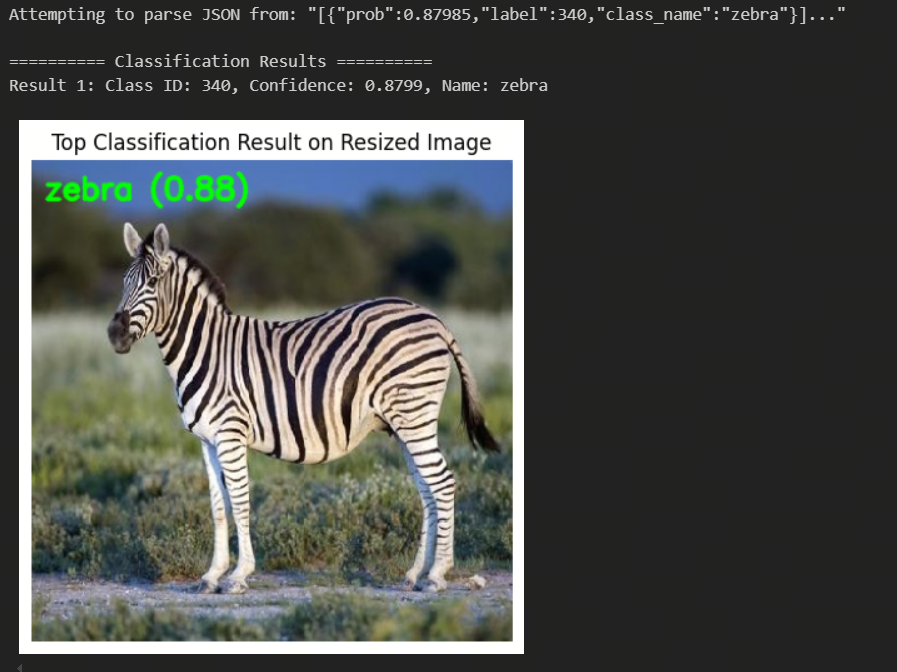

[English](./README.md) | 简体中文

# MobileNetV3

- [MobileNetV3](#mobilenetv3)
  - [1. 简介](#1-简介)
  - [2. 模型下载](#2-模型下载)
  - [3. 部署测试](#3-部署测试)
  - [4. 量化实验](#4-量化实验)
    - [数据集准备](#数据集准备)
    - [校准数据处理](#校准数据处理)
    - [模型检查](#模型检查)
    - [模型编译](#模型编译)
    - [模型推理](#模型推理)

## 1. 简介

- **论文地址**: [Searching for MobileNetV3](https://arxiv.org/abs/1905.02244)
- [ResNet strikes back: An improved training procedure in timm](https://arxiv.org/abs/2110.00476)

- **Github 仓库**: [pytorch-image-models/timm/models/mobilenetv3.py at main · huggingface/pytorch-image-models (github.com)](https://github.com/huggingface/pytorch-image-models/blob/main/timm/models/mobilenetv3.py)


MobileNetV3 是对 [MobileNetV2](../MobileNetV2/README_cn.md) 的改进，同样是一种轻量级的神经网络。MobileNetV3 通过使用**网络架构搜索(network architecture search，NAS)** 和 NetAdapt 对网络进行优化。同时，论文提出了 MobileNetV3-Large 和 MobileNetV3-Small 两种不同的网络应对于不同的实际使用情况。与 [MobileNetV2](../MobileNetV2/README_cn.md) 相比，MobileNetV3-Large在 ImageNet 数据集识别的准确率高3.2%，同时减少15%的延迟，而 MobileNetV3-Small 的准确率高4.6%，同时减少5%的延迟。MobileNetV3-Large 在 MS COCO 数据集的检测精度大致比 [MobileNetV2](../MobileNetV2/README_cn.md) 快25%

**MobileNetV3 模型特点**：

- **深度可分离卷积 (Depthwise Separable Convolution)**：MobileNetV3 继承了 MobileNetV2 的深度可分离卷积结构，将标准卷积分解为深度卷积和逐点卷积，大大减少了计算量和参数量
- **倒残差结构 (Inverted Residuals)**：与 [MobileNetV2](../MobileNetV2/README_cn.md) 类似，MobileNetV3 使用了倒残差块 (Inverted Residual Block)，其中包含扩展卷积、深度卷积和逐点卷积，并在输入和输出之间添加了跳跃连接 (Skip Connection)
- **Squeeze-and-Excitation (SE) 模块**：MobileNetV3 引入了 SE 模块，通过全局池化和通道注意力机制 (Channel Attention Mechanism) 来重新调整通道权重，以增强特征的表示能力
- **H-Swish 激活函数**：MobileNetV3 使用了一种新的激活函数 H-Swish (Hard-Swish)，这是一种硬化版本的 Swish 激活函数，能够在保持精度的同时减少计算复杂度
- **NAS (Neural Architecture Search)**：MobileNetV3 的架构部分是通过神经架构搜索 (NAS) 自动优化得到的，这种方法能够在不同设备的条件下找到性能和效率的平衡

## 2. 模型下载

**.hbm 文件下载**：

可以使用脚本 [download.sh](./model/download.sh) 一键下载此模型结构的 .hbm 模型文件，方便直接更换模型。或者使用以下命令行进行下载：

```shell
wget https://archive.d-robotics.cc/downloads/rdk_model_zoo/rdk_s100/MobileNet/mobilenetv3_224x224_nv12.hbm
```

**ONNX文件下载**：

onnx 模型使用的是 timm 库 (PyTorch Image Models) 中的模型进行转换的，使用以下命令安装所需要的包：

```shell
pip install timm onnx
```

安装完必要的库后可以使用python文件夹下的 [get_mobilenetv3_onnx.py](python/get_mobilenetv3_onnx.py) 脚本完成onnx文件的下载

* 注：需要配置终端代理并使用以下命令登录 huggingface
```shell
huggingface-cli login
```

* 若不想配置终端代理可选择手动前往 [timm/mobilenetv3_large_100.ra_in1k](https://huggingface.co/timm/mobilenetv3_large_100.ra_in1k) 下载模型 并使用 [python/timm2onnx.py](python/timm2onnx_local.py) 脚本完成onnx转换
  
完成onnx文件导出后脚本会输出模型 input, mean, std, path, parameters 等信息，格式如下：

```shell
input: (3, 224, 224)
mean (0.485, 0.456, 0.406)
std (0.229, 0.224, 0.225)
Simplified model is valid.
Simplified model saved to mobilenetv3_large_100.onnx
Total number of parameters in the model: 5470832
```

## 3. 部署测试

在下载完毕 .hbm 文件后，可以执行 'test_mobilenetv3.ipynb' 或 pyhton文件夹中的 's100_inference.py' ，在板端实际运行体验实际测试效果。

若需要更改测试图片，可额外下载数据集后，放入到data文件夹下并更改 jupyter 文件或 python脚本 中图片的路径



* 部署性能测试：
```shell
hrt_model_exec perf --model_file ./model/mobilenetv3_224x224_nv12.hbm \
                   --core_id=0 \
                   --frame_count=200 \
                   --perf_time=0 \
                   --thread_num=1
```
thread_num = 1
```
Running condition:
- Thread number is: 1
- Frame count is: 200
Perf result:
- Frame totally latency is: 108.508 ms
- Average latency is: 0.543 ms
- Frame rate is: 1771.793 FPS
```
thread_num = 3
```
Running condition:
- Thread number is: 3
- Frame count is: 200
Perf result:
- Frame totally latency is: 176.123 ms
- Average latency is: 0.881 ms
- Frame rate is: 3276.057 FPS
```


## 4. 量化实验

### 数据集准备

模型使用的数据集为 [ImageNet](https://image-net.org/)
* 数据集：ILSVRC2012

| 数据集名称 | 分类数量 | 图片数量 |
| -- | -- | -- |
| ILSVRC2012训练集 | 1000个分类 | 约120万张图片 |
| ILSVRC2012验证集 | 1000个分类 | 5万张图片 |
| ILSVRC2012测试集 | 1000个分类 | 10万张图片 |

我们建议您将下载的数据集解压成如下结构

```shell
imagenet/ 
 ├── calibration_data 
 │   ├── ILSVRC2012_val_00000001.JPEG 
 │   ├── ... 
 │   └── ILSVRC2012_val_00000100.JPEG 
 ├── ILSVRC2017_val.txt 
 ├── val 
 │   ├── ILSVRC2012_val_00000001.JPEG 
 │   ├── ... 
 │   └── ILSVRC2012_val_00050000.JPEG 
 └── val.txt
```

### 校准数据处理

准备好数量为100的校准数据集后，运行以下命令生成校准数据，校准数据保存在 /calibration_data_rgb 目录下:

```shell
python3 python/get_calibration_data.py
```

### 模型检查

在准备好onnx模型后，可以通过以下命令快速完成模型验证：

```shell
hb_compile --model mobilenetv3_large_100.onnx --march nash-e
```

### 模型编译

模型验证通过后可以通过校准数据集进行模型量化编译，参考 yaml 文件已提供在 yaml 文件夹中，运行以下命令：

```shell
hb_compile --config yaml/mobilenetv3_config.yaml
```

完成模型编译后可在 model_output 目录下发现编译产物，需要上板使用的为 mobilenetv3_224x224_nv12.hbm 

* 模型量化后余弦相似度

```shell
 +------------+-------------------+------------------+
 | TensorName | Calibrated Cosine | Quantized Cosine |
 +------------+-------------------+------------------+
 | output     | 0.911233          | 0.909042         |
 +------------+-------------------+------------------+
```

* 工具链给出的性能参考

```bash
Summary:
FPS (1 core): 2616.81
latency: 0.38 ms (382.1 us)
BPU conv original OPs per run: 433,179,520
```

### 模型推理

在 python 目录下提供了在 X86 平台和 S100 平台快速进行推理的 demo， 其中：
* [x86_inference.py](python/x86_inference.py) 支持 ONNX , HBIR(.bc) 和 HBM 格式在 X86 平台的推理。
* [s100_inference.py](python/s100_inference.py) 支持 HBM 格式在板端的推理。

x86_inference.py 需要通过 -m , -i 传入模型路径和图像路径，示例
```shell
python3 python/x86_inference.py -m model_output/mobilenetv3_224x224_nv12_quantized_model.bc -i data/zebra_cls.jpg
```

s100_inference.py 需要修改 main 函数中模型和图像路径