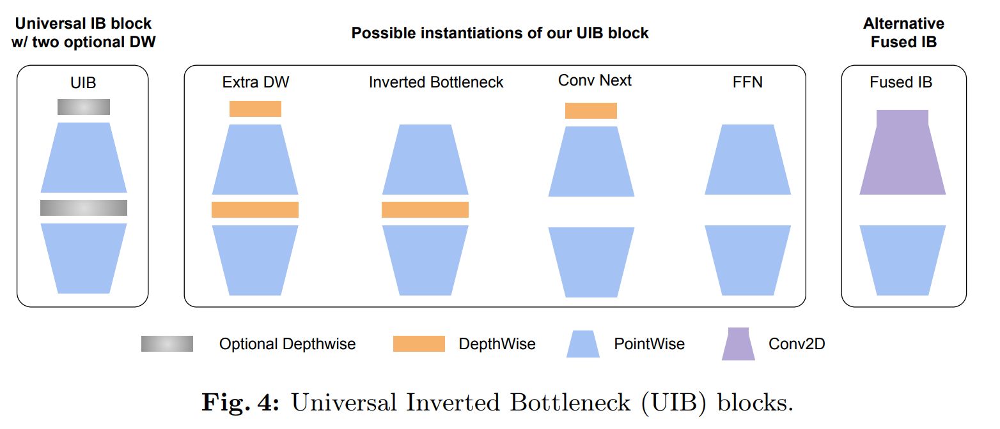
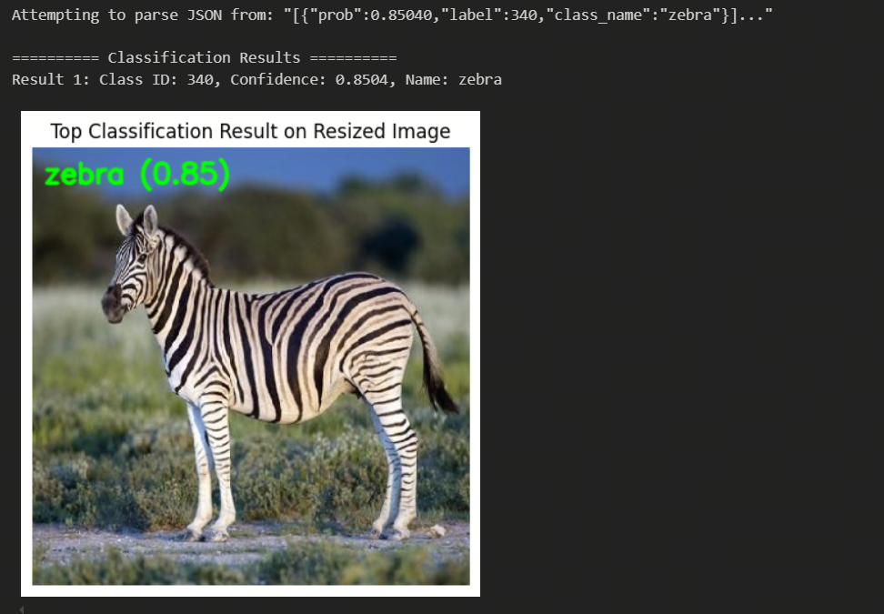

[English](./README.md) | 简体中文

# MobileNetV4

- [MobileNetV4](#mobilenetv4)
  - [1. 简介](#1-简介)
  - [2. 模型下载](#2-模型下载)
  - [3. 部署测试](#3-部署测试)
  - [4. 量化实验](#4-量化实验)
    - [数据集准备](#数据集准备)
    - [校准数据处理](#校准数据处理)
    - [模型检查](#模型检查)
    - [模型编译](#模型编译)
    - [模型推理](#模型推理)

## 1. 简介

- **论文地址**: [MobileNetV4 -- Universal Models for the Mobile Ecosystem](https://arxiv.org/abs/2404.10518)

- **Github 仓库**: [pytorch-image-models/timm/models/MobileNetV4.py at main · huggingface/pytorch-image-models (github.com)](https://github.com/huggingface/pytorch-image-models/blob/main/timm/models/MobileNetV4.py)



MobileNetV4 基于MobileNet的经典组件如可分离的深度卷积（DW）和逐点（PW）扩展及投影倒置瓶颈块，引入了**通用倒置颈结构**（UIB）。这个结构相当简单，在倒置瓶颈块中引入了两个可选的深度卷积（DW），一个位于扩展层之前，另一个位于扩展层和投影层之间。这两个深度卷积的存在与否是神经架构搜索（NAS）优化过程的一部分，最终会生成新颖的网络架构。尽管这个修改看似简单，但作者却巧妙地统一了几个重要的模块，包括原始的倒置颈结构、ConvNext以及ViT中的FFN。此外，UIB还引入了一个新的变体：ExtraDW。通过这种技术的增强，MNv4-Hybrid-Large模型在ImageNet-1K准确率达到了87%，在Pixel 8 EdgeTPU上的运行时间仅为3.8ms。

**MobileNetV4 模型特点**：

- 引入了Universal Inverted Bottleneck(UIB)搜索块，这是一种统一灵活的结构，合并了Inverted Bottleneck(IB)、ConvNext、前馈网络(FFN)和一种新的额外深度卷积(Extra Depthwise)变体。
- 提出了针对移动加速器优化的移动版多头注意力(Mobile MQA)，相比传统多头自注意力(MHSA)提供39%的推理加速。介绍了一种优化的神经架构搜索(NAS)方法，提高了MNv4搜索的有效性

## 2. 模型下载

**.hbm 文件下载**：

可以使用脚本 [download.sh](./model/download.sh) 一键下载此模型结构的 .hbm 模型文件，方便直接更换模型。或者使用以下命令行进行下载：

```shell
wget https://archive.d-robotics.cc/downloads/rdk_model_zoo/rdk_s100/MobileNet/mobilenetv4_medium_256x256_nv12.hbm
wget https://archive.d-robotics.cc/downloads/rdk_model_zoo/rdk_s100/MobileNet/mobilenetv4_small_224x224_nv12.hbm
```

**ONNX文件下载**：

onnx 模型使用的是 timm 库 (PyTorch Image Models) 中的模型进行转换的，使用以下命令安装所需要的包：

```shell
pip install timm onnx
```

安装完必要的库后可以使用python文件夹下的 [get_mobilenetv4_onnx.py](python/get_mobilenetv4_onnx.py) 脚本完成onnx文件的下载

* 注：需要配置终端代理并使用以下命令登录 huggingface
```shell
huggingface-cli login
```

* 若不想配置终端代理可选择手动前往 [timm/mobilenetv4_conv_medium.e500_r256_in1k](https://huggingface.co/timm/mobilenetv4_conv_medium.e500_r256_in1k)和[timm/mobilenetv4_conv_small.e2400_r224_in1k](https://huggingface.co/timm/mobilenetv4_conv_small.e2400_r224_in1k) 下载模型 并使用 [python/timm2onnx.py](python/timm2onnx_local.py) 脚本完成onnx转换
  
完成onnx文件导出后脚本会输出模型 input, mean, std, path, parameters 等信息，格式如下：

```bash
Processing mobilenetv4_conv_small...
input: (3, 224, 224)
mean (0.485, 0.456, 0.406)
std (0.229, 0.224, 0.225)
Simplified model is valid.
Simplified model saved to mobilenetv4_conv_small.onnx
Total number of parameters in the model: 3761480

Processing mobilenetv4_conv_medium...
input: (3, 256, 256)
mean (0.485, 0.456, 0.406)
std (0.229, 0.224, 0.225)
Simplified model is valid.
Simplified model saved to mobilenetv4_conv_medium.onnx
Total number of parameters in the model: 9681560
```

## 3. 部署测试

在下载完毕 .hbm 文件后，可以执行 'test_mobilenetv4.ipynb' 或 python 文件夹中的 's100_inference.py' ，在板端实际运行体验实际测试效果。

若需要更改测试图片，可额外下载数据集后，放入到data文件夹下并更改 jupyter 文件或 python脚本 中图片的路径



* 部署性能测试：
```shell
hrt_model_exec perf --model_file ./model/mobilenetv4_224x224_nv12.hbm \
                   --core_id=0 \
                   --frame_count=200 \
                   --perf_time=0 \
                   --thread_num=1
```

mobilenetv4_medium：

thread_num = 1
```
Running condition:
- Thread number is: 1
- Frame count is: 200
Perf result:
- Frame totally latency is: 118.902 ms
- Average latency is: 0.595 ms
- Frame rate is: 1612.084 FPS
```
thread_num = 3
```
Running condition:
- Thread number is: 3
- Frame count is: 200
Perf result:
- Frame totally latency is: 192.371 ms
- Average latency is: 0.962 ms
- Frame rate is: 3000.570 FPS
```

mobilenetv4_small：

thread_num = 1
```
Running condition:
- Thread number is: 1
- Frame count is: 200
Perf result:
- Frame totally latency is: 77.684 ms
- Average latency is: 0.388 ms
- Frame rate is: 2423.449 FPS
```
thread_num = 3
```
Running condition:
- Thread number is: 3
- Frame count is: 200
Perf result:
- Frame totally latency is: 111.443 ms
- Average latency is: 0.557 ms
- Frame rate is: 5130.441 FPS
```

## 4. 量化实验

### 数据集准备

模型使用的数据集为 [ImageNet](https://image-net.org/)
* 数据集：ILSVRC2012

| 数据集名称 | 分类数量 | 图片数量 |
| -- | -- | -- |
| ILSVRC2012训练集 | 1000个分类 | 约120万张图片 |
| ILSVRC2012验证集 | 1000个分类 | 5万张图片 |
| ILSVRC2012测试集 | 1000个分类 | 10万张图片 |

我们建议您将下载的数据集解压成如下结构

```shell
imagenet/ 
 ├── calibration_data 
 │   ├── ILSVRC2012_val_00000001.JPEG 
 │   ├── ... 
 │   └── ILSVRC2012_val_00000100.JPEG 
 ├── ILSVRC2017_val.txt 
 ├── val 
 │   ├── ILSVRC2012_val_00000001.JPEG 
 │   ├── ... 
 │   └── ILSVRC2012_val_00050000.JPEG 
 └── val.txt
```

### 校准数据处理

准备好数量为100的校准数据集后，运行以下命令生成校准数据，校准数据保存在 /calibration_data_rgb 目录下:

* 注：Medium 和 Small 对应不同的图像尺寸需要按需修改main函数中的参数
 
```shell
python3 python/get_calibration_data.py
```

### 模型检查

在准备好onnx模型后，可以通过以下命令快速完成模型验证：

```shell
hb_compile --model mobilenetv4_conv_medium.onnx --march nash-e
```

```shell
hb_compile --model mobilenetv4_conv_small.onnx --march nash-e
```

### 模型编译

模型验证通过后可以通过校准数据集进行模型量化编译，参考 yaml 文件已提供在 yaml 文件夹中，运行以下命令：

```shell
hb_compile --config yaml/mobilenetv4_medium_config.yaml
```

```shell
hb_compile --config yaml/mobilenetv4_small_config.yaml
```

完成模型编译后可在 model_output 目录下发现编译产物，需要上板使用的为mobilenetv4_medium_256x256_nv12.hbm 和 mobilenetv4_medium_224x224_nv12.hbm 

* 模型量化后余弦相似度

mobilenetv4_medium：

```shell
 +------------+-------------------+------------------+
 | TensorName | Calibrated Cosine | Quantized Cosine |
 +------------+-------------------+------------------+
 | output     | 0.999759          | 0.999863         |
 +------------+-------------------+------------------+
```

mobilenetv4_small:

```shell
 +------------+-------------------+------------------+
 | TensorName | Calibrated Cosine | Quantized Cosine |
 +------------+-------------------+------------------+
 | output     | 0.999892          | 0.99988          |
 +------------+-------------------+------------------+
```

* 工具链给出的性能参考

mobilenetv4_medium：

```bash
Summary:
FPS (1 core): 2468.07
latency: 0.41 ms (405.2 us)
BPU conv original OPs per run: 2,160,488,448
```

mobilenetv4_small:

```bash
Summary:
FPS (1 core): 5698.18
latency: 0.18 ms (175.5 us)
BPU conv original OPs per run: 372,011,136
```

### 模型推理

在 python 目录下提供了在 X86 平台和 S100 平台快速进行推理的 demo， 其中：
* [x86_inference.py](python/x86_inference.py) 支持 ONNX , HBIR(.bc) 和 HBM 格式在 X86 平台的推理。
* [s100_inference.py](python/s100_inference.py) 支持 HBM 格式在板端使用新的 HB_HBMRuntime API 进行推理。

x86_inference.py 需要通过 -m , -i 传入模型路径和图像路径，示例
```shell
python3 python/x86_inference.py -m model_output/mobilenetv4_224x224_nv12_quantized_model.bc -i data/zebra_cls.jpg
```
