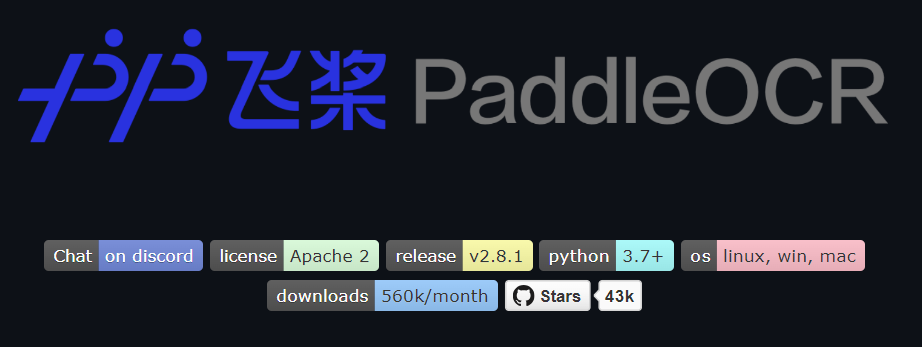
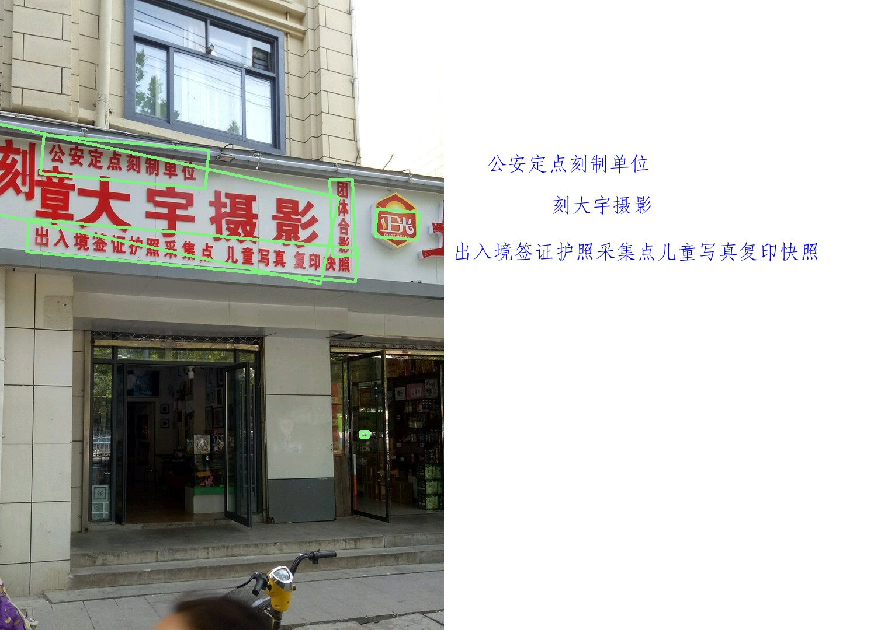
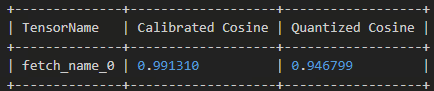
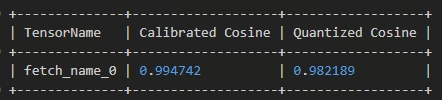

English| [简体中文](./README_cn.md)

# Introduction to PaddleOCR

[PaddleOCR](https://github.com/PaddlePaddle/PaddleOCR) is a deep learning-based Optical Character Recognition (OCR) tool developed by Baidu's PaddlePaddle team. Built upon the PaddlePaddle framework, it enables text recognition from images through a pipeline of preprocessing, text detection, and text recognition. PaddleOCR supports multiple languages and fonts, making it suitable for extracting text in complex scenarios. It also supports custom training to optimize model performance.

Research Paper: [https://arxiv.org/abs/2206.03001](https://arxiv.org/abs/2206.03001)

**GitHub Repository**: [https://github.com/PaddlePaddle/PaddleOCR](https://github.com/PaddlePaddle/PaddleOCR)


## Workflow

1. **Image Preprocessing**: Includes denoising, resizing, etc.
2. **Text Detection**: Deep models detect text regions and generate bounding boxes.
3. **Text Recognition**: Recognizes the text content within the bounding boxes to produce the final output.

---

## Quick Start

### Environment Dependencies

```bash
# Install PaddlePaddle (on S100)
pip install paddlepaddle
```

---

## Model Download and Inference
You can use the script [download.sh](source/scripts/download.sh) to download all `.hbm` model files of this model structure with a single command:

```shell
wget -P $(dirname $0) https://archive.d-robotics.cc/downloads/rdk_model_zoo/rdk_s100/paddle_ocr/cn_PP-OCRv3_det_infer-deploy_640x640_nv12.hbm
wget -P $(dirname $0) https://archive.d-robotics.cc/downloads/rdk_model_zoo/rdk_s100/paddle_ocr/cn_PP-OCRv3_rec_infer-deploy_48x320_rgb.hbm
```
After downloading the `.hmb` files, you can perform inference using either the `paddle_ocr.py` Python script or a Jupyter notebook. When changing the test image, update the path in the script accordingly. Example output:


---

## Model Conversion and Quantization Process

### Environment Setup

```bash
# Clone repository and install dependencies
git clone https://github.com/PaddlePaddle/PaddleOCR.git
cd PaddleOCR && python3 -m pip install -e .

# Install Paddle2ONNX and ONNXRuntime
python3 -m pip install paddle2onnx
python3 -m pip install onnxruntime
```

---

### Exporting ONNX Models (Example: PP-OCRv3)

```bash
# Download detection model
wget -nc -P ./inference https://paddleocr.bj.bcebos.com/PP-OCRv3/chinese/ch_PP-OCRv3_det_infer.tar
cd ./inference && tar xf ch_PP-OCRv3_det_infer.tar && cd ..

# Download recognition model
wget -nc -P ./inference https://paddleocr.bj.bcebos.com/PP-OCRv3/chinese/ch_PP-OCRv3_rec_infer.tar
cd ./inference && tar xf ch_PP-OCRv3_rec_infer.tar && cd ..
```

```bash
# Convert detection model
paddle2onnx --model_dir ./inference/ch_PP-OCRv3_det_infer \
--model_filename inference.pdmodel \
--params_filename inference.pdiparams \
--save_file ./inference/det_onnx/model.onnx \
--opset_version 19 \
--enable_onnx_checker True

# Convert recognition model
paddle2onnx --model_dir ./inference/ch_PP-OCRv3_rec_infer \
--model_filename inference.pdmodel \
--params_filename inference.pdiparams \
--save_file ./inference/rec_onnx/model.onnx \
--opset_version 19 \
--enable_onnx_checker True
```

---

## Model Quantization

### Dataset Preparation

Use the [ICDAR2019-LSVT dataset](https://ai.baidu.com/broad/introduction?dataset=lsvt)

* **Size**: 450,000 Chinese street view images
* **Annotation Types**:

  * Full annotation (bounding box + content): 50,000 (20k test + 30k train)
  * Weak annotation (content only): 400,000

Download link: [Click to Download](https://ai.baidu.com/broad/download?dataset=lsvt)

### Calibration Data Processing

After modifying the dataset path, run the following to generate calibration data in the `/det_calibration_data` directory:

```bash
python get_det_calibration_data.py
```

---

## Model Compilation: Detection Model

**Configuration File: `yaml_det_configs100.yaml`**

```yaml
model_parameters:
  onnx_model: './../PaddleOCR/inference/det_onnx/modelv3.onnx'
  march: "nash-e"
  layer_out_dump: False
  working_dir: 'model_output'
  output_model_file_prefix: 'cn_PP-OCRv3_det_infer-deploy_640x640_nv12'
  remove_node_type: "Dequantize"

input_parameters:
  input_name: "x"
  input_type_rt: 'nv12'
  input_type_train: 'rgb'
  input_layout_train: 'NCHW'
  input_shape: '1x3x640x640'
  norm_type: 'data_mean_and_scale'
  mean_value: 123.675 116.28 103.53
  scale_value: 0.01712475 0.017507 0.01742919

calibration_parameters:
  cal_data_dir: './../calibration_data'
  cal_data_type: 'float32'
  calibration_type: 'default'

compiler_parameters:
  compile_mode: 'latency'
  debug: False
  optimize_level: 'O2'
```

To convert the detection model, run:

```bash
hb_compile -c yaml_det_configs100.yaml
```

---

## Model Compilation: Recognition Model

Run the following to generate data (on S100):

```bash
python get_rec_calbration_data.py
```

Copy the data into the server’s Docker container and use the following configuration:

**Configuration File: `yaml_rec_configs100.yaml`**

```yaml
model_parameters:
  onnx_model: './../PaddleOCR/inference/rec_onnx/model_recv3.onnx'
  march: "nash-e"
  layer_out_dump: False
  working_dir: 'model_output'
  output_model_file_prefix: 'cn_PP-OCRv3_rec_infer-deploy_48x320_rgb'
  node_info:
    "p2o.Softmax.0": { 'ON': 'BPU', 'InputType': 'int16', 'OutputType': 'int16' }
    "p2o.Softmax.1": { 'ON': 'BPU', 'InputType': 'int16', 'OutputType': 'int16' }
    "p2o.Softmax.2": { 'ON': 'BPU', 'InputType': 'int16', 'OutputType': 'int16' }

input_parameters:
  input_type_rt: 'featuremap'
  input_layout_rt: 'NCHW'
  input_type_train: 'featuremap'
  input_layout_train: 'NCHW'
  input_shape: '1x3x48x320'
  norm_type: 'no_preprocess'

calibration_parameters:
  cal_data_dir: './../calibration_data_rec'
  cal_data_type: 'float32'
  calibration_type: 'default'
  optimization: "set_all_nodes_int16"

compiler_parameters:
  compile_mode: 'latency'
  debug: False
  optimize_level: 'O2'
```

To convert the recognition model, run:

```bash
hb_compile -c yaml_rec_configs100.yaml
```

---

## Performance Evaluation

### Detection Model (`det`)

```bash
hrt_model_exec perf --model_file cn_PP-OCRv3_det_infer-deploy_640x640_nv12.hbm
```

* **Frames**: 200
* **Average Latency**: 1.219ms
* **Max Latency**: 16.704ms
* **FPS**: 798.575

---

### Recognition Model (`rec`)

```bash
hrt_model_exec perf --model_file cn_PP-OCRv3_rec_infer-deploy_48x320_rgb.hbm
```

* **Frames**: 200
* **Average Latency**: 2.588ms
* **Max Latency**: 17.812ms
* **FPS**: 380.525

---

## Accuracy Evaluation

* **Cosine Similarity After Detection Model Quantization**

  

* **Cosine Similarity After Recognition Model Quantization**

  

---

Would you like this translation saved as a Markdown file?
