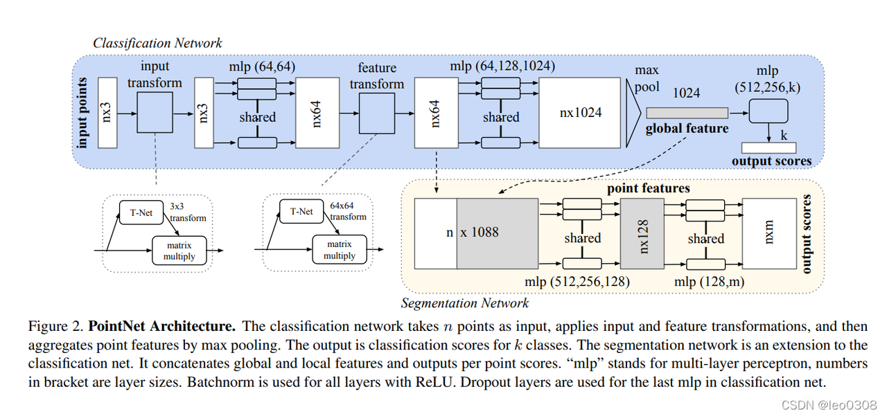
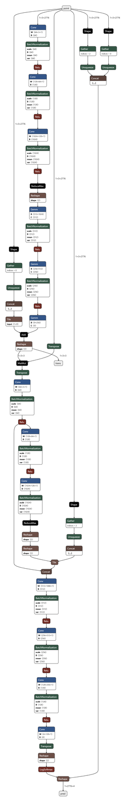
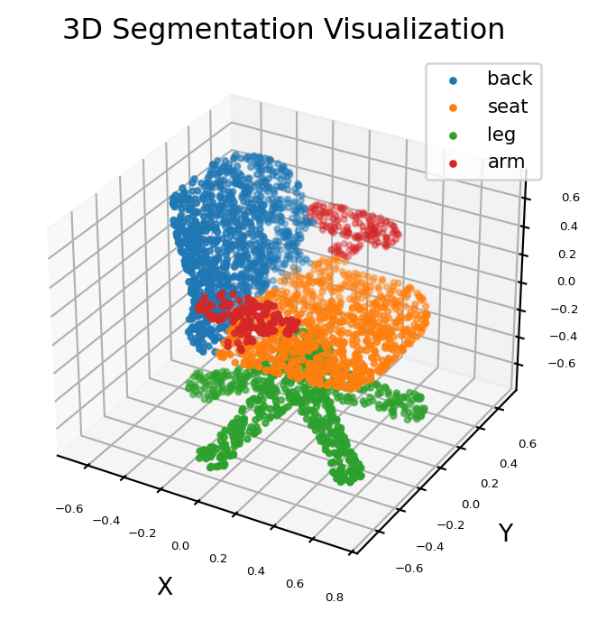

[English](./README.md) | 简体中文

# 1. 背景介绍

PointNet是处理点云数据的深度学习模型，其地位堪比2D图像处理中的CNN网络， 后续的诸多点云数据处理的深度网络都有PointNet的影子。


## 1.1 点云数据介绍

既然PointNet处理的是点云数据， 那么首先需要先知道点云数据是长什么样子。 其实所谓点云数据就是一系列点组成的集合，

每一个点代表一个三维坐标(x,y,z), (注：有些点云数据可能是6个值， 除了三个坐标外， 还有nx,ny,nz构成法向量。)

那么由N个点构成的一个点云数据其实就是一个Nx3的数组。

点云数据有一个很重要的特性是： 无序性。 因为就是一堆点的集合， 顺序是无所谓的。

网络设计就要考虑这一特性。 那么什么函数有这样的属性呢？ 比如求max, 求和等等， 这些都是顺序无关的。

PointNet就是采用了max的方法，因为简单。


## 1.2 PointNet介绍



网络结构非常简单， 直接输入点云数据， 然后经过几个MLP层进行升维，论文中是升到1024维， 然后进行max操作（在每个维度对所有点取max）， 最终得到了1x1024维度的的全局特征。

基于这个特征就可以直接做分类任务了。 其实用几个MLP进行升维、提取特征的思想也很好理解， 假设没有升维的操作， max之后只有3维特征了， 显然包含的信息太少， 拿这个特征去做分类或者其他的显然不那么靠谱。


## 1.3 PointNet ONNX

我们将PointNet导出ONNX，可以观察到其ONNX图的算子包括如下：



从上图中可以看到，主要的算子包含了Conv、BatchNorm、RELU等常规算子。这些常规算子在RDK S100上均有支持。随后，我们将该模型在RDK S100上进行部署。

# 2. RDK S100部署

## 2.1 模型上板性能

我们将该模型转为hbm的格式，该格式为地瓜异构模型，支持使用地瓜BPU算力。

使用4.0.3beta的RDK S100版本的hrt\_model\_exec工具进行模型性能测试。

得到如下结果表格：

| 线程数 | 总帧数 | 总时延    | 平均时延 | FPS    |
| --- | --- | ------ | ---- | ------ |
| 1   | 100 | 143.63 | 1.43 | 689.61 |
| 2   | 100 | 216.20 | 2.16 | 914.32 |
| 4   | 100 | 429.76 | 4.30 | 910.70 |
| 8   | 100 | 839.86 | 8.35 | 910.84 |

## 2.2 模型上板精度

该精度我们将评估为量化精度，即fp32模型进行int量化后的精度，是否与原版fp32 CPU模型精度对齐。

本次量化，我们选择int16类型的量化，看到得到的量化精度如下：


可以看到对于trans，结果精度>0.9999（4个9），而pred精度则是>0.98

## 2.3 模型上板操作讲解

代码仓库可以参考：https://gitee.com/chenguanzhong/rdk\_-s100\_-point-net\_-official

我们先安装相关依赖：

```plain&#x20;text
pip install -r requirements.txt
```

随后，我们安装bpu的python推理库：

```plain&#x20;text
pip install hbmruntime-0.1.0-cp310-cp310-linux_aarch64.whl
```

重命名模型文件：

```
mv pointnet.hbm1 pointnet.hbm
```

确保当前文件夹下拥有chair.pts，main.py，和pointnet.hbm三个文件。分别是数据、主程序、和bpu上板的模型文件。

运行方法为：

```plain&#x20;text
python main.py
```

该函数执行完成后，可以在当前目录看到生成的两个新的图片文件，分别是chair.png和chair\_res.png，分别代表原点云数据和点云分割的结果。

我们看到点云分割的结果如下：

