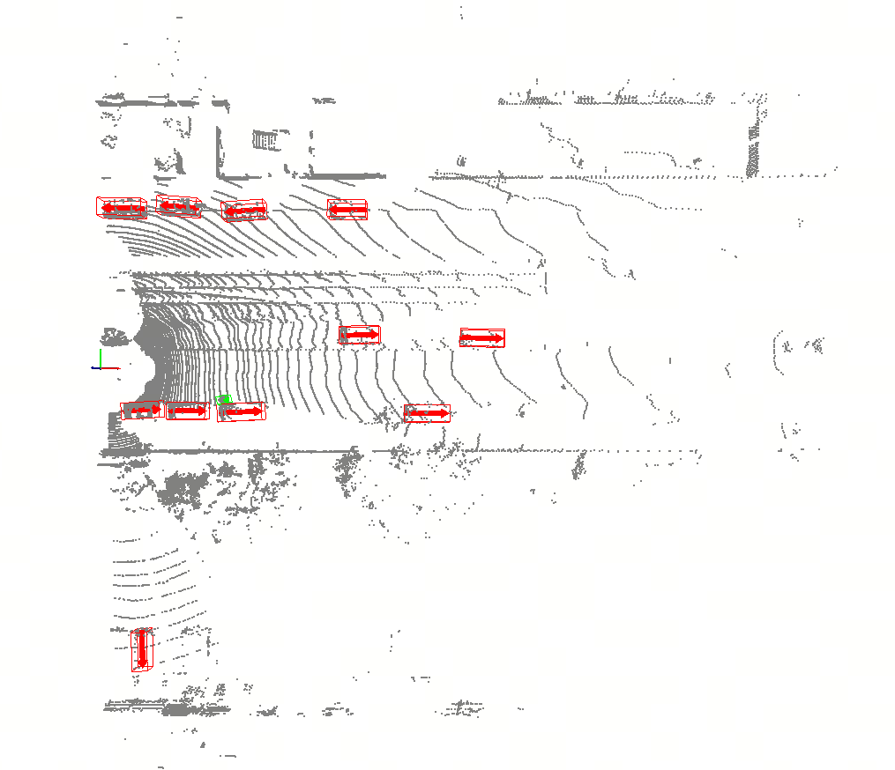
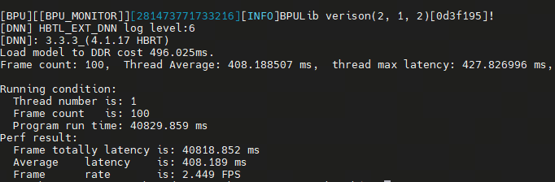
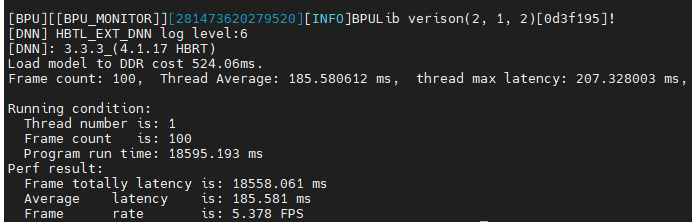

[English](./README.md) | 简体中文

# 算法背景

OpenPCDet 是一个由西南交通大学开发的开源 3D 目标检测框架，专注于基于 LiDAR 点云数据 的目标检测任务，常用于自动驾驶场景中。该框架具有如下特点：

1. 模块化设计：网络结构清晰，便于拓展和修改。
2. 支持多种主流算法：如 PointPillars、SECOND、PV-RCNN、CenterPoint 等。
3. PyTorch 实现，易于集成和部署。
4. 强大的社区支持和丰富的训练脚本、预训练模型。

其主要功能模块包括了数据预处理（数据增强、体素化等），特征提取器（如 PointNet、VoxelNet），目标检测头（如 anchor-based 或 center-based 检测器），以及后处理（NMS，转换成3D框）。

PointPillars 是 2019 年由 NVIDIA 提出的一种高效的 实时 3D 目标检测算法，其核心思想是：将稀疏的点云转化为规则的“柱状体素”（pillars），从而可以使用高效的 2D 卷积神经网络进行处理。

其论文的名称为：`PointPillars: Fast Encoders for Object Detection from Point Clouds`。论文的链接为：https://arxiv.org/abs/1812.05784。

其核心思想和流程为：

1. 点云柱状体素化（Pillarization）：将点云划分成一个个在 xy 平面上的小柱子（pillar）。每个柱子内最多保留 N 个点（超出则截断，不足则补零）。将每个柱子表示为一个张量：[num_pillars, num_points_per_pillar, feature_dim]。
2. Pillar Feature Net（特征提取）：对每个柱子内的点使用一个小型的 MLP（类似 PointNet）提取局部特征。将这些特征聚合成每个柱子的固定维度特征。
3. Pseudo Image（伪图像）生成：将柱子特征放置到对应的位置，形成一个“伪图像”。输入尺寸为：[C, H, W]，可直接用 2D CNN 处理。
4. 2D Backbone & Detection Head：使用高效的 2D 卷积网络（如 FPN）提取更深的特征。最后通过检测头输出 3D 边界框（位置、尺寸、方向等）。


# 快速体验

## 环境依赖

在我们拥有一块RDK S100后，我们登录到其环境中。

我们首先克隆代码仓：

```
git clone https://github.com/D-Robotics/rdk_model_zoo_s.git
```

我们随后切换到如下目录：

```
cd samples\Vision\PointPillars\python
```

安装相关依赖：

```
pip install -r requirements.txt
```

下载相关输入：

```
wget https://archive.d-robotics.cc/downloads/rdk_model_zoo/rdk_s100/PointPillars/voxels0.npy
wget https://archive.d-robotics.cc/downloads/rdk_model_zoo/rdk_s100/PointPillars/voxel_coords0.npy
wget https://archive.d-robotics.cc/downloads/rdk_model_zoo/rdk_s100/PointPillars/voxel_num_points0.npy
```

下载模型：

```
wget https://archive.d-robotics.cc/downloads/rdk_model_zoo/rdk_s100/PointPillars/AnchorHeadSingle.onnx
wget https://archive.d-robotics.cc/downloads/rdk_model_zoo/rdk_s100/PointPillars/backbone.hbm
wget https://archive.d-robotics.cc/downloads/rdk_model_zoo/rdk_s100/PointPillars/vfe.hbm
wget https://archive.d-robotics.cc/downloads/rdk_model_zoo/rdk_s100/PointPillars/PointPillarScatter.onnx
```

## 效果验证

完成上述步骤后，我们在RDK S100上执行运行命令，对上述提供的一组点云输入进行验证

```
python main.py
```

脚本执行完成后，会生成一系列输出，包括`pillar_features.npy`、`spatial_features_2d.npy`、`batch_cls_preds.npy`、`batch_box_preds.npy`。

我们将这些输出使用OpenPCDet工具进行可视化，可以看到如下结果：



## 速度验证

### VFE

我们使用如下命令对地瓜异构模型vfe.hbm进行速度的验证

```
hrt_model_exec perf --model_file vfe.hbm --frame_count 100
```

我们得到如下结果



* **Frames**: 100
* **Average Latency**: 408.189ms
* **FPS**: 2.449

### Backbone

我们使用如下命令对地瓜异构模型backbone.hbm进行速度的验证

```
hrt_model_exec perf --model_file backbone.hbm --frame_count 100
```

我们得到如下结果



* **Frames**: 100
* **Average Latency**: 185.581ms
* **FPS**: 5.378