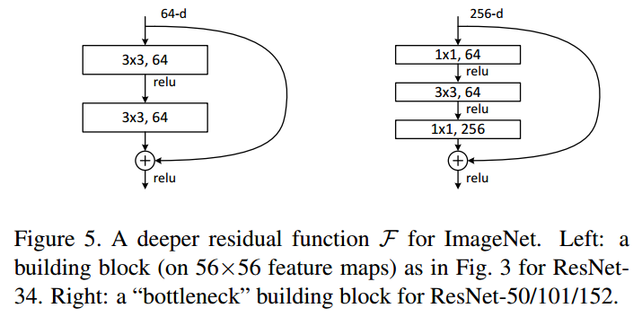

[English](./README.md) | 简体中文

# resnet152

- [resnet152](#resnet152)
  - [1. 简介](#1-简介)
  - [2. 模型下载](#2-模型下载)
  - [3. 部署测试](#3-部署测试)
  - [4. 量化实验](#4-量化实验)
    - [数据集准备](#数据集准备)
    - [校准数据处理](#校准数据处理)
    - [模型检查](#模型检查)
    - [模型编译](#模型编译)
    - [模型推理](#模型推理)

## 1. 简介

- **论文地址**: [Deep Residual Learning for Image Recognition](http://arxiv.org/abs/2307.09283)

- **Github 仓库**: [vision/resnet.py at main · pytorch/vision (github.com)](https://github.com/pytorch/vision/blob/main/torchvision/models/resnet.py)


`ResNet`是由微软研究院的何恺明、张祥雨、任少卿、孙剑等人提出的，并在`2015`年的ILSVRC（ImageNet Large Scale Visual Recognition Challenge）中取得了冠军，在top5上的错误率为3.57%，同时参数量比VGGNet低，效果非常突出，是卷积神经网络图像史上的一件里程碑事件。作者何凯明也因此摘得`CVPR2016`最佳论文奖。

`ResNet`的主要贡献是发现了**退化现象（Degradation）**，并针对退化现象使用**快捷连接（Shortcut connection）**，极大的消除了深度过大的神经网络训练困难问题，并使**神经网络的“深度”首次突破了100层、最大的神经网络甚至超过了1000层**。`ResNet`的结构可以**极快的加速神经网络的训练**，模型的准确率也有比较大的提升。同时`ResNet`的推广性非常好，甚至可以直接用到`InceptionNet`网络中。

`ResNet` 网络是参考了 `VGG19` 网络，在其基础上进行了修改，并通过快捷连接加入了残差单元。变化主要体现在 `ResNet` 直接使用步长=2的卷积做下采样，并且用全局平均池化层替换了全连接层。`ResNet` 的一个重要设计原则是：**当特征映射大小降低一半时，特征映射的数量增加一倍，这保持了网络层的复杂度**。从图中可以看到，`ResNet` 相比普通网络每两层间增加了短路机制，这就形成了残差学习，其中虚线表示特征映射数量发生了改变。图展示的34层的ResNet，还可以构建更深的网络如表所示。从表中可以看到，对于18层和34层的 `ResNet` ,其进行的两层间的残差学习，当网络更深时，其进行的是三层间的残差学习，三层卷积核分别是 `1x1` 、`3x3` 和 `1x1` ，一个值得注意的是隐含层的特征映射数量是比较小的，并且是输出特征映射数量的1/4。




ResNet152是ResNet系列中一个非常深的版本，它包含152个卷积层（不包括快捷连接）。与18层和34层的ResNet不同，ResNet152使用了瓶颈（Bottleneck）结构作为残差块。瓶颈结构由三个卷积层组成：一个1x1卷积用于降维，一个3x3卷积进行主要的特征提取，以及一个1x1卷积用于升维，恢复到原始维度。这种结构可以减少参数数量和计算量，使得网络可以构建得更深。


**ResNet 模型特点**：

- 残差结构人为构造了恒等映射，就能让整个结构朝着恒等映射的方向去收敛，确保最终的错误率不会因为深度的变大而越来越大 
- ResNet的动机在于解决“退化”问题，残差块的设计让学习恒等映射变得容易，即使堆叠了过量的block，ResNet可以让冗余的block学习成恒等映射，性能也不会下降。 
- 网络的“实际深度”是在训练过程中决定的，即ResNet具有某种深度自适应的能力
- ResNet152等更深的网络采用瓶颈（Bottleneck）残差块，通过1x1卷积降维和升维，有效减少了计算量和参数数量，使得构建更深层网络成为可能。

## 2. 模型下载

**.hbm 文件下载**：

可以使用脚本 [download.sh](./model/download.sh) 一键下载此模型结构的 .hbm 模型文件，方便直接更换模型。或者使用以下命令行进行下载：

```shell
wget https://archive.d-robotics.cc/downloads/rdk_model_zoo/rdk_s100/ResNet/resnet152_224x224_nv12.hbm
```

**ONNX文件**：

ONNX文件可在此网址获取：https://docs.pytorch.org/vision/main/models/generated/torchvision.models.resnet152.html

或直接下载：
```bash
wget https://archive.d-robotics.cc/downloads/rdk_model_zoo/rdk_s100/ResNet/resnet152.onnx
```

## 3. 部署测试

在下载完毕 .hbm 文件后，可以执行 'test_resnet152.ipynb' 或 python 文件夹中的 's100_inference.py' ，在板端实际运行体验实际测试效果。

若需要更改测试图片，可额外下载数据集后，放入到data文件夹下并更改 jupyter 文件或 python脚本 中图片的路径


* 部署性能测试：
```shell
hrt_model_exec perf --model_file ./model/resnet152_224x224_nv12.hbm \
                   --core_id=0 \
                   --frame_count=200 \
                   --perf_time=0 \
                   --thread_num=1
```
thread_num = 1
```
Running condition:
- Thread number is: 1
- Frame count is: 200
Perf result:
- Frame totally latency is: 426.180 ms
- Average latency is: 2.131 ms
- Frame rate is: 463.021 FPS
```
thread_num = 3
```
Running condition:
- Thread number is: 3
- Frame count is: 200
Perf result:
- Frame totally latency is: 1100.839 ms
- Average latency is: 5.504 ms
- Frame rate is: 539.012 FPS
```


## 4. 量化实验

### 数据集准备

模型使用的数据集为 [ImageNet](https://image-net.org/)
* 数据集：ILSVRC2012

| 数据集名称 | 分类数量 | 图片数量 |
| -- | -- | -- |
| ILSVRC2012训练集 | 1000个分类 | 约120万张图片 |
| ILSVRC2012验证集 | 1000个分类 | 5万张图片 |
| ILSVRC2012测试集 | 1000个分类 | 10万张图片 |

我们建议您将下载的数据集解压成如下结构

```shell
imagenet/ 
 ├── calibration_data 
 │   ├── ILSVRC2012_val_00000001.JPEG 
 │   ├── ... 
 │   └── ILSVRC2012_val_00000100.JPEG 
 ├── ILSVRC2017_val.txt 
 ├── val 
 │   ├── ILSVRC2012_val_00000001.JPEG 
 │   ├── ... 
 │   └── ILSVRC2012_val_00050000.JPEG 
 └── val.txt
```

### 校准数据处理

准备好数量为100的校准数据集后，运行以下命令生成校准数据，校准数据保存在 /calibration_data_rgb 目录下:

```shell
python3 python/get_calibration_data.py
```

### 模型检查

在准备好onnx模型后，可以通过以下命令快速完成模型验证：

```shell
hb_compile --model resnet152.onnx --march nash-e
```

### 模型编译

模型验证通过后可以通过校准数据集进行模型量化编译，参考 yaml 文件已提供在 yaml 文件夹中，运行以下命令：

```shell
hb_compile --config yaml/resnet152_config.yaml
```

完成模型编译后可在 model_output 目录下发现编译产物，需要上板使用的为 resnet152_224x224_nv12.hbm 

* 模型量化后余弦相似度

```shell
 +------------+-------------------+------------------+
 | TensorName | Calibrated Cosine | Quantized Cosine |
 +------------+-------------------+------------------+
 | output     | 0.994397          | 0.992285         |
 +------------+-------------------+------------------+
```

* 工具链给出的性能参考

```bash
Summary:
FPS (1 core): 449.03
latency: 2.23 ms
BPU conv original OPs per run: 22,564,831,232
```

### 模型推理

在 python 目录下提供了在 X86 平台和 S100 平台快速进行推理的 demo， 其中：
* [x86_inference.py](python/x86_inference.py) 支持 ONNX , HBIR(.bc) 和 HBM 格式在 X86 平台的推理。
* [s100_inference.py](python/s100_inference.py) 支持 HBM 格式在板端使用新的 HB_HBMRuntime API 进行推理。

x86_inference.py 需要通过 -m , -i 传入模型路径和图像路径，示例
```shell
python3 python/x86_inference.py -m model_output/resnet152_224x224_nv12_quantized_model.bc -i data/zebra_cls.jpg
```
