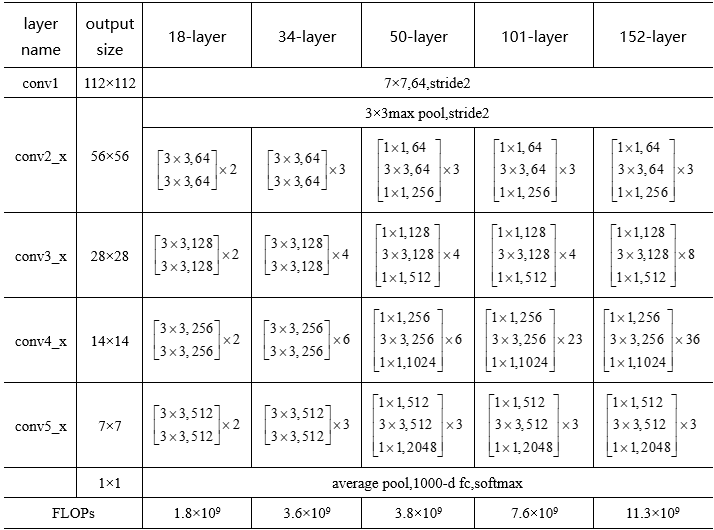
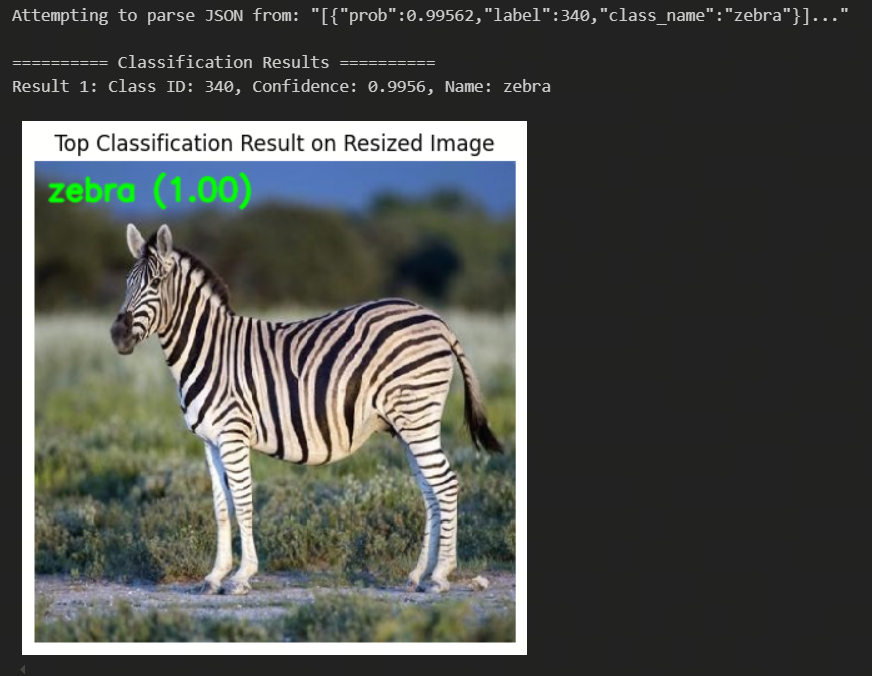

English | [简体中文](./README_cn.md)

# ResNet50

- [ResNet50](#resnet50)
  - [1. Introduction](#1-introduction)
  - [2. Model Download](#2-model-download)
  - [3. Deployment \& Testing](#3-deployment--testing)

## 1. Introduction

- **Paper**: [Deep Residual Learning for Image Recognition](http://arxiv.org/abs/2307.09283)

- **GitHub repository**: [vision/resnet.py at main · pytorch/vision (github.com)](https://github.com/pytorch/vision/blob/main/torchvision/models/resnet.py)

ResNet was proposed by Kaiming He, Xiangyu Zhang, Shaoqing Ren, and Jian Sun from Microsoft Research. It won the ILSVRC (ImageNet Large Scale Visual Recognition Challenge) in 2015, achieving a top-5 error rate of 3.57% with fewer parameters than VGGNet. Its outstanding performance marked a milestone in the history of convolutional neural networks. Kaiming He also received the CVPR2016 Best Paper Award for this work.

The main contribution of "ResNet" is the identification of the degradation phenomenon and the use of shortcut connections to address it. This greatly reduces the difficulty of training very deep neural networks, allowing network depth to exceed 100 layers for the first time, with some models even surpassing 1000 layers. The ResNet architecture accelerates training and significantly improves model accuracy. It also generalizes well and can be directly applied to other architectures such as InceptionNet.

ResNet modifies the VGG19 network by adding residual units via shortcut connections. Key changes include using stride-2 convolutions for downsampling and replacing the fully connected layer with a global average pooling layer. An important design principle is that when the feature map size is halved, the number of feature maps is doubled, maintaining network complexity. As shown in the figure, ResNet introduces shortcut connections between every two layers, forming residual learning. The dashed lines indicate changes in the number of feature maps. The 34-layer ResNet shown can be extended to deeper networks. For 18-layer and 34-layer ResNet, residual learning occurs between two layers; for deeper networks, it occurs between three layers with 1x1, 3x3, and 1x1 convolutions. Notably, the number of hidden layer feature maps is relatively small, at 1/4 of the output feature map count.

ResNet50 is a widely used version in the ResNet family, featuring 50 convolutional layers (excluding shortcut connections). Unlike the 18-layer and 34-layer versions, ResNet50 adopts a bottleneck structure for its residual blocks. Each bottleneck block consists of three convolutional layers: a 1x1 convolution for dimensionality reduction, a 3x3 convolution for main feature extraction, and another 1x1 convolution for restoring the original dimensions. This design reduces the number of parameters and computational cost, enabling the construction of deeper networks.




**ResNet model features**:

- The residual structure constructs an identity mapping, ensuring that the final error rate does not increase as depth increases.
- ResNet is designed to solve the degradation problem. The residual blocks make it easy to learn identity mappings, so stacking more blocks does not degrade performance.
- The effective depth of the network is determined during training, giving ResNet a degree of deep self-adaptation.
- Deeper networks like ResNet50 use bottleneck residual blocks, which employ 1x1 convolutions for dimensionality reduction and restoration. This design effectively reduces computational cost and the number of parameters, making it possible to build much deeper networks.

## 2. Model Download

**.hbm file download**:

You can use the [download.sh](./model/download.sh) script to download the .hbm model file for this structure with one command, or use the following command line:

```shell
wget https://archive.d-robotics.cc/downloads/rdk_model_zoo/rdk_s100/ResNet/resnet50_224x224_nv12.hbm
```

This model is the result of quantization using Horizon's reference algorithm.

Model conversion uses the ONNX model: https://pytorch.org/vision/main/models/generated/torchvision.models.resnet50.html

For quantization and conversion steps for resnet50, refer to the conversion steps for other ResNet models or use the OE SDK samples at samples/ai_toolchain/horizon_model_convert_sample/03_classification/13_resnet50.

## 3. Deployment & Testing

After downloading the .hbm file, you can run the `test_resnet50.ipynb` Jupyter notebook or `s100_inference.py` script on the board to test the model. 

To change the test image, download your dataset, place it in the `data` folder, and update the image path in the notebook or script.

