# Vision Transformer
English | [简体中文](./README_cn.md)
## Quick Start

```bash
# Make Sure your are in this file
$ cd samples/Vision/ViT

# Check your workspace
$ tree -L 2
.
|-- README.md     # English Document
|-- README_cn.md  # Chinese Document
|-- py
|   `-- Vit_YUV420SP.py      # Quick Start
|-- cpp
|   |   |-- CMakeLists.txt # infer C++ CmakeList
|   |   |-- main.cc # Quick Start C++
|   |   `-- eval.cc # Quick Eval C++
`-- source
|   |-- imgs
|   |-- reference_hbm_models    # Reference HBM Models
|   |-- reference_logs          # Reference logs
|   `-- reference_yamls         # Reference yaml configs
```
### Python Inference Experience
Before using, please refer to the README in reference_hbm_models to download the corresponding model to the folder. After ensuring the model exists, run the following commands:
```bash
cd rdk_model_zoo_s/samples/Vision/ViT/py
python3 Vit_YUV420SP.py
```

### C++ UCP Inference Experience

Before using, please refer to the README in reference_hbm_models to download the corresponding model to the folder. After ensuring the model exists, run the following commands:

```bash
cd rdk_model_zoo_s/samples/Vision/ViT/cpp
mkdir build && cd build
cmake .. && make
./main
```

To test your own model, please modify the following macro definitions in the main code and recompile:

```c++
#define MODEL_PATH //Model Path
#define TEST_IMG_PATH //Test Image Path
#define CLASSES_NUM //Class Number
std::vector<std::string> object_names //Class label
```

To perform board-side accuracy evaluation on your CIFAR model, use eval and modify the following macro definitions, then recompile and run. Ensure the test dataset file format is as follows (for custom dataset accuracy evaluation, please modify the file loading section):

```bash
# Check your Eval
$ tree -L 2
.
├── eval_img
│   ├── airplane
│   ├── automobile
│   ├── bird
│   ├── cat
│   ├── deer
│   ├── dog
│   ├── frog
│   ├── horse
│   ├── ship
│   └── truck
├── readme_img
└── test_img
```

```c++

#define MODEL_PATH //Model Path
#define TEST_IMGS_FOLDER //Test Fold Path
#define CLASSES_NUM //Class Number
#define TEST_SAMPLES_PER_CLASS //Number of test samples per class
#define TOTAL_TEST_SAMPLES //Total number of test samples
std::vector<std::string> object_names //Class label
```

## BenchMark - Accuracy

| Model | Top-1 | Top-5 |
| :---: | :---: | :---: |
| ONNX  |74.54% | 98.36%      |
| HBM   |72.62% | 98.03%|

### Accuracy Test Instructions

1. BPU models experience accuracy degradation when quantizing NCHW-RGB888 inputs to YUV420SP(nv12) format due to color space conversion. This degradation can be mitigated by incorporating color space conversion loss during training. 
2. Subtle accuracy discrepancies exist between Python and C/C++ interfaces, primarily stemming from different floating-point handling during memcpy operations and data structure conversions.
3. This benchmark uses PTQ (Post-Training Quantization) with 50 calibration images, representing typical first-time compilation scenarios for developers. No accuracy optimization or QAT (Quantization-Aware Training) was applied, meeting standard validation requirements but not representing peak performance.

## Algorithm Theory and End-to-End Pipeline: Training, Export, Quantization & Compilation

> Author：SkyXZ
>
> Develop Environment：Ubuntu22.04(192x CPU 8x NVIDIA GeForce RTX 4090)、D-Robotics-OE 3.2.0、Ubuntu22.04 GPU Docker
>
> Board Environment：RDKS100-RDK OS 4.0.2-Beta

- ViT Paper：[An Image is Worth 16x16 Words: Transformers for Image Recognition at Scale](https://arxiv.org/pdf/2010.11929)

&nbsp;&nbsp;&nbsp;&nbsp;&nbsp;&nbsp;&nbsp;&nbsp;Recently, embodied intelligence has gained significant momentum, with VLM, VLA, and VLN emerging rapidly. As one of the most fundamental building blocks of these architectures, Transformer has become the de facto standard for constructing multimodal intelligent systems, thanks to its powerful modeling capabilities, excellent scalability, and unified architectural design. From the initial success of BERT and GPT in NLP to the extension of ViT, CLIP, RT-1, and other models in vision and control domains, Transformer has established a bridge unifying language, vision, and even action spaces.

&nbsp;&nbsp;&nbsp;&nbsp;&nbsp;&nbsp;&nbsp;&nbsp; **Since Transformer has become the infrastructure of embodied intelligence, as an engineer aspiring to work in robotics and future technologies, I naturally need to master it.** Therefore, I decided to start with the most classic and fundamental Vision Transformer (ViT), step by step from first principles, hand-implement it with PyTorch, and document this learning journey and insights as the content of this blog post. If you're also interested in Transformer applications in computer vision or getting started with embodied intelligence, I hope this article will be helpful!

PS：💻 Complete project code is available on Github: [ViT_PyTorch](https://github.com/xiongqi123123/ViT_PyTorch.git). Questions, suggestions, or error reports are welcome in the comments - let's collaborate and improve together!

### ONE. Architecture Design: A Paper-Based Approach

&nbsp;&nbsp;&nbsp;&nbsp;&nbsp;&nbsp;&nbsp;&nbsp;Before formally starting the reproduction, let's begin from the source and read the original Vision Transformer paper: "An Image is Worth 16x16 Words: Transformers for Image Recognition at Scale"[[arXiv:2010.11929](https://arxiv.org/abs/2010.11929)]。This is a landmark paper proposed by Google Research in 2020, which first demonstrated that pure Transformer architecture can achieve excellent performance in image classification tasks without relying on any convolutional modules.

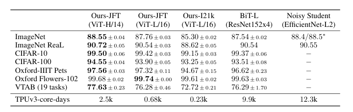

&nbsp;&nbsp;&nbsp;&nbsp;&nbsp;&nbsp;&nbsp;&nbsp;Transformer originally designed to solve natural language processing tasks, its initial purpose was to model long-range dependencies in sequential data. In the NLP domain, Transformer can flexibly capture global relationships between words through self-attention mechanisms, greatly enhancing language understanding and generation capabilities. Google's research team proposed a bold and elegant idea: if we can cut images into small pieces (Patches) and treat each Patch as a 'word', can we also transform images into sequences, thus enabling Transformer to process visual information? The proposed ViT does exactly this: it divides an image into fixed-size patches (such as 16×16), flattens each patch into a vector, and then maps it to a unified dimensional space through a linear projection layer, ultimately forming a token sequence. Subsequently, ViT adds a learnable [CLS] token to the front of this token sequence and superimposes positional encoding to preserve spatial position information in the image. The entire sequence is like a piece of text, sent to multi-layer standard Transformer encoder structures for processing, and finally completes the classification task of the entire image through the output of the CLS token. This method does not rely on any convolutional operations, is completely based on sequence modeling, and demonstrates the enormous potential of Transformer in image modeling.


&nbsp;&nbsp;&nbsp;&nbsp;&nbsp;&nbsp;&nbsp;&nbsp;The ViT architecture is shown in the figure above. Similar to conventional classification networks, the entire Vision Transformer can be divided into two parts: one is the feature extraction part, and the other is the classification part. The feature extraction part is its most core component, including Patch Embedding, Positional Encoding, and Transformer Encoder. The classification part follows immediately after feature extraction, using a learnable [CLS] token to represent the global semantics of the entire image. This token will participate in the Transformer encoding process along with other tokens, and finally be sent to a simple MLP classification head for category prediction. Next, we will explain the ViT network architecture step by step according to the following divisions:

- **Patch Embedding**

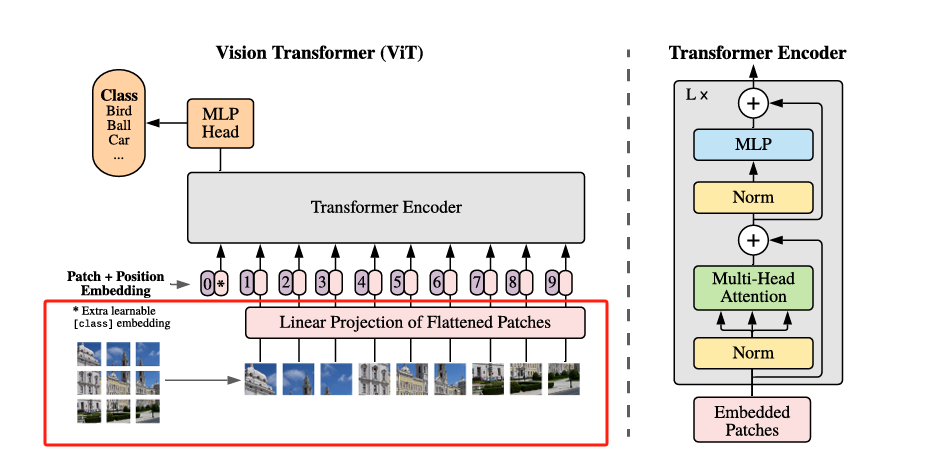

&nbsp;&nbsp;&nbsp;&nbsp;&nbsp;&nbsp;&nbsp;&nbsp;The first step of ViT is to transform the input image into a series of **visual tokens**. This process is called **Patch Embedding**. A Patch refers to a small segmented image region. Its core idea is very straightforward:

> Divide a two-dimensional image into several small blocks (Patches) of fixed size (e.g., 16×16), then flatten each Patch into a vector, and map it to a specified dimensional space (e.g., 768 dimensions) through a linear layer, thereby obtaining a set of input tokens for Transformer to use.

&nbsp;&nbsp;&nbsp;&nbsp;&nbsp;&nbsp;&nbsp;&nbsp;This processing method essentially simulates the process of "encoding each word as a vector" in NLP—except that the "words" here are image patches, not text. Assuming the input image size is `224×224×3` and the Patch size is `16×16`, an image will be divided into $(224/16)^2=14×14=196$ patches, and each Patch will be flattened into a $16 × 16 × 3 = 768$ dimensional vector. After flattening into a vector, it is mapped to the model's embedding space through a `Linear` layer (manually set, ViT-Base is 768 dimensions, ViT-Large is 1024, ViT-Huge is 1280, typically using 768). Finally, we obtain a patch token sequence with shape: `[batch_size, 196, embed_dim]`. How do we segment the image to implement Patch Embedding? At this point, we can think of convolution. Since convolution uses the sliding window concept, we only need to set the convolution kernel and stride equal to the Patch-Size. This way, the feature extraction process of two image regions will not overlap. When our input image is `[224, 224, 3]`, we can obtain a feature layer of `[14, 14, 768]`.

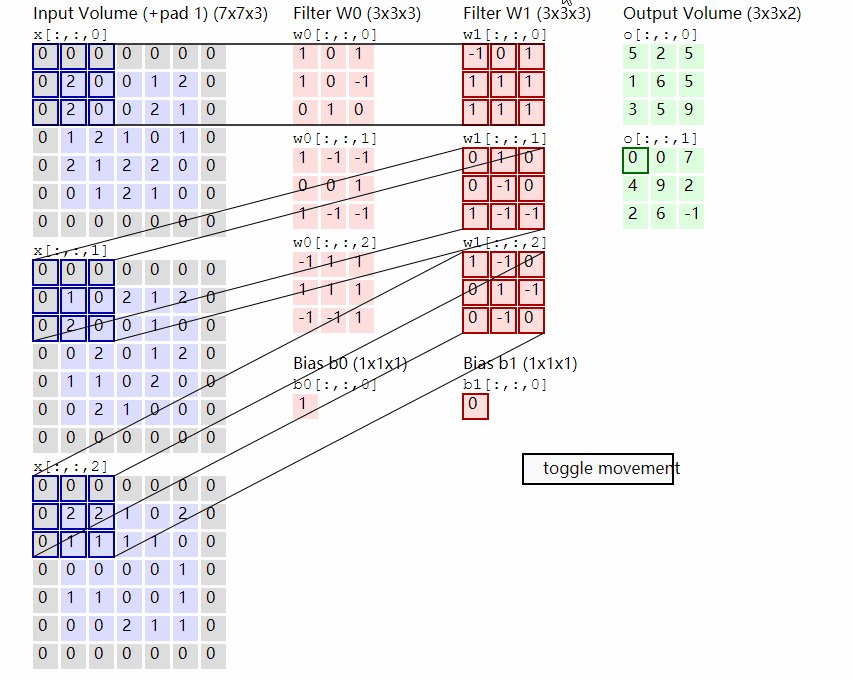

&nbsp;&nbsp;&nbsp;&nbsp;&nbsp;&nbsp;&nbsp;&nbsp;And after obtaining the feature information, we need to combine the obtained feature information into a sequence. The combination method is very simple. We only need to flatten the feature map (Flatten) and transpose it into a standard sequence format to obtain the final Patch Token sequence, which is used as input for the Transformer. We obtained a feature layer of `[14, 14, 768]` after segmenting the image above, and we will get a **feature layer of `[196, 768]`** after **flattening the height and width dimensions** of this feature map, so Patch Embedding is completed!

- **cls_token + Position Embedding**

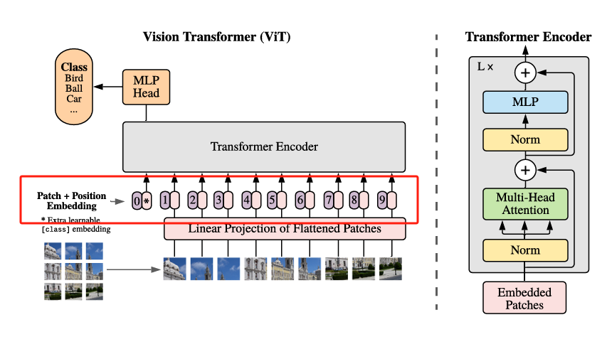

&nbsp;&nbsp;&nbsp;&nbsp;&nbsp;&nbsp;&nbsp;&nbsp;After completing Patch Embedding to obtain a Patch Token sequence of the form `[batch_size, 196, 768]`, the next two key things we need to do are:

1. Add `[CLS] Token` —— the "global summary" entry of the image

   &nbsp;&nbsp;&nbsp;&nbsp;&nbsp;&nbsp;&nbsp;&nbsp;When Transformer was originally used to process text tasks, it would add a special `[CLS]` Token to the front of the sequence, which was used to aggregate the semantic information of the entire sentence. Similarly, in ViT, a `[CLS]` Token is introduced, which does not represent a specific Patch, but as a global representative Token, it "participates" in the information interaction of each layer in the Transformer, and finally used to extract the global features of the entire image. As shown in the figure above, the position marked as `0*` is the `[CLS]` Token, its initial value is a learnable parameter vector, with the same dimension as the Patch Token (e.g., 768), after Transformer encoding, ViT will **use the output vector of this `[CLS]` Token as the input of the image classification result** into the MLP Head, completing the final classification.

   &nbsp;&nbsp;&nbsp;&nbsp;&nbsp;&nbsp;&nbsp;&nbsp;After adding the `[CLS]` Token, the original `196` Patch Token sequence becomes `197` Tokens, and the shape becomes: `[batch_size, 196 + 1, 768]`

2. Add positional encoding (Positional Embedding) —— helping the model understand "position in the image"

   &nbsp;&nbsp;&nbsp;&nbsp;&nbsp;&nbsp;&nbsp;&nbsp;Since Transformer is built entirely based on self-attention mechanisms, it does not have the natural **position information modeling ability** of convolutional networks. So we still need to add a **positional encoding** to each Token to tell the model which area of the image this Token comes from. ViT adopts an **learnable absolute positional encoding**, which is to initialize a learnable positional vector for each position (including the `[CLS]` Token) and add it to the original Token, so that the model can learn the spatial order and semantic relationship by itself.

   &nbsp;&nbsp;&nbsp;&nbsp;&nbsp;&nbsp;&nbsp;&nbsp;The shape of positional encoding is consistent with the input sequence, also `[1, 196 + 1, 768]`, and the way positional encoding is added is very simple: `tokens = tokens + pos_embed  # [B, 197, 768]`, after these two steps, ViT's input is finally ready to be sent into the Transformer encoder for multi-layer feature interaction and modeling, so cls_token + Position Embedding is completed!


- **Multi-head Attention + LayerNorm + MLP + Residual**

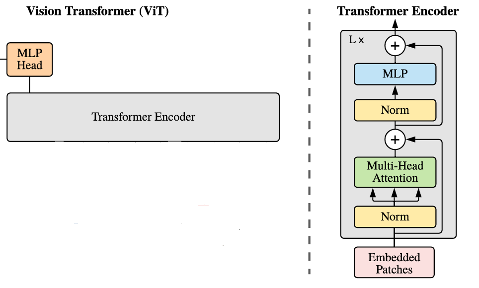

&nbsp;&nbsp;&nbsp;&nbsp;&nbsp;&nbsp;&nbsp;&nbsp;When we have obtained the complete Patch sequence with `[CLS]` Token and positional encoding (shape `[B, 197, 768]`), ViT will send it into a series of standard **Transformer Encoder Blocks** for deep modeling. Each Block's design is consistent with the original NLP Transformer's Encoder, and its structure is very classic, consisting of two sub-modules:

1. **LayerNorm + Multi-Head Self-Attention Mechanism**

   &nbsp;&nbsp;&nbsp;&nbsp;&nbsp;&nbsp;&nbsp;&nbsp;In this sub-module, we first normalize the input, then send it into the Multi-Head Self-Attention module. The self-attention here is to establish **global relationships** between all Tokens, so that each Token can obtain information from other areas. This is the soul of Transformer, its specific implementation is to let each Token match its Query with all other Tokens' Key to calculate its attention weight to other positions, thereby extracting the most useful information for the current task. Represented by formulas and pictures as follows:

$$
\text{Attention}(Q, K, V) = \text{Softmax}\left( \frac{QK^\top}{\sqrt{d_k}} \right) V
$$


&nbsp;&nbsp;&nbsp;&nbsp;&nbsp;&nbsp;&nbsp;&nbsp;For beginners, this part may seem abstract, but if we break it down step by step, it is very intuitive. In the multi-head self-attention mechanism, each input **Token** (image Patch) will be mapped out three vectors, namely: **Query (Query vector), Key (Key vector), Value (Value vector)**. Using a simple and clear metaphor to understand: Suppose you are attending a meeting (attention mechanism), you are the Query, and each participant in the meeting room (including yourself) is a Key, while they all hold a document (Value). You will decide how much to refer to their documents (Value) based on the "similarity" of your Key to theirs —— this is the calculation of attention weights. Let the current input sequence be a matrix $X \in \mathbb{R}^{n \times d}$, where $n$ is the sequence length (e.g., 197 Tokens in ViT), and $d$ is the dimension of each Token (e.g., 768). We transform it using three sets of learnable parameter matrices:
$$
[
Q = XW^Q,\quad K = XW^K,\quad V = XW^V
]
$$
&nbsp;&nbsp;&nbsp;&nbsp;&nbsp;&nbsp;&nbsp;&nbsp;Then calculate the attention score (Score):
$$
[
\text{Score} = \frac{QK^\top}{\sqrt{d_k}}
]
$$
&nbsp;&nbsp;&nbsp;&nbsp;&nbsp;&nbsp;&nbsp;&nbsp;Then use Softmax to normalize the scores to get attention weights $\alpha$:
$$
[
\alpha = \text{Softmax}\left( \frac{QK^\top}{\sqrt{d_k}} \right)
]
$$
&nbsp;&nbsp;&nbsp;&nbsp;&nbsp;&nbsp;&nbsp;&nbsp;Finally, weighted combination of all Value vectors to obtain the new output representation:
$$
[
\text{Attention}(Q, K, V) = \alpha V
]
$$

&nbsp;&nbsp;&nbsp;&nbsp;&nbsp;&nbsp;&nbsp;&nbsp;**This calculation process in human language is that** we assume there are three inputs `input-1`, `input-2`, `input-3` and three corresponding outputs `output-1`, `output-2`, `output-3`, and each input has its own QKV vectors

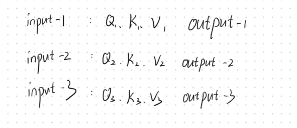

&nbsp;&nbsp;&nbsp;&nbsp;&nbsp;&nbsp;&nbsp;&nbsp;If we require `output-1`, we first multiply the Q query vector of `input-1` with the K key vectors of the three inputs to get the corresponding scores, which represent the "attention degree" of `input-1` to the other three inputs; then we take these three scores and apply `softmax` once to make them into probabilities between 0 and 1, and add them up to 1, this process can be understood as: **distributing attention**, telling us "who to pay attention to and how much". Finally, using the three attention weights obtained earlier, weight the corresponding **Value vectors V** respectively, and then add them together to get the final `output-1`

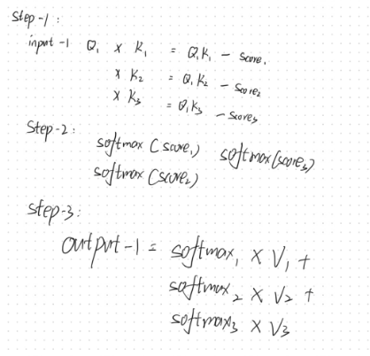

&nbsp;&nbsp;&nbsp;&nbsp;&nbsp;&nbsp;&nbsp;&nbsp;That is: output = sum of "values" of all concerned objects × weighted sum of "attention degree" to them. Each Query will weight the corresponding Value based on the similarity to all Keys, and then sum up to get the final output. This way, all Tokens can exchange information, thus capturing **global contextual dependencies**; therefore, although the output is still a new sequence with the same number of original Tokens, each Token's representation has integrated global information.

2. **LayerNorm + MLP **

   &nbsp;&nbsp;&nbsp;&nbsp;&nbsp;&nbsp;&nbsp;&nbsp;In each Transformer Block, in addition to the attention mechanism, there is also a very important part, which is the **Feed Forward Network (Feed Forward Network, FFN)**, also often referred to as the **MLP sub-module**. This sub-module's structure is actually very simple, it's just two fully connected layers (Linear), with an intermediate non-linear activation function (e.g., GELU):
   $$
   FFN(x)=Linear 
   2
   ​
    (GELU(Linear 
   1
   ​
    (x)))
   $$
   &nbsp;&nbsp;&nbsp;&nbsp;&nbsp;&nbsp;&nbsp;&nbsp;The Linear layer here is the familiar fully connected layer, the dimension change is usually like this: first, the first Linear layer will map the input dimension from `d_model` (e.g., 768) to a higher dimension (e.g., 3072), then introduce non-linearity through the GELU activation function, and finally use a Linear layer to reduce the dimension back to the original `d_model`. This FFN structure can be understood as performing a deeper feature transformation independently for each Token. Unlike the cross-Token information interaction in the multi-head self-attention mechanism, the processing of the feedforward neural network is **point-to-point non-linear transformation** by Token, mainly used to enhance the model's expression ability. The introduction of residual connections can form a **short-circuit path (Shortcut Path)** within each Transformer Block, which can effectively alleviate the gradient disappearance problem in deep networks: instead of directly learning a mapping function $F(x)$, it is better for the network to learn $F(x) = H(x) - x$, that is, let the model focus on "the difference between input and output", which is actually easier to optimize. Therefore, the complete calculation process is as follows:
   $$
   y=x+FFN(LayerNorm(x))
   $$


&nbsp;&nbsp;&nbsp;&nbsp;&nbsp;&nbsp;&nbsp;&nbsp;Thus, the core structure of ViT is finally completed. From Patch Embedding to `[CLS]` Token and positional encoding, to the depth of multi-layer Transformer encoder, ViT fully ported the structure of the language model to the visual domain and achieved breakthrough performance. Transformer Block is the "modeling brain" of ViT, and is also the foundation of its universality and powerful performance.


- **Classification Head**

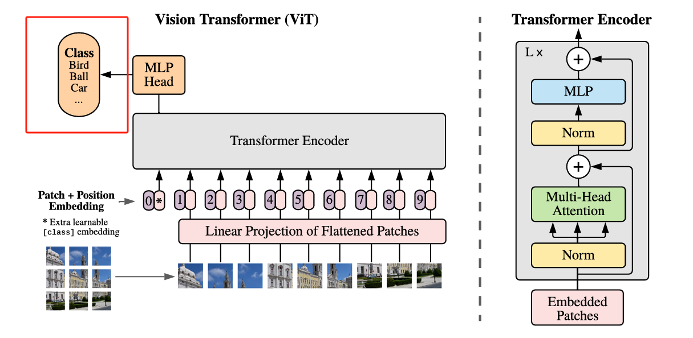

&nbsp;&nbsp;&nbsp;&nbsp;&nbsp;&nbsp;&nbsp;&nbsp;After multiple Transformer Block deep feature extraction, we obtain a new sequence representation, whose shape is `[B, 197, 768]` (assuming we use the ViT-Base model), where the first position Token is still the `[CLS]` Token we added at the beginning. This `[CLS]` Token can be regarded as the global semantic representation of the entire image, because in multiple rounds of attention interaction, it has "integrated" all the information of the Patches. Therefore, we only need to take out the vector at this position (i.e., the first Token) from the sequence and send it into a fully connected layer (Linear) to complete the classification task.


### TWO. Practical Implementation of PyTorch Version ViT Network Architecture

### Module 1. PatchEmbedding Class

&nbsp;&nbsp;&nbsp;&nbsp;&nbsp;&nbsp;&nbsp;&nbsp;`PatchEmbedding` is the most critical step in ViT, where we use convolution to divide the input image into several non-overlapping small blocks (Patches), each Patch is encoded as a vector, and we implement the division using equal stride convolution and then send it to the Transformer module for subsequent processing.

```python
class VisionPatchEmbedding(nn.Module):
    def __init__(self, image_size, patch_size, in_channels, embed_dim, flatter=True):
        super().__init__()
        self.proj = nn.Conv2d(in_channels, embed_dim, patch_size, patch_size)
        self.norm = nn.LayerNorm(embed_dim)
        self.flatter = flatter

    def forward(self, x):
        x = self.proj(x)
        if self.flatter:
            x = x.flatten(2).transpose(1, 2)  # [B, C, H, W] -> [B, N, C]
        x = self.norm(x)
        return x
```

### Module 2. PositionEmbedding

&nbsp;&nbsp;&nbsp;&nbsp;&nbsp;&nbsp;&nbsp;&nbsp;Since ViT is not a CNN, it lacks a convolutional receptive field, so positional encoding (`pos_embed`) is needed to preserve position information. Each Patch's position information

```python
self.cls_token = nn.Parameter(torch.zeros(1, 1, num_features))
self.pos_embed = nn.Parameter(torch.zeros(1, num_patches + 1, num_features))
```

&nbsp;&nbsp;&nbsp;&nbsp;&nbsp;&nbsp;&nbsp;&nbsp;When ViT is pre-trained, it usually uses a fixed resolution (e.g., `224x224`), and the image is divided into `14x14` Patches (patch_size=16), the shape of the positional encoding `pos_embed` is `[1, 197, 768]` (197 = 1(cls_token) + 14x14), but due to the lack of receptive field in ViT, when the input resolution is different (e.g., `256x256`), the number of Patches becomes `16x16 = 256` (+1 cls_token = 257), the original positional encoding (197) cannot be used directly, so we need to adjust the `14x14` positional encoding to the grid size corresponding to the new resolution through bicubic interpolation, and the specific implementation is as follows:

```python
img_token_pos_embed = F.interpolate(
    img_token_pos_embed, size=self.features_shape, mode='bicubic', align_corners=False
)
pos_embed = torch.cat((cls_token_pos_embed, img_token_pos_embed), dim=1)
x = self.pos_drop(x + pos_embed)
```

### Module 3. Multi-head Attention and MLP

&nbsp;&nbsp;&nbsp;&nbsp;&nbsp;&nbsp;&nbsp;&nbsp;Then we implement the most critical multi-head attention mechanism in the Transformer, we define a class `SelfAttention` to implement the multi-head self-attention mechanism. In this module, we first generate Query (Q), Key (K), and Value (V) simultaneously using a linear layer, and then split the dimensions by the number of heads, and then calculate the dot product of Q and K and scale, and then use `softmax` to get the attention weights, use the weighted value (V) to get the final result, and finally concatenate the multi-head results and pass through a linear transformation and `dropout` to make the output have the same feature dimension as the input, completing the dynamic fusion and expression enhancement of information.

```python
class SelfAttention(nn.Module):
    def __init__(self, dim, num_heads, qkv_bias=False, attn_drop_rate=0.0, proj_drop_rate=0.0):
        super().__init__()
        self.num_heads = num_heads
        self.head_dim = dim // num_heads
        self.scale = self.head_dim ** -0.5

        self.qkv = nn.Linear(dim, dim * 3, bias=qkv_bias)
        self.attn_drop = nn.Dropout(attn_drop_rate)
        self.proj = nn.Linear(dim, dim)
        self.proj_drop = nn.Dropout(proj_drop_rate)

    def forward(self, x):
        B, N, C = x.shape
        qkv = self.qkv(x).reshape(B, N, 3, self.num_heads, C // self.num_heads).permute(2,0,3,1,4)
        q, k, v = qkv[0], qkv[1], qkv[2]

        attn = torch.matmul(q, k.transpose(-2, -1)) * self.scale
        attn = attn .softmax(dim=-1)
        attn = self.attn_drop(attn)

        x = torch.matmul(attn, v).transpose(1,2).reshape(B,N,C)
        x = self.proj(x)
        x = self.proj_drop(x)

        return x
```

&nbsp;&nbsp;&nbsp;&nbsp;&nbsp;&nbsp;&nbsp;&nbsp;In this `MLP` module, I designed a two-layer fully connected network. First, I mapped the input features to the hidden dimension through `fc1`, then passed through the activation function non-linear transformation, followed by dropout for regularization to prevent overfitting, then mapped through `fc2` to the output dimension, and finally used dropout again, this process is used to help the model capture more complex non-linear features and enhance expression ability.

```python
class MLP(nn.Module):
    def __init__(self, in_features, hidden_features, out_features, act_layer, drop_rate):
        super().__init__()
        out_features = out_features or in_features
        hidden_features = hidden_features or in_features
        drop_probs = (drop_rate, drop_rate)

        self.fc1 = nn.Linear(in_features, hidden_features)
        self.act = act_layer()
        self.drop1 = nn.Dropout(drop_probs[0])
        self.fc2 = nn.Linear(hidden_features, out_features)
        self.drop2 = nn.Dropout(drop_probs[1])

    def forward(self, x):
        x = self.fc1(x)
        x = self.act(x)
        x = self.drop1(x)
        x = self.fc2(x)
        x = self.drop2(x)
        return x
```

### Module 4. Encoder Layer Stacking

&nbsp;&nbsp;&nbsp;&nbsp;&nbsp;&nbsp;&nbsp;&nbsp;Since PyTorch does not have a ready-made `DropPath` function, we need to implement this usage ourselves, here we use DropPath to randomly drop the entire path to regularize the deep network, and skip the current module with a probability drop_path during training, and scale the remaining paths to maintain the expected value; in the Block class, I encapsulated the complete Transformer layer structure, including LayerNorm normalization, multi-head attention, MLP feedforward network, and residual connection, where the attention part uses my custom SelfAttention module, MLP adopts a structure design of expanding and compressing, both of which integrate DropPath mechanism

   &nbsp;&nbsp;&nbsp;&nbsp;&nbsp;&nbsp;&nbsp;&nbsp;A complete Transformer Block calculation process is as follows:

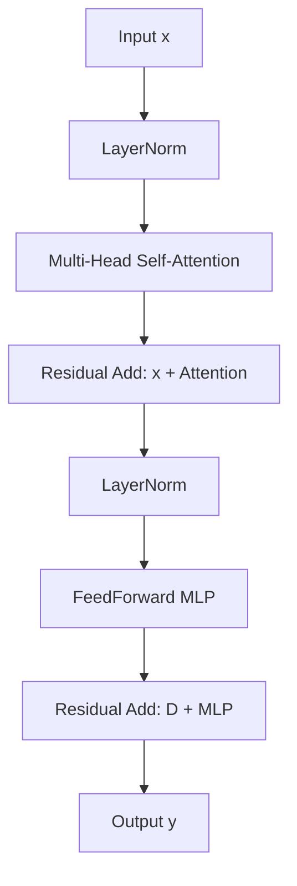

```python
class DropPath(nn.Module):
    def __init__(self, drop_prob=None):
        super(DropPath, self).__init__()
        self.drop_prob = drop_prob

    def drop_path(self, x, drop_prob, training):
        if drop_prob == 0. or not training:
            return x
        keep_prob       = 1 - drop_prob
        shape           = (x.shape[0],) + (1,) * (x.ndim - 1)
        random_tensor   = keep_prob + torch.rand(shape, dtype=x.dtype, device=x.device)
        random_tensor.floor_() 
        output          = x.div(keep_prob) * random_tensor
        return output

    def forward(self, x):
        return self.drop_path(x, self.drop_prob, self.training)
    
class Block(nn.Module):
    def __init__(self, dim, num_heads, mlp_radio, qkv_bias, drop, attn_drop, drop_path, act_layer, norm_layer):
        super().__init__()
        self.norm_1 = norm_layer(dim)
        self.attn = SelfAttention(dim, num_heads=num_heads, qkv_bias=qkv_bias, attn_drop_rate=attn_drop, proj_drop_rate=drop)
        self.norm_2 = norm_layer(dim)
        self.mlp = MLP(in_features=dim, hidden_features=int(dim * mlp_radio), out_features=None, act_layer=act_layer, drop_rate=drop_path)
        self.drop_path = DropPath(drop_path) if drop_path > 0.0 else nn.Identity() # Drop path

    def forward(self, x):
        x = x + self.drop_path(self.attn(self.norm_1(x)))
        x = x + self.drop_path(self.mlp(self.norm_2(x)))
        return x
```

### Module 5. ViT Complete Model Class

&nbsp;&nbsp;&nbsp;&nbsp;&nbsp;&nbsp;&nbsp;&nbsp;Finally, we implement our complete ViT—VisonTransformer, in this `VisonTransformer` class, I integrate all the modules I introduced earlier to implement the complete ViT network. First, I use convolution to cut the input image into fixed-size Patches and map it to the feature space; then, through the introduction of learnable classification tokens and positional encoding, provide position information to compensate for the "receptive field" missing problem of convolution. After that, I stack multiple Transformer encoder Blocks, each Block containing a multi-head self-attention mechanism and an MLP module, through residual connection and normalization to ensure effective information transmission and feature abstraction. Finally, I take the output of the classification token, map it to the target category through a linear layer, and complete the image classification task.

```python
class VisonTransformer(nn.Module):
    def __init__(self, input_shape, patch_size, in_channels, num_classes, num_features, depth,
                 num_heads, mlp_ratio, qkv_bias, drop_rate, attn_drop_rate, drop_path_rate,
                 norm_layer, act_layer):
        super().__init__()
        self.input_shape = input_shape # Input dimensions
        self.patch_size = patch_size # Patch size
        self.in_channels = in_channels # Input channels
        self.num_classes = num_classes # Number of output classes
        self.num_features = num_features # Feature dimensions
        self.depth = depth # Number of Transformer encoder layers
        self.num_heads = num_heads # Number of Transformer attention heads
        self.mlp_ratio = mlp_ratio # MLP ratio MLP: Multi-layer perceptron, following Self-Attention, used for non-linear transformation: enhancing model's expressive ability; feature mapping: further transforming features extracted by Self-Attention. 
        self.qkv_bias = qkv_bias # Whether to use bias
        self.drop_rate = drop_rate # Dropout rate
        self.attn_drop_rate = attn_drop_rate # Attention dropout rate
        self.drop_path_rate = drop_path_rate # Drop path rate
        self.norm_layer = norm_layer # Normalization layer
        self.act_layer = act_layer # Activation function layer

        self.features_shape = [input_shape[1] // patch_size, input_shape[2] // patch_size]  # [14, 14]
        self.num_patches = self.features_shape[0] * self.features_shape[1]
        self.patch_embed = VisionPatchEmbedding(input_shape, patch_size, in_channels, num_features) # Split input image into patches and perform linear mapping

        # ViT is not CNN, it has no "receptive field", so positional encoding is introduced to add position information to each patch;
        self.pretrained_features_shape = [224 // patch_size, 224 // patch_size] # Pre-trained feature map size

        self.cls_token = nn.Parameter(torch.zeros(1, 1, num_features)) # Classification token 196, 768 -> 197, 768
        self.pos_embed = nn.Parameter(torch.zeros(1, self.num_patches + 1, num_features)) # Positional encoding 197, 768 -> 197, 768

        self.pos_drop = nn.Dropout(drop_rate) # Dropout rate
        self.norm = norm_layer(self.num_features) # Normalization

        self.dpr = [x.item() for x in torch.linspace(0, drop_path_rate, depth)] # Drop path rate
        self.blocks = nn.Sequential(
            *[
                Block(
                    dim = num_features,
                    num_heads = num_heads,
                    mlp_radio = mlp_ratio,
                    qkv_bias = qkv_bias,
                    drop = drop_rate,
                    attn_drop = attn_drop_rate,
                    drop_path = self.dpr[i],
                    norm_layer = norm_layer,
                    act_layer = act_layer 
                )for i in range(depth)
            ]
        )
        self.head = nn.Linear(num_features, num_classes) if num_classes > 0 else nn.Identity()

    def forward_features(self,x):
        x = self.patch_embed(x)
        cls_token = self.cls_token.expand(x.shape[0], -1, -1) # Expand classification token to same shape as input feature map
        x = torch.cat((cls_token, x), dim=1) # Concatenate classification token with input feature map

        cls_token_pos_embed = self.pos_embed[:, 0:1, :] # Positional encoding for classification token
        img_token_pos_embed = self.pos_embed[:, 1:, :]  # [1, num_patches, num_features]
        # Change to [1, H, W, C]
        img_token_pos_embed = img_token_pos_embed.view(1, self.features_shape[0], self.features_shape[1], -1).permute(0, 3, 1, 2)  # [1, C, H, W]
        # Interpolation
        img_token_pos_embed = F.interpolate(
            img_token_pos_embed,
            size=self.features_shape,  # [H, W]
            mode='bicubic',
            align_corners=False
        )
        # Change back to [1, num_patches, C]
        img_token_pos_embed = img_token_pos_embed.permute(0, 2, 3, 1).reshape(1, -1, img_token_pos_embed.shape[1])

        pos_embed = torch.cat((cls_token_pos_embed, img_token_pos_embed), dim=1) # Concatenate positional encoding of classification token with image token positional encoding
        
        x = self.pos_drop(x + pos_embed) # Add positional encoding to input feature map

        x = self.blocks(x)
        x = self.norm(x)

        return x[:, 0] # Return classification token features
    
    def forward(self, x):
        x = self.forward_features(x)
        x = self.head(x)
        return x
```

<font color="red">**Thus, we have completed the complete ViT!**</font>

### Module 6. Implement Data Loading Code (Data Loading, Loss, Optimizer)

&nbsp;&nbsp;&nbsp;&nbsp;&nbsp;&nbsp;&nbsp;&nbsp;The dataset loading part is relatively simple, so I won't elaborate too much. My dataset structure and specific code are as follows:

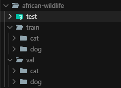

```python
import os 
from torch.utils.data import Dataset, DataLoader 
from PIL import Image 
import torchvision.transforms as transforms 

class ViTDataset(Dataset):
    def __init__(self, root, split, transform=None, target_transform=None, img_size=224):
        super().__init__()
        self.split = split 
        self.img_size = img_size  # Image size
        self.transform = transform if transform is not None else transforms.ToTensor()
        self.target_transform = target_transform  # Label transformation
        # Build dataset root directory
        self.data_dir = os.path.join(root, split)  # Training set or test set directory
        # Get all classes
        self.classes = sorted(os.listdir(self.data_dir))
        self.class_to_idx = {cls_name: i for i, cls_name in enumerate(self.classes)}
        # Collect all image file paths and corresponding labels
        self.images = []
        self.labels = []
        for class_name in self.classes:
            class_dir = os.path.join(self.data_dir, class_name)
            if not os.path.isdir(class_dir):
                continue
            for img_name in os.listdir(class_dir):
                if img_name.endswith(('.jpg', '.jpeg', '.png')):
                    img_path = os.path.join(class_dir, img_name)
                    self.images.append(img_path)
                    self.labels.append(self.class_to_idx[class_name])
        print(f"Loaded {len(self.images)} images for {split} set, with {len(self.classes)} classes in total")

    def __len__(self):
        return len(self.images)
    
    def __getitem__(self, index):
        # Get image path and label
        img_path = self.images[index]
        label = self.labels[index]
        # Load image
        image = Image.open(img_path).convert('RGB')
        # Resize image
        image = image.resize((self.img_size, self.img_size), Image.Resampling.BILINEAR)
        # Apply transformation
        image = self.transform(image)
        if self.target_transform is not None:
            label = self.target_transform(label)
            
        return image, label
    

def ViTDataLoad(root, batch_size, num_workers, img_size):
    # Create training dataset
    train_dataset = ViTDataset(
        root=root,
        split='train',  # Use training set split
        img_size=img_size
    )
    
    # Create validation dataset
    val_dataset = ViTDataset(
        root=root,
        split='val',  # Use validation set split
        img_size=img_size
    )
    
    # Create training data loader
    train_loader = DataLoader(
        train_dataset,
        batch_size=batch_size,
        shuffle=True,  # Randomly shuffle data
        num_workers=num_workers,  # Multi-threaded loading
        pin_memory=True,  # Pre-load data to fixed memory, accelerate GPU transfer
        drop_last=True  # Drop the last incomplete batch
    )
    
    # Create validation data loader
    val_loader = DataLoader(
        val_dataset,
        batch_size=batch_size,
        shuffle=False,  # Don't shuffle data
        num_workers=num_workers,
        pin_memory=True
    )
    
    return train_loader, val_loader
```

### Module 7. Implement Training Code

&nbsp;&nbsp;&nbsp;&nbsp;&nbsp;&nbsp;&nbsp;&nbsp;Next, let's complete our training code. I use the `ViTDataLoad` defined in the previous section to load training and validation datasets. During training, I adopt the commonly used cross-entropy loss function (`CrossEntropyLoss`) to measure classification performance, and use `AdamW` optimizer which is more suitable for Transformer. The specific implementation is as follows, without much elaboration:

```python
from model.transformer_net import VisonTransformer
from dataset_load import ViTDataLoad
import torch 
import torch.nn as nn
import torch.optim as optim
from tqdm import tqdm
import matplotlib.pyplot as plt

def train(
    root="/home/xq/Working/dockertrain_test/input/timmdataset/african-wildlife", # Dataset root directory
    img_size=224,
    patch_size=16,
    in_channels=3,
    num_features=768,
    depth=12,
    num_heads=12,
    mlp_ratio=4.0,
    qkv_bias=True,
    drop_rate=0.1,
    attn_drop_rate=0.1,
    drop_path_rate=0.1,
    epochs=50,
    batch_size=4,
    num_workers=4,
    lr=1e-4,
    device=None
):
    device = device or ("cuda" if torch.cuda.is_available() else "cpu")
    # Data loading
    train_loader, val_loader = ViTDataLoad(root, batch_size, num_workers, img_size)
    num_classes = len(train_loader.dataset.classes)
    input_shape = (in_channels, img_size, img_size)

    # Model
    model = VisonTransformer(
        input_shape=input_shape,
        patch_size=patch_size,
        in_channels=in_channels,
        num_classes=num_classes,
        num_features=num_features,
        depth=depth,
        num_heads=num_heads,
        mlp_ratio=mlp_ratio,
        qkv_bias=qkv_bias,
        drop_rate=drop_rate,
        attn_drop_rate=attn_drop_rate,
        drop_path_rate=drop_path_rate,
        norm_layer=nn.LayerNorm,
        act_layer=nn.GELU
    ).to(device)

    criterion = nn.CrossEntropyLoss()
    optimizer = optim.AdamW(model.parameters(), lr=lr)
    best_acc = 0
    train_loss_list, val_loss_list = [], []
    train_acc_list, val_acc_list = [], []

    for epoch in range(epochs):
        model.train()
        total_loss, correct, total = 0, 0, 0
        pbar = tqdm(train_loader, desc=f"Epoch {epoch+1}/{epochs}")
        for images, labels in pbar:
            images, labels = images.to(device), labels.to(device)
            optimizer.zero_grad()
            outputs = model(images)
            loss = criterion(outputs, labels)
            loss.backward()
            optimizer.step()
            total_loss += loss.item() * images.size(0)
            _, preds = outputs.max(1)
            correct += preds.eq(labels).sum().item()
            total += labels.size(0)
        train_loss = total_loss / total
        train_acc = correct / total
        train_loss_list.append(train_loss)
        train_acc_list.append(train_acc)

        # Validation
        model.eval()
        val_loss, val_correct, val_total = 0, 0, 0
        with torch.no_grad():
            for images, labels in val_loader:
                images, labels = images.to(device), labels.to(device)
                outputs = model(images)
                loss = criterion(outputs, labels)
                val_loss += loss.item() * images.size(0)
                _, preds = outputs.max(1)
                val_correct += preds.eq(labels).sum().item()
                val_total += labels.size(0)
        val_loss = val_loss / val_total
        val_acc = val_correct / val_total
        val_loss_list.append(val_loss)
        val_acc_list.append(val_acc)

        print(f"Epoch {epoch+1}: Train Loss={train_loss:.4f}, Train Acc={train_acc:.4f}, Val Loss={val_loss:.4f}, Val Acc={val_acc:.4f}")
        # Save best model
        if val_acc > best_acc:
            best_acc = val_acc
            torch.save(model.state_dict(), "best_vit.pth")

    # Visualize loss and accuracy
    plt.figure()
    plt.plot(train_loss_list, label="Train Loss")
    plt.plot(val_loss_list, label="Val Loss")
    plt.legend()
    plt.title("Loss Curve")
    plt.savefig("loss_curve.png")
    plt.figure()
    plt.plot(train_acc_list, label="Train Acc")
    plt.plot(val_acc_list, label="Val Acc")
    plt.legend()
    plt.title("Accuracy Curve")
    plt.savefig("acc_curve.png")
    print("Training completed, best validation accuracy:", best_acc)

if __name__ == "__main__":
    train()
```

### Module 8. Implement Validation Code

&nbsp;&nbsp;&nbsp;&nbsp;&nbsp;&nbsp;&nbsp;&nbsp;The validation code is also relatively simple. Students with PyTorch and deep learning foundation can implement it quickly, so I won't elaborate here either:

```python
import torch
from model.transformer_net import VisonTransformer
import torchvision.transforms as transforms
from PIL import Image
import sys
import os

img_size = 224
patch_size = 16
in_channels = 3
num_features = 768
depth = 12
num_heads = 12
mlp_ratio = 4.0
qkv_bias = True
drop_rate = 0.1
attn_drop_rate = 0.1
drop_path_rate = 0.1

classes = ['cat', 'dog']  
num_classes = len(classes)
input_shape = (in_channels, img_size, img_size)

def load_model(device):
    model = VisonTransformer(
        input_shape=input_shape,
        patch_size=patch_size,
        in_channels=in_channels,
        num_classes=num_classes,
        num_features=num_features,
        depth=depth,
        num_heads=num_heads,
        mlp_ratio=mlp_ratio,
        qkv_bias=qkv_bias,
        drop_rate=drop_rate,
        attn_drop_rate=attn_drop_rate,
        drop_path_rate=drop_path_rate,
        norm_layer=torch.nn.LayerNorm,
        act_layer=torch.nn.GELU
    ).to(device)
    model.load_state_dict(torch.load("best_vit.pth", map_location=device))
    model.eval()
    return model

def predict(img_path, model, device):
    transform = transforms.Compose([
        transforms.Resize((img_size, img_size)),
        transforms.ToTensor(),
    ])
    img = Image.open(img_path).convert('RGB')
    img = transform(img).unsqueeze(0).to(device)
    with torch.no_grad():
        output = model(img)
        pred = output.argmax(dim=1).item()
    return classes[pred]

if __name__ == "__main__":
    img_path = sys.argv[1]
    if not os.path.exists(img_path):
        print(f"Image does not exist: {img_path}") 
        sys.exit(1)
    device = "cuda" if torch.cuda.is_available() else "cpu"
    model = load_model(device)
    pred_class = predict(img_path, model, device)
    print(f"The predicted class for image {img_path} is: {pred_class}") 
```

### THREE. ViT: Training and Testing on Custom Dataset and CIFAR-10

### 1. Custom Dataset

&nbsp;&nbsp;&nbsp;&nbsp;&nbsp;&nbsp;&nbsp;&nbsp;We first test on our custom dataset. Please ensure the dataset format is as follows:


&nbsp;&nbsp;&nbsp;&nbsp;&nbsp;&nbsp;&nbsp;&nbsp;Then modify the dataset path in the training code and run the following command to start training:

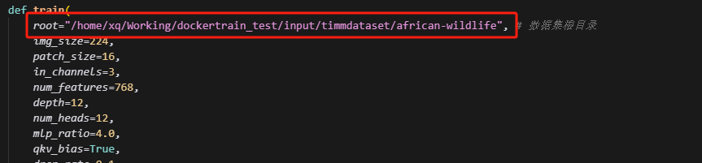

```bash
python3 train.py
```

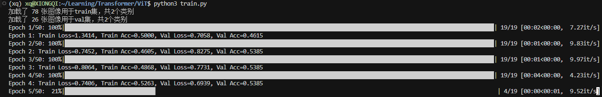

&nbsp;&nbsp;&nbsp;&nbsp;&nbsp;&nbsp;&nbsp;&nbsp;After training is completed, there will be a best_vit.pth file and two training accuracy and loss graphs for analysis

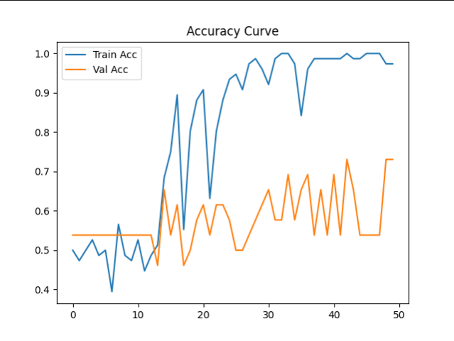

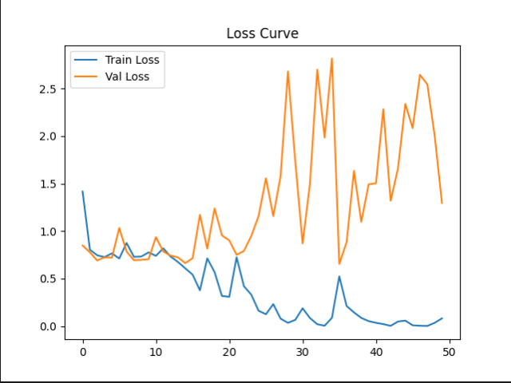

Next, we can run `python3 predict.py [img_path]` to perform inference!

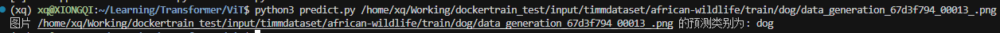

### 2. CIFAR-10 Dataset

&nbsp;&nbsp;&nbsp;&nbsp;&nbsp;&nbsp;&nbsp;&nbsp;After completing the above custom dataset, we can continue to try CIFAR-10! We first download our CIFAR-10 dataset. The CIFAR-10 dataset is already integrated into Torch, so we can use the PyTorch interface to download it directly. The specific download method is as follows, without much elaboration:

```bash
# CIFAR-10 full dataset
import torchvision.datasets as datasets
train_dataset = datasets.CIFAR10(root='./data', train=True, download=True)
test_dataset = datasets.CIFAR10(root='./data', train=False, download=True)
```

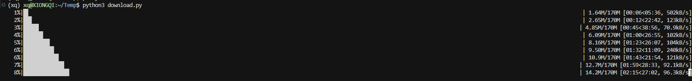

&nbsp;&nbsp;&nbsp;&nbsp;&nbsp;&nbsp;&nbsp;&nbsp;Since the downloaded CIFAR-10 dataset format is as follows (data_batch_1 ~ data_batch_5: training data (10,000 images each), test_batch: test data (10,000 images), batches.meta: metadata file (containing class names and other information)), we need to modify our `dataset_load.py` code to adapt to our CIFAR-10 dataset

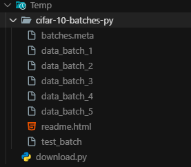

```python
import os
import pickle
import numpy as np
import torch
from torch.utils.data import Dataset, DataLoader
from PIL import Image
import torchvision.transforms as transforms

class CIFAR10Dataset(Dataset):
    def __init__(self, root, train=True, transform=None, target_transform=None):
        super().__init__()
        self.root = root
        self.train = train
        self.transform = transform
        self.target_transform = target_transform
        
        # CIFAR-10 class names
        self.classes = [
            'airplane', 'automobile', 'bird', 'cat', 'deer',
            'dog', 'frog', 'horse', 'ship', 'truck'
        ]
        self.class_to_idx = {cls_name: i for i, cls_name in enumerate(self.classes)}
        
        self.data = []
        self.targets = []
        
        if self.train:
            for i in range(1, 6):
                batch_file = os.path.join(root, f'data_batch_{i}')
                with open(batch_file, 'rb') as f:
                    batch_data = pickle.load(f, encoding='bytes')
                    self.data.append(batch_data[b'data'])
                    self.targets.extend(batch_data[b'labels'])
            self.data = np.vstack(self.data)
        else:
            test_file = os.path.join(root, 'test_batch')
            with open(test_file, 'rb') as f:
                test_data = pickle.load(f, encoding='bytes')
                self.data = test_data[b'data']
                self.targets = test_data[b'labels']
        
        # Reshape data to image format (N, 32, 32, 3)
        self.data = self.data.reshape(-1, 3, 32, 32).transpose(0, 2, 3, 1)
        
        print(f"Loaded {len(self.data)} CIFAR-10 images for {'training' if train else 'testing'}, with {len(self.classes)} classes in total")

    def __len__(self):
        return len(self.data)
    
    def __getitem__(self, index):
        img = self.data[index]
        target = self.targets[index]
        img = Image.fromarray(img)
        if self.transform is not None:
            img = self.transform(img)
        
        if self.target_transform is not None:
            target = self.target_transform(target)
            
        return img, target

def CIFAR10DataLoad(root, batch_size, num_workers=4, img_size=224):
    train_transform = transforms.Compose([
        transforms.Resize((img_size, img_size)),  
        transforms.RandomHorizontalFlip(p=0.5), 
        transforms.RandomRotation(10), 
        transforms.ToTensor(),
        transforms.Normalize(mean=[0.485, 0.456, 0.406], std=[0.229, 0.224, 0.225]) 
    ])
    
    test_transform = transforms.Compose([
        transforms.Resize((img_size, img_size)),
        transforms.ToTensor(),
        transforms.Normalize(mean=[0.485, 0.456, 0.406], std=[0.229, 0.224, 0.225])
    ])
    
    # Create dataset
    train_dataset = CIFAR10Dataset(
        root=root,
        train=True,
        transform=train_transform
    )
    
    test_dataset = CIFAR10Dataset(
        root=root,
        train=False,
        transform=test_transform
    )
    
    # Create data loader
    train_loader = DataLoader(
        train_dataset,
        batch_size=batch_size,
        shuffle=True,
        num_workers=num_workers,
        pin_memory=True,
        drop_last=True
    )
    
    test_loader = DataLoader(
        test_dataset,
        batch_size=batch_size,
        shuffle=False,
        num_workers=num_workers,
        pin_memory=True
    )
    
    return train_loader, test_loader


if __name__ == "__main__":
    # Test data loader
    root = "/home/xq/Temp/cifar-10-batches-py"
    train_loader, test_loader = CIFAR10DataLoad(root, batch_size=32)
    # Test one batch
    for images, labels in train_loader:
        print(f"Image batch shape: {images.shape}")
        print(f"Label batch shape: {labels.shape}")
        print(f"Label range: {labels.min()} - {labels.max()}")
        break 
```

&nbsp;&nbsp;&nbsp;&nbsp;&nbsp;&nbsp;&nbsp;&nbsp;Then modify our training code, mainly modify the dataset path and data loader call:

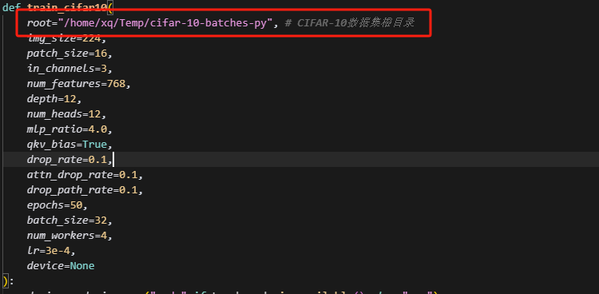

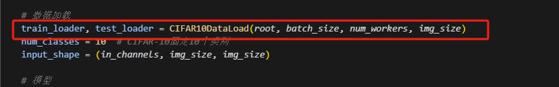

```bash
python3 train.py
```

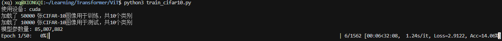

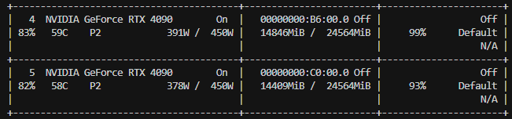

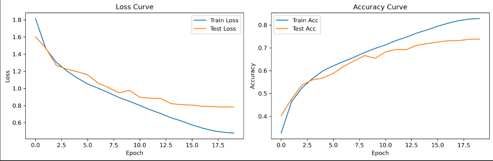

&nbsp;&nbsp;&nbsp;&nbsp;&nbsp;&nbsp;&nbsp;&nbsp;**Since the CIFAR-10 dataset is relatively large, training speed is slow, we just need to wait patiently**. After training is completed, run the following commands to perform inference:

```bash
# Single prediction
python3 predict_cifar10.py <image_path>
# Top-K prediction
python3 predict_cifar10.py <image_path> --top-k 3
```

&nbsp;&nbsp;&nbsp;&nbsp;&nbsp;&nbsp;&nbsp;&nbsp;The export part is consistent with the ordinary model process, the only difference is that when exporting, the network's `drop_rate`, `attn_drop_rate` and `drop_path_rate` all need to be set to 0. The specific code is as follows:

```python
import onnx
import onnxslim
import torch
from model.transformer_net import VisonTransformer
import torch.nn as nn
def export_vit_to_onnx():
    # Model parameter configuration (consistent with training)
    img_size = 224
    patch_size = 16
    in_channels = 3
    num_classes = 10  # CIFAR-10
    num_features = 768
    depth = 12
    num_heads = 12
    mlp_ratio = 4.0
    qkv_bias = True
    drop_rate = 0.0  # Set to 0 when exporting
    attn_drop_rate = 0.0  # Set to 0 when exporting
    drop_path_rate = 0.0  # Set to 0 when exporting
    device = "cuda" if torch.cuda.is_available() else "cpu"
    print(f"Using device: {device}")
    input_shape = (in_channels, img_size, img_size)
    model = VisonTransformer(
        input_shape=input_shape,
        patch_size=patch_size,
        in_channels=in_channels,
        num_classes=num_classes,
        num_features=num_features,
        depth=depth,
        num_heads=num_heads,
        mlp_ratio=mlp_ratio,
        qkv_bias=qkv_bias,
        drop_rate=drop_rate,
        attn_drop_rate=attn_drop_rate,
        drop_path_rate=drop_path_rate,
        norm_layer=nn.LayerNorm,
        act_layer=nn.GELU
    ).to(device)
    model_path = "best_vit_cifar10.pth"
    model.load_state_dict(torch.load(model_path, map_location=device))
    print(f"Successfully loaded model weights: {model_path}")
    model.eval()
    dummy_input = torch.randn(1, in_channels, img_size, img_size).to(device)
    onnx_path = "vit_cifar10_batch1.onnx"
    print("Starting ONNX model export...")
    with torch.no_grad():
        torch.onnx.export(
            model,
            dummy_input,
            onnx_path,
            export_params=True,
            opset_version=19,
            do_constant_folding=True,
            input_names=['input'],
            output_names=['output'],
            verbose=False
        )
    print(f"ONNX model export completed: {onnx_path}")
    print("Validating ONNX model...")
    onnx_model = onnx.load(onnx_path)
    onnx.checker.check_model(onnx_model)
    print("ONNX model validation passed!")
if __name__ == "__main__":
    export_vit_to_onnx()
```

### FOUR. ViT Deployment on RDK S100

&nbsp;&nbsp;&nbsp;&nbsp;&nbsp;&nbsp;&nbsp;&nbsp;After obtaining the `onnx` format middleware model, we start implementing deployment on RDKS100. First, make sure you have installed the S100 Docker toolchain or configured the development environment yourself. The conversion on S100 is not much different from X5, except that when exporting the onnx model, we can choose to export `opset=19`. After configuring the calibration data (for specific reference, see the OE documentation), we can use the following command to start the conversion!

```bash
hb_compile -c convert.yaml
```

```yaml
model_parameters:
  onnx_model: './vit_cifar10_batch1.onnx'
  march: "nash-e" 
  layer_out_dump: False
  working_dir: 'vit_cifar10_batch1'
  output_model_file_prefix: 'vit_cifar10_batch1'
input_parameters:
  input_name: ""
  input_type_rt: 'nv12'
  input_type_train: 'rgb'
  input_layout_train: 'NCHW'
  norm_type: 'data_mean_and_scale'
  mean_value: 125.307 122.961 113.8575
  scale_value: 0.01938 0.01967 0.01951
calibration_parameters:
  cal_data_dir: '../../Dataset/cifar-10-batches-py/cali_img_npy/'
  cal_data_type: 'float32'
  quant_config: {"op_config": {"softmax": {"qtype": "int32"}}}
  # quant_config: {
  #   "model_config": {
  #       "all_node_type": "int16",
  #       "model_output_type": "int16",
  #   }
  # }
compiler_parameters:
  # extra_params: {'input_no_padding': True, 'output_no_padding': True}
  compile_mode: 'latency'
  debug: False
  jobs: 8
  optimize_level: 'O2'
  advice: 1
```

&nbsp;&nbsp;&nbsp;&nbsp;&nbsp;&nbsp;&nbsp;&nbsp;The reference compilation log is as follows:

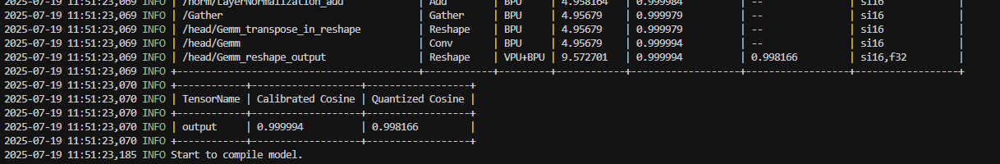

&nbsp;&nbsp;&nbsp;&nbsp;&nbsp;&nbsp;&nbsp;&nbsp;After obtaining the compiled model, we can use the code in [/cpp/main.cc](./cpp/main.cc) for deployment testing or use [/cpp/eval.cc](./cpp/eval.cc) for accuracy evaluation:

Compilation results are as follows:

```bash
mkdir build && cd build 
cmake .. && make 
./main # Deployment test
./eval # Accuracy evaluation
```
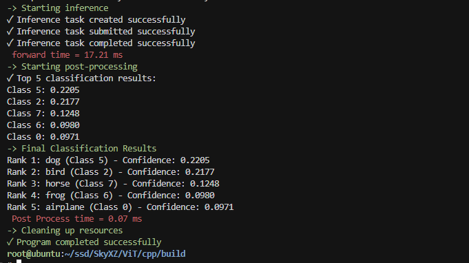