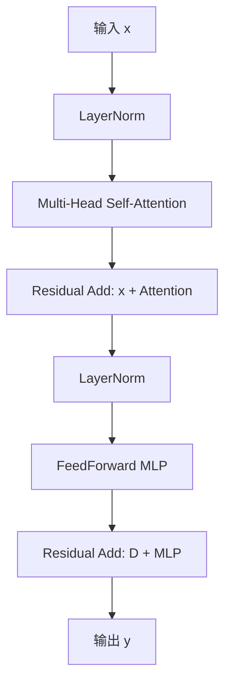

# Vision Transformer
[English](./README.md) | 简体中文
## 快速体验

```bash
# Make Sure your are in this file
$ cd samples/Vision/ViT

# Check your workspace
$ tree -L 2
.
|-- README.md     # English Document
|-- README_cn.md  # Chinese Document
|-- py
|   `-- Vit_YUV420SP.py      # Quick Start
|-- cpp
|   |   |-- CMakeLists.txt # infer C++ CmakeList
|   |   |-- main.cc # Quick Start C++
|   |   `-- eval.cc # Quick Eval C++
`-- source
|   |-- imgs
|   |-- reference_hbm_models    # Reference HBM Models
|   |-- reference_logs          # Reference logs
|   `-- reference_yamls         # Reference yaml configs
```
### Python 推理体验
使用前请先参照reference_hbm_models中的Readme下载对应模型至文件夹，模型确保存在后运行以下命令即可
```bash
cd rdk_model_zoo_s/samples/Vision/ViT/py
python3 Vit_YUV420SP.py
```

### C++ UCP推理体验

使用前请先参照reference_hbm_models中的Readme下载对应模型至文件夹，模型确保存在后运行以下命令即可

```bash
cd rdk_model_zoo_s/samples/Vision/ViT/cpp
mkdir build && cd build
cmake .. && make
./main
```

若要测试自己的模型请修改`main`代码中以下宏定义后重新编译运行即可

```c++
#define MODEL_PATH //模型路径
#define TEST_IMG_PATH //测试图片路径
#define CLASSES_NUM //类别数量
std::vector<std::string> object_names //类别标签
```

若要对自己的cifar模型进行板端精度评估请使用`eval`并修改以下宏定义后重新编译运行并保证测试集的文件格式如下即可（自定义数据集精度评测请修改文件加载部分）

```bash
# Check your Eval
$ tree -L 2
.
├── eval_img
│   ├── airplane
│   ├── automobile
│   ├── bird
│   ├── cat
│   ├── deer
│   ├── dog
│   ├── frog
│   ├── horse
│   ├── ship
│   └── truck
├── readme_img
└── test_img
```

```c++

#define MODEL_PATH //模型路径
#define TEST_IMGS_FOLDER //测试文件夹路径
#define CLASSES_NUM //类别数量
#define TEST_SAMPLES_PER_CLASS //测试集分类别数量
#define TOTAL_TEST_SAMPLES //测试集总数
std::vector<std::string> object_names //类别标签
```

## BenchMark - Accuracy

| Model | Top-1 | Top-5 |
| :---: | :---: | :---: |
| ONNX  |74.54% | 98.36%      |
| HBM   |72.62% | 98.03%|

### Accuracy Test Instructions

1. BPU模型在量化NCHW-RGB888输入转换为YUV420SP(nv12)输入后, 也会有一部分精度损失, 这是由于色彩空间转化导致的, 在训练时加入这种色彩空间转化的损失可以避免这种精度损失. 
2. Python接口和C/C++接口的精度结果有细微差异, 主要在于Python和C/C++的一些数据结构进行memcpy和转化的过程中, 对浮点数的处理方式不同, 导致的细微差异.
3. 测试脚本请参考RDK Model Zoo的eval部分: https://github.com/D-Robotics/rdk_model_zoo/tree/main/demos/tools/eval_pycocotools
4. 本表格是使用PTQ(训练后量化)使用50张图片进行校准和编译的结果, 用于模拟普通开发者第一次直接编译的精度情况, 并没有进行精度调优或者QAT(量化感知训练), 满足常规使用验证需求, 不代表精度上限.

## 算法原理阐述与模型训练导出量化编译全流程

> 作者：SkyXZ
>
> 开发环境：Ubuntu22.04(192x CPU 8x NVIDIA GeForce RTX 4090)、D-Robotics-OE 3.2.0、Ubuntu22.04 GPU Docker
>
> 板端环境：RDKS100-RDK OS 4.0.2-Beta

- ViT论文Arxiv地址：[An Image is Worth 16x16 Words: Transformers for Image Recognition at Scale](https://arxiv.org/pdf/2010.11929)

&nbsp;&nbsp;&nbsp;&nbsp;&nbsp;&nbsp;&nbsp;&nbsp;最近具身智能足够火热，VLM、VLA、VLN层出不穷发展迅速，而Transformer作为这些架构最重要的底座之一，得益于其强大的建模能力、良好的可扩展性与统一的结构设计，Transformer 已经成为构建多模态智能系统的事实标准。从最初的 BERT、GPT 在 NLP 中的成功，到 ViT、CLIP、RT-1 等模型在视觉和控制领域的延伸，Transformer 构筑起了统一语言、视觉乃至动作空间的桥梁。

&nbsp;&nbsp;&nbsp;&nbsp;&nbsp;&nbsp;&nbsp;&nbsp;**既然 Transformer 成为了具身智能的基础设施，那作为一名想走进机器人、走进未来的工程师，我当然也要学会它。**于是我决定从最经典、最基础的 Vision Transformer（ViT）入手，一步步从原理出发，亲手用 PyTorch 复现，并整理下这一路的学习过程与思考，作为这篇博客的分享内容。如果你也对 Transformer 在视觉领域的应用感兴趣，或者正在入门具身智能相关方向，希望这篇文章能对你有所帮助！

PS：💻 项目完整代码已上传至Github：[ViT_PyTorch](https://github.com/xiongqi123123/ViT_PyTorch.git)，如果你在阅读中有任何问题、建议或错误指出，也欢迎在评论区与我讨论，我们共同进步！

### 一、ViT：从论文出发理解架构设计

&nbsp;&nbsp;&nbsp;&nbsp;&nbsp;&nbsp;&nbsp;&nbsp;在正式动手复现之前，我们先从源头出发，来读一读 Vision Transformer 的原始论文：《**An Image is Worth 16x16 Words: Transformers for Image Recognition at Scale**》[[arXiv:2010.11929](https://arxiv.org/abs/2010.11929)]。这是由 Google Research 于 2020 年提出的一篇具有里程碑意义的论文，它首次展示了 **纯 Transformer 架构在图像分类任务上可以不依赖任何卷积模块，依然取得优秀性能**。


&nbsp;&nbsp;&nbsp;&nbsp;&nbsp;&nbsp;&nbsp;&nbsp;Transformer 原本是为了解决语言文字处理任务而提出的模型，其设计初衷是用于建模序列数据中的长距离依赖关系。在 NLP 领域中，Transformer 能够通过自注意力机制灵活地捕捉单词之间的全局关系，极大提升了语言理解与生成的能力。而谷歌的研究团队提出了非常大胆也非常优雅的一个思想：如果我们能把图像切割成小块（Patch），再把每个 Patch 当作一个“词”，是否也能将图像转化为序列，从而让 Transformer 也能处理视觉信息？而其提出的ViT 就是这样做的：它将一张图像划分为固定大小的 Patch（如 16×16），将每个 Patch 展平成向量，再通过一个线性投影层将其映射到统一的维度空间，最终形成一个 token 序列。随后，ViT 在这个 token 序列前加上一个可学习的 `[CLS]` token，并叠加位置编码（Positional Encoding），以保留图像中的空间位置信息。整个序列就像一段文本，送入多层标准的 Transformer 编码器结构进行处理，最后通过 `CLS` token 的输出，完成整张图像的分类任务。这种方法不依赖任何卷积操作，完全基于序列建模，展现了 Transformer 在图像建模上的巨大潜力。


&nbsp;&nbsp;&nbsp;&nbsp;&nbsp;&nbsp;&nbsp;&nbsp;ViT的架构如上图，与寻常的分类网络类似，整个Vision Transformer可以分为两部分，一部分是特征提取部分，另一部分是分类部分，**特征提取部分**是其最核心的组成，它包括了Patch Embedding、Positional Encoding以及Transformer Encoder，**分类部分** 则是紧接在特征提取之后，通过一个可学习的 `[CLS]` token 来代表整张图像的全局语义。这个 token 会随着其他 token 一起参与 Transformer 编码过程，最终被送入一个简单的 **MLP 分类头** 进行类别预测。接下来我们按照如下的划分来逐个讲解ViT网络架构

- **图像分块与线性嵌入模块（Patch Embedding）**


&nbsp;&nbsp;&nbsp;&nbsp;&nbsp;&nbsp;&nbsp;&nbsp;ViT 的第一步操作，就是将输入图像转化为一系列的 **视觉 token**，这个过程被称为 **Patch Embedding**，Patch 指的就是分割后的一小块图像区域，它的核心思想非常直接：

> 将一张二维图像按照固定大小（如 16×16）划分成若干个小块（Patch），然后将每个 Patch 展平成一个向量，再通过一个线性层将其映射到指定的维度空间（例如 768维），从而得到一组输入 token，供 Transformer 使用。

&nbsp;&nbsp;&nbsp;&nbsp;&nbsp;&nbsp;&nbsp;&nbsp;这个处理方式本质上就是在模拟 NLP 中“将每个单词编码为向量”的过程——只不过这里的“单词”是图像块 patch，而不是文字，我们假设假设输入图像大小为 `224×224×3`，Patch 大小为 `16×16`，则一张图像将被划分为$ (224/16)^2=14×14=196$ 个 patch，而每个 Patch 将被展平成一个 $16 × 16 × 3 = 768$ 维的向量，将其展平成向量后，再通过一个 `Linear` 层映射到模型的 embedding 空间（手动设置，ViT-Base为 768 维，ViT-Large为1024，ViT-Huge为1280，通常使用768），最终我们就能得到一个形状为：`[batch_size, 196, embed_dim]`的patch token 序列，而我们该如何对图像进行分割实现Patch Embedding呢？这时候我们便可以想到我们的卷积，由于卷积使用的是滑动窗口的思想，因此我们只需要将卷积核以及步长设置成与Patch-Size相等便可，这时两个图片区域的特征提取过程就不会有重叠，当我们输入的图片是`[224, 224, 3]`的时候，我们可以获得一个`[14, 14, 768]`的特征层。


&nbsp;&nbsp;&nbsp;&nbsp;&nbsp;&nbsp;&nbsp;&nbsp;而获得了特征信息之后我们需要将得到的特征信息组合成序列，组合的方式很简单，我们只需要对这个特征图进行展平（Flatten）并转置为标准序列格式，便可以得到最终的 Patch Token 序列，用于输入 Transformer，我们在上面对图像进行分割后得到了一个`[14, 14, 768]`的特征层，我们将这个特征图的**高宽维度进行平铺**后即可得到**一个`[196, 768]`的特征层**，至此Patch Embedding便完成啦！

- **分类标记与位置编码模块（cls_token + Position Embedding）**


&nbsp;&nbsp;&nbsp;&nbsp;&nbsp;&nbsp;&nbsp;&nbsp;在完成 Patch Embedding 得到形如 `[batch_size, 196, 768]` 的 Patch Token 序列后，接下来我们要做两件关键的事情：

1. 添加 `[CLS] Token` —— 图像的“全局摘要”入口

   &nbsp;&nbsp;&nbsp;&nbsp;&nbsp;&nbsp;&nbsp;&nbsp;Transformer 最初在处理文本任务时，会在序列的最前面添加一个特殊的 `[CLS]` Token，用于聚合整个句子的语义信息。同理，在 ViT 中也引入了 `[CLS] Token`，它并不代表某个具体的 Patch，而是作为一个全局的代表 Token，在 Transformer 中“参与”每一层的信息交互，最终用于提取整个图像的全局特征。如上图所示，编号为 `0*` 的那个位置即表示 `[CLS] Token`，其初始值是一个可学习的参数向量，维度与 Patch Token 相同（例如 768），经过 Transformer 编码后，ViT 会**使用这个 `[CLS] Token` 的输出向量作为图像的分类结果输入**到 MLP Head 中，完成最终分类。

   &nbsp;&nbsp;&nbsp;&nbsp;&nbsp;&nbsp;&nbsp;&nbsp;添加了 `[CLS] Token` 之后，原本的 `196` 个 Patch Token 序列就变成了 `197` 个 Token，形状变为了形如：`[batch_size, 196 + 1, 768]`

2. 添加位置编码（Positional Embedding）—— 帮助模型理解“图像中的位置”

   &nbsp;&nbsp;&nbsp;&nbsp;&nbsp;&nbsp;&nbsp;&nbsp;由于 Transformer 是完全基于自注意力机制构建的，它并不具备卷积网络中天然的**位置信息建模能力**。所以我们还需要给每个 Token 添加一个**位置编码**，用于告诉模型这个 Token 来自于图像的哪一块区域。ViT 采用的是一种 **可学习的绝对位置编码**，也就是为每一个 Token 的位置（包括 `[CLS]` Token）都初始化一个可学习的位置向量，并与原始 Token 相加，这样，模型就能在学习过程中自己掌握空间顺序和语义之间的关系。

   &nbsp;&nbsp;&nbsp;&nbsp;&nbsp;&nbsp;&nbsp;&nbsp;位置编码的形状与输入序列一致，也是`[1, 196 + 1, 768]`，且位置编码的加入方式非常简单即：`tokens = tokens + pos_embed  # [B, 197, 768]`,经过这两个步骤之后，ViT 的输入才真正准备好，可以送入 Transformer 编码器中进行多层特征交互与建模，至此cls_token + Position Embedding便完成啦！


- **标准 Transformer 编码器（Multi-head Attention + LayerNorm + MLP + 残差连接）**


&nbsp;&nbsp;&nbsp;&nbsp;&nbsp;&nbsp;&nbsp;&nbsp;当我们得到了带有 `[CLS] Token` 和位置编码的完整 Patch 序列（形状为 `[B, 197, 768]`）之后，ViT 会将其送入一系列标准的 **Transformer Encoder Block** 中进行深度建模。每一个 Block 的设计与原始的 NLP Transformer 中的 Encoder 保持一致，结构非常经典，由两个子模块组成：

1. **LayerNorm + 多头自注意力机制（Multi-Head Self Attention）**

   &nbsp;&nbsp;&nbsp;&nbsp;&nbsp;&nbsp;&nbsp;&nbsp;在这个子模块中，我们首先对输入进行 LayerNorm 归一化，再送入 Multi-Head Self-Attention 模块，这里的自注意力的作用是建立所有 Token 之间的**全局关系**，使每个 Token 都能获取其他区域的信息，这也是Transformer的灵魂部分，其具体实现则是让每个 Token 通过查询（Query）与所有其他 Token 的键（Key）进行匹配，计算其对其他位置的关注权重，从而提取对当前任务最有用的信息。用公式和图片表示如下：

$$
\text{Attention}(Q, K, V) = \text{Softmax}\left( \frac{QK^\top}{\sqrt{d_k}} \right) V
$$


&nbsp;&nbsp;&nbsp;&nbsp;&nbsp;&nbsp;&nbsp;&nbsp;对于初学者来说，这部分内容看起来可能会比较抽象，但是我们如果将它拆解一步一步来看，其实非常直观。在多头自注意力机制中，每一个输入的 **Token**（图像的 Patch）都会被分别映射出三个向量，分别是：**Query（查询向量）、Key（键向量）、Value（值向量）**，用一个简单明了的比喻来理解：假设你在参加一次会议（注意力机制），你是 Query，而会议室里每一个与会者（包括你自己）都是一个 Key，同时他们手里都拿着一份资料（Value），你会根据自己和其他人 Key 的“相似程度”决定你要多大程度参考他们的资料（Value）——这就是注意力权重的计算。设当前输入序列为矩阵 $X \in \mathbb{R}^{n \times d}$，其中 $n$ 是序列长度（例如 ViT 中是 197 个 Token），$d$ 是每个 Token 的维度（例如 768）。我们用三组可学习的参数矩阵将其变换为：
$$
[
Q = XW^Q,\quad K = XW^K,\quad V = XW^V
]
$$
&nbsp;&nbsp;&nbsp;&nbsp;&nbsp;&nbsp;&nbsp;&nbsp;然后计算注意力得分（Score）：
$$
[
\text{Score} = \frac{QK^\top}{\sqrt{d_k}}
]
$$
&nbsp;&nbsp;&nbsp;&nbsp;&nbsp;&nbsp;&nbsp;&nbsp;接着使用 Softmax 对得分进行归一化，得到注意力权重 $\alpha$：
$$
[
\alpha = \text{Softmax}\left( \frac{QK^\top}{\sqrt{d_k}} \right)
]
$$
&nbsp;&nbsp;&nbsp;&nbsp;&nbsp;&nbsp;&nbsp;&nbsp;最后加权组合所有 Value 向量，得到新的输出表示：
$$
[
\text{Attention}(Q, K, V) = \alpha V
]
$$

&nbsp;&nbsp;&nbsp;&nbsp;&nbsp;&nbsp;&nbsp;&nbsp;**这套计算流程用人话说就是，**我们这套注意力系统假设有三个输入分别是`input-1`、`input-2`、`input-3`以及三个对应的输出`output-1`、`output-2`、`output-3`，每个输入都有他们自己的QKV向量


&nbsp;&nbsp;&nbsp;&nbsp;&nbsp;&nbsp;&nbsp;&nbsp;如果我们要求`output-1`，那我们首先先将`input-1`的Q查询向量与三个输入的K键向量分别相乘得到对应的分数，这个分数代表的便是 `input-1` 对其它三个输入的“注意力程度”；接下来我们将这三个分数分别求一次`softmax`使它们变成 0 到 1 之间的概率值，并且加起来为 1，这个过程可以理解为：**分配关注度**，告诉我们该“关注谁、关注多少”；最后，用刚才得到的这三个注意力权重，去分别加权对应的 **值向量 V**，再把它们加在一起，得到的就是最终的 `output-1`


&nbsp;&nbsp;&nbsp;&nbsp;&nbsp;&nbsp;&nbsp;&nbsp;也就是说：输出 = 所有关注对象的“值” × “关注它的程度”的加权和。每个 Query 会根据与所有 Key 的相似程度，对对应的 Value 进行加权求和；这样的话所有 Token 之间都能进行信息交换，从而捕捉 **全局上下文依赖**；因此最后的输出的虽然仍然是一个与原始 Token 数量相同的新序列，但每个 Token 的表示已经融合了全局信息。

2. **LayerNorm + MLP 前馈神经网络**

   &nbsp;&nbsp;&nbsp;&nbsp;&nbsp;&nbsp;&nbsp;&nbsp;在每个 Transformer Block 中，除了注意力机制之外，还有一个非常重要的部分，那就是 **前馈神经网络（Feed Forward Network, FFN）**，也常被称为 **MLP 子模块**。这个子模块的结构其实非常简单，就是两个全连接层（Linear），中间再加一个非线性激活函数（如 GELU）：
   $$
   FFN(x)=Linear 
   2
   ​
    (GELU(Linear 
   1
   ​
    (x)))
   $$
   &nbsp;&nbsp;&nbsp;&nbsp;&nbsp;&nbsp;&nbsp;&nbsp;这里的 Linear 层也就是我们熟悉的全连接层，维度的变化一般是这样的：首先第一个 Linear 层会把输入的维度从 `d_model`（比如 768）提升到一个更高的维度（比如 3072），接着通过 GELU 激活函数引入非线性，最后再用一个 Linear 层将维度降回原来的 `d_model`这个 FFN 的结构可以理解为对每个 Token 独立地进行更深层次的特征变换。不同于多头自注意力机制那种跨 Token 的信息交互，前馈神经网络的处理是**逐 Token 的点对点非线性变换**，主要用于增强模型的表达能力。而残差连接的引入可以在每个 Transformer Block 内形成一种**短路路径（Shortcut Path）**，它能有效缓解深层网络中的梯度消失问题：与其直接学习一个映射函数 $F(x)$，不如让网络学习 $F(x) = H(x) - x$，即让模型关注“输入与输出的差值”，这样反而更容易优化。因此完整的计算流程如下：
   $$
   y=x+FFN(LayerNorm(x))
   $$


&nbsp;&nbsp;&nbsp;&nbsp;&nbsp;&nbsp;&nbsp;&nbsp;至此，ViT 的核心结构也就完整拼装完成了。从 Patch Embedding 到 `[CLS] Token` 与位置编码，再到深度的多层 Transformer 编码器，ViT 完整地将语言模型的结构移植到了视觉领域，并取得了突破性的表现。Transformer Block 是 ViT 的“建模大脑”，也是其通用性与强大性能的根基。


- **分类头（Classification Head）**


&nbsp;&nbsp;&nbsp;&nbsp;&nbsp;&nbsp;&nbsp;&nbsp;经过多个 Transformer Block 的深度特征提取之后，我们得到了一个新的序列表示，其形状为 `[B, 197, 768]`（假设我们使用的是 ViT-Base 模型），其中第一个位置的 Token 仍然是我们在最开始加入的 `[CLS] Token`。这个 `[CLS] Token` 可以看作是整个图像的全局语义表示，因为在多轮注意力交互中，它已经“融合”了所有 Patch 的信息。因此，我们只需要从序列中取出这一位置的向量（即第一个 Token），然后送入一个全连接层（Linear）就可以完成分类任务了。


### 二、实战复现PyTorch版ViT网络架构

### （一）模块1：PatchEmbedding类

&nbsp;&nbsp;&nbsp;&nbsp;&nbsp;&nbsp;&nbsp;&nbsp;`PatchEmbedding` 是 ViT 中最关键的一步，我们在这里使用卷积操作将输入图像划分为若干不重叠的小块（Patch），每个 Patch 被编码为一个向量，我们采用等步长卷积的方式实现划分，并在展平后将其送入 Transformer 模块进行后续处理。

```python
class VisionPatchEmbedding(nn.Module):
    def __init__(self, image_size, patch_size, in_channels, embed_dim, flatter=True):
        super().__init__()
        self.proj = nn.Conv2d(in_channels, embed_dim, patch_size, patch_size)
        self.norm = nn.LayerNorm(embed_dim)
        self.flatter = flatter

    def forward(self, x):
        x = self.proj(x)
        if self.flatter:
            x = x.flatten(2).transpose(1, 2)  # [B, C, H, W] -> [B, N, C]
        x = self.norm(x)
        return x
```

### （二）模块2：PositionEmbedding

&nbsp;&nbsp;&nbsp;&nbsp;&nbsp;&nbsp;&nbsp;&nbsp;由于ViT 不像CNN，其没有卷积感受野，因此需要加入位置编码（`pos_embed`）来保留位置信息每一个Patch的位置信息

```python
self.cls_token = nn.Parameter(torch.zeros(1, 1, num_features))
self.pos_embed = nn.Parameter(torch.zeros(1, num_patches + 1, num_features))
```

&nbsp;&nbsp;&nbsp;&nbsp;&nbsp;&nbsp;&nbsp;&nbsp;由ViTViT在**预训练时**通常使用固定分辨率（如 `224x224`），图像被分割为 `14x14` 个 Patch（`patch_size=16`），位置编码 `pos_embed` 的形状为 `[1, 197, 768]`（`197 = 1(cls_token) + 14x14`），但是同样由于ViT没有感受野一说，因此**实际应用**当输入分辨率不同（如 `256x256`）时，Patch 数量变为 `16x16 = 256`（`+1 cls_token = 257`），原来的位置编码（`197`）便无法直接使用，因此我们需要通过双三次插值（`bicubic`）将 `14x14` 的位置编码调整到新分辨率对应的网格尺寸，具体实现如下：

```python
img_token_pos_embed = F.interpolate(
    img_token_pos_embed, size=self.features_shape, mode='bicubic', align_corners=False
)
pos_embed = torch.cat((cls_token_pos_embed, img_token_pos_embed), dim=1)
x = self.pos_drop(x + pos_embed)
```

### （三）模块3：Multi-head Attention与MLP

&nbsp;&nbsp;&nbsp;&nbsp;&nbsp;&nbsp;&nbsp;&nbsp;接着我们实现Transformer中最关键的多头注意力机制，我们定义一个类`SelfAttention` 来实现了多头自注意力机制，在这个模块里我们先用一个线性层同时生成查询（Q）、键（K）、值（V），并按头数拆分维度，然后计算 Q 和 K 的点积并缩放，通过 `softmax`得到注意力权重，利用权重加权值（V），最后将多头结果拼接后通过线性变换和 `dropout`，使输出具有与输入维度相同的特征，完成信息的动态融合与表达增强。

```python
class SelfAttention(nn.Module):
    def __init__(self, dim, num_heads, qkv_bias=False, attn_drop_rate=0.0, proj_drop_rate=0.0):
        super().__init__()
        self.num_heads = num_heads
        self.head_dim = dim // num_heads
        self.scale = self.head_dim ** -0.5

        self.qkv = nn.Linear(dim, dim * 3, bias=qkv_bias)
        self.attn_drop = nn.Dropout(attn_drop_rate)
        self.proj = nn.Linear(dim, dim)
        self.proj_drop = nn.Dropout(proj_drop_rate)

    def forward(self, x):
        B, N, C = x.shape
        qkv = self.qkv(x).reshape(B, N, 3, self.num_heads, C // self.num_heads).permute(2,0,3,1,4)
        q, k, v = qkv[0], qkv[1], qkv[2]

        attn = torch.matmul(q, k.transpose(-2, -1)) * self.scale
        attn = attn .softmax(dim=-1)
        attn = self.attn_drop(attn)

        x = torch.matmul(attn, v).transpose(1,2).reshape(B,N,C)
        x = self.proj(x)
        x = self.proj_drop(x)

        return x
```

&nbsp;&nbsp;&nbsp;&nbsp;&nbsp;&nbsp;&nbsp;&nbsp;在这个 `MLP` 模块中，我设计了一个两层的全连接网络，首先通过 `fc1` 将输入特征映射到隐藏维度，然后经过激活函数非线性变换，接着用 dropout 做正则化防止过拟合，接着再通过 `fc2` 映射到输出维度，最后再用一次 dropout，这个过程用来帮助模型捕捉更丰富的非线性特征，提升表达能力。

```python
class MLP(nn.Module):
    def __init__(self, in_features, hidden_features, out_features, act_layer, drop_rate):
        super().__init__()
        out_features = out_features or in_features
        hidden_features = hidden_features or in_features
        drop_probs = (drop_rate, drop_rate)

        self.fc1 = nn.Linear(in_features, hidden_features)
        self.act = act_layer()
        self.drop1 = nn.Dropout(drop_probs[0])
        self.fc2 = nn.Linear(hidden_features, out_features)
        self.drop2 = nn.Dropout(drop_probs[1])

    def forward(self, x):
        x = self.fc1(x)
        x = self.act(x)
        x = self.drop1(x)
        x = self.fc2(x)
        x = self.drop2(x)
        return x
```

### （四）模块4：Encoder层堆叠

&nbsp;&nbsp;&nbsp;&nbsp;&nbsp;&nbsp;&nbsp;&nbsp;由于PyTorch中没有现成的`DropPath`函数可以使用，因此我们需要自己实现这一用法，在这里我们使用DropPath来随机丢弃完整路径实现深度网络的正则化，并在训练时以概率drop_path跳过当前模块并缩放剩余路径以保持期望值；在Block类中我则封装了完整的Transformer层结构，包含LayerNorm归一化、多头注意力、MLP前馈网络和残差连接，其中注意力部分使用我自定义的SelfAttention模块，MLP采用先扩展后压缩的结构设计，两者都集成了DropPath机制

   &nbsp;&nbsp;&nbsp;&nbsp;&nbsp;&nbsp;&nbsp;&nbsp;于是一个完整的Transformer Block计算流程如下：



```python
class DropPath(nn.Module):
    def __init__(self, drop_prob=None):
        super(DropPath, self).__init__()
        self.drop_prob = drop_prob

    def drop_path(self, x, drop_prob, training):
        if drop_prob == 0. or not training:
            return x
        keep_prob       = 1 - drop_prob
        shape           = (x.shape[0],) + (1,) * (x.ndim - 1)
        random_tensor   = keep_prob + torch.rand(shape, dtype=x.dtype, device=x.device)
        random_tensor.floor_() 
        output          = x.div(keep_prob) * random_tensor
        return output

    def forward(self, x):
        return self.drop_path(x, self.drop_prob, self.training)
    
class Block(nn.Module):
    def __init__(self, dim, num_heads, mlp_radio, qkv_bias, drop, attn_drop, drop_path, act_layer, norm_layer):
        super().__init__()
        self.norm_1 = norm_layer(dim)
        self.attn = SelfAttention(dim, num_heads=num_heads, qkv_bias=qkv_bias, attn_drop_rate=attn_drop, proj_drop_rate=drop)
        self.norm_2 = norm_layer(dim)
        self.mlp = MLP(in_features=dim, hidden_features=int(dim * mlp_radio), out_features=None, act_layer=act_layer, drop_rate=drop_path)
        self.drop_path = DropPath(drop_path) if drop_path > 0.0 else nn.Identity() # 丢弃路径

    def forward(self, x):
        x = x + self.drop_path(self.attn(self.norm_1(x)))
        x = x + self.drop_path(self.mlp(self.norm_2(x)))
        return x
```

### （五）模块5：ViT整体模型类

&nbsp;&nbsp;&nbsp;&nbsp;&nbsp;&nbsp;&nbsp;&nbsp;最后我们来实现我们完整的ViT—VisonTransformer，在这个 `VisonTransformer` 类中，我将前面介绍的各个模块整合在一起，实现了完整的ViT网络。首先，我用卷积将输入图像切分成固定大小的Patch，并映射到特征空间；接着通过引入可学习的分类token和位置编码，为模型提供位置信息弥补卷积“感受野”缺失的问题。之后，我堆叠多个Transformer编码器Block，每个Block包含多头自注意力机制和MLP模块，通过残差连接和归一化保证信息的有效传递与特征抽象。最后，我取分类token的输出，通过线性层映射到目标类别，实现图像分类任务。

```python
class VisonTransformer(nn.Module):
    def __init__(self, input_shape, patch_size, in_channels, num_classes, num_features, depth,
                 num_heads, mlp_ratio, qkv_bias, drop_rate, attn_drop_rate, drop_path_rate,
                 norm_layer, act_layer):
        super().__init__()
        self.input_shape = input_shape # 输入的维度
        self.patch_size = patch_size # Patch 的大小
        self.in_channels = in_channels # 输入的维度
        self.num_classes = num_classes # 输出类别数
        self.num_features = num_features # 特征维度
        self.depth = depth # Transformer编码器层数
        self.num_heads = num_heads # Transformer注意力头数
        self.mlp_ratio = mlp_ratio # MLP 比例 MLP:多层感知机,紧随 Self-Attention 之后，用于非线性变换：增强模型的表达能力；特征映射：将 Self-Attention 提取的特征进一步转换。 
        self.qkv_bias = qkv_bias # 是否使用偏置
        self.drop_rate = drop_rate # 丢弃率
        self.attn_drop_rate = attn_drop_rate # 注意力丢弃率
        self.drop_path_rate = drop_path_rate # 丢弃路径率
        self.norm_layer = norm_layer # 归一化层
        self.act_layer = act_layer # 激活函数层

        self.features_shape = [input_shape[1] // patch_size, input_shape[2] // patch_size]  # [14, 14]
        self.num_patches = self.features_shape[0] * self.features_shape[1]
        self.patch_embed = VisionPatchEmbedding(input_shape, patch_size, in_channels, num_features) # 将输入图片分割成patch，并进行线性映射

        # ViT 不是 CNN，没有"感受野"，所以引入了位置编码，来为每个 patch 加上位置信息；
        self.pretrained_features_shape = [224 // patch_size, 224 // patch_size] # 预训练的特征图尺寸

        self.cls_token = nn.Parameter(torch.zeros(1, 1, num_features)) # 分类 token 196, 768 -> 197, 768
        self.pos_embed = nn.Parameter(torch.zeros(1, self.num_patches + 1, num_features)) # 位置编码 197, 768 -> 197, 768

        self.pos_drop = nn.Dropout(drop_rate) # 丢弃率
        self.norm = norm_layer(self.num_features) # 归一化

        self.dpr = [x.item() for x in torch.linspace(0, drop_path_rate, depth)] # 丢弃路径率
        self.blocks = nn.Sequential(
            *[
                Block(
                    dim = num_features,
                    num_heads = num_heads,
                    mlp_radio = mlp_ratio,
                    qkv_bias = qkv_bias,
                    drop = drop_rate,
                    attn_drop = attn_drop_rate,
                    drop_path = self.dpr[i],
                    norm_layer = norm_layer,
                    act_layer = act_layer 
                )for i in range(depth)
            ]
        )
        self.head = nn.Linear(num_features, num_classes) if num_classes > 0 else nn.Identity()

    def forward_features(self,x):
        x = self.patch_embed(x)
        cls_token = self.cls_token.expand(x.shape[0], -1, -1) # 将分类 token 扩展到与输入特征图相同的形状
        x = torch.cat((cls_token, x), dim=1) # 将分类 token 与输入特征图拼接

        cls_token_pos_embed = self.pos_embed[:, 0:1, :] # 分类 token 的位置编码
        img_token_pos_embed = self.pos_embed[:, 1:, :]  # [1, num_patches, num_features]
        # 变成[1, H, W, C]
        img_token_pos_embed = img_token_pos_embed.view(1, self.features_shape[0], self.features_shape[1], -1).permute(0, 3, 1, 2)  # [1, C, H, W]
        # 插值
        img_token_pos_embed = F.interpolate(
            img_token_pos_embed,
            size=self.features_shape,  # [H, W]
            mode='bicubic',
            align_corners=False
        )
        # 变回[1, num_patches, C]
        img_token_pos_embed = img_token_pos_embed.permute(0, 2, 3, 1).reshape(1, -1, img_token_pos_embed.shape[1])

        pos_embed = torch.cat((cls_token_pos_embed, img_token_pos_embed), dim=1) # 将分类 token 的位置编码与图像 token 的位置编码拼接
        
        x = self.pos_drop(x + pos_embed) # 将位置编码与输入特征图相加

        x = self.blocks(x)
        x = self.norm(x)

        return x[:, 0] # 返回分类 token 的特征
    
    def forward(self, x):
        x = self.forward_features(x)
        x = self.head(x)
        return x
```

<font color="red">**至此我们完整的ViT便搭建完成了！**</font>

### （六）实现数据加载代码（数据加载、loss、优化器）

&nbsp;&nbsp;&nbsp;&nbsp;&nbsp;&nbsp;&nbsp;&nbsp;数据集加载部分比较简答，不过多赘述，我的数据集结构及具体代码如下：


```python
import os 
from torch.utils.data import Dataset, DataLoader 
from PIL import Image 
import torchvision.transforms as transforms 

class ViTDataset(Dataset):
    def __init__(self, root, split, transform=None, target_transform=None, img_size=224):
        super().__init__()
        self.split = split 
        self.img_size = img_size  # 图像大小
        self.transform = transform if transform is not None else transforms.ToTensor()
        self.target_transform = target_transform  # 标签变换
        # 构建数据集根目录
        self.data_dir = os.path.join(root, split)  # 训练集或测试集目录
        # 获取所有类别
        self.classes = sorted(os.listdir(self.data_dir))
        self.class_to_idx = {cls_name: i for i, cls_name in enumerate(self.classes)}
        # 收集所有图像文件路径和对应的标签
        self.images = []
        self.labels = []
        for class_name in self.classes:
            class_dir = os.path.join(self.data_dir, class_name)
            if not os.path.isdir(class_dir):
                continue
            for img_name in os.listdir(class_dir):
                if img_name.endswith(('.jpg', '.jpeg', '.png')):
                    img_path = os.path.join(class_dir, img_name)
                    self.images.append(img_path)
                    self.labels.append(self.class_to_idx[class_name])
        print(f"加载了 {len(self.images)} 张图像用于{split}集，共{len(self.classes)}个类别")

    def __len__(self):
        return len(self.images)
    
    def __getitem__(self, index):
        # 获取图像路径和标签
        img_path = self.images[index]
        label = self.labels[index]
        # 加载图像
        image = Image.open(img_path).convert('RGB')
        # 调整图像大小
        image = image.resize((self.img_size, self.img_size), Image.Resampling.BILINEAR)
        # 应用变换
        image = self.transform(image)
        if self.target_transform is not None:
            label = self.target_transform(label)
            
        return image, label
    

def ViTDataLoad(root, batch_size, num_workers, img_size):
    # 创建训练数据集
    train_dataset = ViTDataset(
        root=root,
        split='train',  # 使用训练集划分
        img_size=img_size
    )
    
    # 创建验证数据集
    val_dataset = ViTDataset(
        root=root,
        split='val',  # 使用验证集划分
        img_size=img_size
    )
    
    # 创建训练数据加载器
    train_loader = DataLoader(
        train_dataset,
        batch_size=batch_size,
        shuffle=True,  # 随机打乱数据
        num_workers=num_workers,  # 多线程加载
        pin_memory=True,  # 数据预加载到固定内存，加速GPU传输
        drop_last=True  # 丢弃最后不足一个批次的数据
    )
    
    # 创建验证数据加载器
    val_loader = DataLoader(
        val_dataset,
        batch_size=batch_size,
        shuffle=False,  # 不打乱数据
        num_workers=num_workers,
        pin_memory=True
    )
    
    return train_loader, val_loader
```

### （七）实现训练代码

&nbsp;&nbsp;&nbsp;&nbsp;&nbsp;&nbsp;&nbsp;&nbsp;接下来我们来完成我们的训练代码，我通过上一节定义的`ViTDataLoad`来加载训练和验证数据集，训练中我采用常用的交叉熵损失函数（`CrossEntropyLoss`）来衡量分类效果，优化器使用了更适合Transformer的`AdamW`，具体实现如下，不过多赘述：

```python
from model.transformer_net import VisonTransformer
from dataset_load import ViTDataLoad
import torch 
import torch.nn as nn
import torch.optim as optim
from tqdm import tqdm
import matplotlib.pyplot as plt

def train(
    root="/home/xq/Working/dockertrain_test/input/timmdataset/african-wildlife", # 数据集根目录
    img_size=224,
    patch_size=16,
    in_channels=3,
    num_features=768,
    depth=12,
    num_heads=12,
    mlp_ratio=4.0,
    qkv_bias=True,
    drop_rate=0.1,
    attn_drop_rate=0.1,
    drop_path_rate=0.1,
    epochs=50,
    batch_size=4,
    num_workers=4,
    lr=1e-4,
    device=None
):
    device = device or ("cuda" if torch.cuda.is_available() else "cpu")
    # 数据加载
    train_loader, val_loader = ViTDataLoad(root, batch_size, num_workers, img_size)
    num_classes = len(train_loader.dataset.classes)
    input_shape = (in_channels, img_size, img_size)

    # 模型
    model = VisonTransformer(
        input_shape=input_shape,
        patch_size=patch_size,
        in_channels=in_channels,
        num_classes=num_classes,
        num_features=num_features,
        depth=depth,
        num_heads=num_heads,
        mlp_ratio=mlp_ratio,
        qkv_bias=qkv_bias,
        drop_rate=drop_rate,
        attn_drop_rate=attn_drop_rate,
        drop_path_rate=drop_path_rate,
        norm_layer=nn.LayerNorm,
        act_layer=nn.GELU
    ).to(device)

    criterion = nn.CrossEntropyLoss()
    optimizer = optim.AdamW(model.parameters(), lr=lr)
    best_acc = 0
    train_loss_list, val_loss_list = [], []
    train_acc_list, val_acc_list = [], []

    for epoch in range(epochs):
        model.train()
        total_loss, correct, total = 0, 0, 0
        pbar = tqdm(train_loader, desc=f"Epoch {epoch+1}/{epochs}")
        for images, labels in pbar:
            images, labels = images.to(device), labels.to(device)
            optimizer.zero_grad()
            outputs = model(images)
            loss = criterion(outputs, labels)
            loss.backward()
            optimizer.step()
            total_loss += loss.item() * images.size(0)
            _, preds = outputs.max(1)
            correct += preds.eq(labels).sum().item()
            total += labels.size(0)
        train_loss = total_loss / total
        train_acc = correct / total
        train_loss_list.append(train_loss)
        train_acc_list.append(train_acc)

        # 验证
        model.eval()
        val_loss, val_correct, val_total = 0, 0, 0
        with torch.no_grad():
            for images, labels in val_loader:
                images, labels = images.to(device), labels.to(device)
                outputs = model(images)
                loss = criterion(outputs, labels)
                val_loss += loss.item() * images.size(0)
                _, preds = outputs.max(1)
                val_correct += preds.eq(labels).sum().item()
                val_total += labels.size(0)
        val_loss = val_loss / val_total
        val_acc = val_correct / val_total
        val_loss_list.append(val_loss)
        val_acc_list.append(val_acc)

        print(f"Epoch {epoch+1}: Train Loss={train_loss:.4f}, Train Acc={train_acc:.4f}, Val Loss={val_loss:.4f}, Val Acc={val_acc:.4f}")
        # 保存最优模型
        if val_acc > best_acc:
            best_acc = val_acc
            torch.save(model.state_dict(), "best_vit.pth")

    # 可视化loss和acc
    plt.figure()
    plt.plot(train_loss_list, label="Train Loss")
    plt.plot(val_loss_list, label="Val Loss")
    plt.legend()
    plt.title("Loss Curve")
    plt.savefig("loss_curve.png")
    plt.figure()
    plt.plot(train_acc_list, label="Train Acc")
    plt.plot(val_acc_list, label="Val Acc")
    plt.legend()
    plt.title("Accuracy Curve")
    plt.savefig("acc_curve.png")
    print("训练完成，最优验证准确率：", best_acc)

if __name__ == "__main__":
    train()
```

### （八）实现验证代码

&nbsp;&nbsp;&nbsp;&nbsp;&nbsp;&nbsp;&nbsp;&nbsp;验证代码也比较简单，有PyTorch及深度学习基础的同学可以很快实现，故这里也不再赘述：

```python
import torch
from model.transformer_net import VisonTransformer
import torchvision.transforms as transforms
from PIL import Image
import sys
import os

img_size = 224
patch_size = 16
in_channels = 3
num_features = 768
depth = 12
num_heads = 12
mlp_ratio = 4.0
qkv_bias = True
drop_rate = 0.1
attn_drop_rate = 0.1
drop_path_rate = 0.1

classes = ['cat', 'dog']  
num_classes = len(classes)
input_shape = (in_channels, img_size, img_size)

def load_model(device):
    model = VisonTransformer(
        input_shape=input_shape,
        patch_size=patch_size,
        in_channels=in_channels,
        num_classes=num_classes,
        num_features=num_features,
        depth=depth,
        num_heads=num_heads,
        mlp_ratio=mlp_ratio,
        qkv_bias=qkv_bias,
        drop_rate=drop_rate,
        attn_drop_rate=attn_drop_rate,
        drop_path_rate=drop_path_rate,
        norm_layer=torch.nn.LayerNorm,
        act_layer=torch.nn.GELU
    ).to(device)
    model.load_state_dict(torch.load("best_vit.pth", map_location=device))
    model.eval()
    return model

def predict(img_path, model, device):
    transform = transforms.Compose([
        transforms.Resize((img_size, img_size)),
        transforms.ToTensor(),
    ])
    img = Image.open(img_path).convert('RGB')
    img = transform(img).unsqueeze(0).to(device)
    with torch.no_grad():
        output = model(img)
        pred = output.argmax(dim=1).item()
    return classes[pred]

if __name__ == "__main__":
    img_path = sys.argv[1]
    if not os.path.exists(img_path):
        print(f"图片不存在: {img_path}") 
        sys.exit(1)
    device = "cuda" if torch.cuda.is_available() else "cpu"
    model = load_model(device)
    pred_class = predict(img_path, model, device)
    print(f"图片 {img_path} 的预测类别为: {pred_class}") 
```

### 三、ViT：在自定义数据集及CIFAR-10进行训练与测试

### （一）自定义数据集

&nbsp;&nbsp;&nbsp;&nbsp;&nbsp;&nbsp;&nbsp;&nbsp;我们首先在我们自定义数据集上进行测试，请保证数据集格式为：


&nbsp;&nbsp;&nbsp;&nbsp;&nbsp;&nbsp;&nbsp;&nbsp;接着在训练代码中修改数据集路径并运行下述命令即可开始训练：


```bash
python3 train.py
```


&nbsp;&nbsp;&nbsp;&nbsp;&nbsp;&nbsp;&nbsp;&nbsp;训练完成后文件内会有一个best_vit.pth以及两个训练的Acc及Loss图用于分析


接下来我们运行`python3 predict.py [img_path]`即可执行推理啦！


### （二）CIFAR-10数据集

&nbsp;&nbsp;&nbsp;&nbsp;&nbsp;&nbsp;&nbsp;&nbsp;在完成上述自定义数据集之后我们便可以继续尝试CIFAR-10啦！我们首先来下载我们的CIFAR-10数据集，CIFAR-10数据集已经集成进了Torch，因此我们可以使用PyTorch接口直接下载，具体下载方式如下，不过多赘述：

```bash
# CIFAR-10全量
import torchvision.datasets as datasets
train_dataset = datasets.CIFAR10(root='./data', train=True, download=True)
test_dataset = datasets.CIFAR10(root='./data', train=False, download=True)
```


&nbsp;&nbsp;&nbsp;&nbsp;&nbsp;&nbsp;&nbsp;&nbsp;由于我们下载下来的CIFAR-10数据集格式如下（data_batch_1 ~ data_batch_5：训练数据（每个10,000张图像），test_batch：测试数据（10,000张图像），batches.meta：元数据文件（包含类别名称等信息）），因此我们需要对我们的`dataset_load.py`代码进行修改以适配我们的CIFAR-10数据集


```python
import os
import pickle
import numpy as np
import torch
from torch.utils.data import Dataset, DataLoader
from PIL import Image
import torchvision.transforms as transforms

class CIFAR10Dataset(Dataset):
    def __init__(self, root, train=True, transform=None, target_transform=None):
        super().__init__()
        self.root = root
        self.train = train
        self.transform = transform
        self.target_transform = target_transform
        
        # CIFAR-10类别名称
        self.classes = [
            'airplane', 'automobile', 'bird', 'cat', 'deer',
            'dog', 'frog', 'horse', 'ship', 'truck'
        ]
        self.class_to_idx = {cls_name: i for i, cls_name in enumerate(self.classes)}
        
        self.data = []
        self.targets = []
        
        if self.train:
            for i in range(1, 6):
                batch_file = os.path.join(root, f'data_batch_{i}')
                with open(batch_file, 'rb') as f:
                    batch_data = pickle.load(f, encoding='bytes')
                    self.data.append(batch_data[b'data'])
                    self.targets.extend(batch_data[b'labels'])
            self.data = np.vstack(self.data)
        else:
            test_file = os.path.join(root, 'test_batch')
            with open(test_file, 'rb') as f:
                test_data = pickle.load(f, encoding='bytes')
                self.data = test_data[b'data']
                self.targets = test_data[b'labels']
        
        # 将数据reshape为图像格式 (N, 32, 32, 3)
        self.data = self.data.reshape(-1, 3, 32, 32).transpose(0, 2, 3, 1)
        
        print(f"加载了 {len(self.data)} 张CIFAR-10图像用于{'训练' if train else '测试'}，共{len(self.classes)}个类别")

    def __len__(self):
        return len(self.data)
    
    def __getitem__(self, index):
        img = self.data[index]
        target = self.targets[index]
        img = Image.fromarray(img)
        if self.transform is not None:
            img = self.transform(img)
        
        if self.target_transform is not None:
            target = self.target_transform(target)
            
        return img, target

def CIFAR10DataLoad(root, batch_size, num_workers=4, img_size=224):
    train_transform = transforms.Compose([
        transforms.Resize((img_size, img_size)),  
        transforms.RandomHorizontalFlip(p=0.5), 
        transforms.RandomRotation(10), 
        transforms.ToTensor(),
        transforms.Normalize(mean=[0.485, 0.456, 0.406], std=[0.229, 0.224, 0.225]) 
    ])
    
    test_transform = transforms.Compose([
        transforms.Resize((img_size, img_size)),
        transforms.ToTensor(),
        transforms.Normalize(mean=[0.485, 0.456, 0.406], std=[0.229, 0.224, 0.225])
    ])
    
    # 创建数据集
    train_dataset = CIFAR10Dataset(
        root=root,
        train=True,
        transform=train_transform
    )
    
    test_dataset = CIFAR10Dataset(
        root=root,
        train=False,
        transform=test_transform
    )
    
    # 创建数据加载器
    train_loader = DataLoader(
        train_dataset,
        batch_size=batch_size,
        shuffle=True,
        num_workers=num_workers,
        pin_memory=True,
        drop_last=True
    )
    
    test_loader = DataLoader(
        test_dataset,
        batch_size=batch_size,
        shuffle=False,
        num_workers=num_workers,
        pin_memory=True
    )
    
    return train_loader, test_loader


if __name__ == "__main__":
    # 测试数据加载器
    root = "/home/xq/Temp/cifar-10-batches-py"
    train_loader, test_loader = CIFAR10DataLoad(root, batch_size=32)
    # 测试一个batch
    for images, labels in train_loader:
        print(f"图像batch形状: {images.shape}")
        print(f"标签batch形状: {labels.shape}")
        print(f"标签范围: {labels.min()} - {labels.max()}")
        break 
```

&nbsp;&nbsp;&nbsp;&nbsp;&nbsp;&nbsp;&nbsp;&nbsp;接着修改我们训练代码，主要修改数据集路径、数据加载器的调用即可：


```bash
python3 train.py
```


&nbsp;&nbsp;&nbsp;&nbsp;&nbsp;&nbsp;&nbsp;&nbsp;**由于CIFAR-10数据集比较大，训练速度较慢，我们耐心等待即可**，训练完成后运行如下命令即可执行推理：

```bash
# 单个预测
python3 predict_cifar10.py <图片路径>
# Top-K预测
python3 predict_cifar10.py <图片路径> --top-k 3
```

&nbsp;&nbsp;&nbsp;&nbsp;&nbsp;&nbsp;&nbsp;&nbsp;导出部分和普通模型的流程一致，唯一的区别在于导出时网络的`drop_rate`、`attn_drop_rate`和`drop_path_rate`均需设置为0，具体代码如下：

```python
import onnx
import onnxslim
import torch
from model.transformer_net import VisonTransformer
import torch.nn as nn
def export_vit_to_onnx():
    # 模型参数配置（与训练时保持一致）
    img_size = 224
    patch_size = 16
    in_channels = 3
    num_classes = 10  # CIFAR-10
    num_features = 768
    depth = 12
    num_heads = 12
    mlp_ratio = 4.0
    qkv_bias = True
    drop_rate = 0.0  # 导出时设为0
    attn_drop_rate = 0.0  # 导出时设为0
    drop_path_rate = 0.0  # 导出时设为0
    device = "cuda" if torch.cuda.is_available() else "cpu"
    print(f"使用设备: {device}")
    input_shape = (in_channels, img_size, img_size)
    model = VisonTransformer(
        input_shape=input_shape,
        patch_size=patch_size,
        in_channels=in_channels,
        num_classes=num_classes,
        num_features=num_features,
        depth=depth,
        num_heads=num_heads,
        mlp_ratio=mlp_ratio,
        qkv_bias=qkv_bias,
        drop_rate=drop_rate,
        attn_drop_rate=attn_drop_rate,
        drop_path_rate=drop_path_rate,
        norm_layer=nn.LayerNorm,
        act_layer=nn.GELU
    ).to(device)
    model_path = "best_vit_cifar10.pth"
    model.load_state_dict(torch.load(model_path, map_location=device))
    print(f"成功加载模型权重: {model_path}")
    model.eval()
    dummy_input = torch.randn(1, in_channels, img_size, img_size).to(device)
    onnx_path = "vit_cifar10_batch1.onnx"
    print("开始导出ONNX模型...")
    with torch.no_grad():
        torch.onnx.export(
            model,
            dummy_input,
            onnx_path,
            export_params=True,
            opset_version=19,
            do_constant_folding=True,
            input_names=['input'],
            output_names=['output'],
            verbose=False
        )
    print(f"ONNX模型导出完成: {onnx_path}")
    print("验证ONNX模型...")
    onnx_model = onnx.load(onnx_path)
    onnx.checker.check_model(onnx_model)
    print("ONNX模型验证通过！")
if __name__ == "__main__":
    export_vit_to_onnx()
```

### 四、ViT在RDKX5、RDK S100上的部署

&nbsp;&nbsp;&nbsp;&nbsp;&nbsp;&nbsp;&nbsp;&nbsp;得到了`onnx`格式的模中间件模型后接下来我们开始实现在RDKS100上的部署，首先确保你安装了S100的Docker工具链或者是自行配置好了开发环境，S100上的转换和X5没有太大区别，只不过导出onnx模型的时候我们可以选择导出`opset=19`啦，在配置好校准数据后（具体可参考工具链文档）我们便可以使用如下命令开始转换啦！

```bash
hb_compile -c convert.yaml
```

```yaml
model_parameters:
  onnx_model: './vit_cifar10_batch1.onnx'
  march: "nash-e" 
  layer_out_dump: False
  working_dir: 'vit_cifar10_batch1'
  output_model_file_prefix: 'vit_cifar10_batch1'
input_parameters:
  input_name: ""
  input_type_rt: 'nv12'
  input_type_train: 'rgb'
  input_layout_train: 'NCHW'
  norm_type: 'data_mean_and_scale'
  mean_value: 125.307 122.961 113.8575
  scale_value: 0.01938 0.01967 0.01951
calibration_parameters:
  cal_data_dir: '../../Dataset/cifar-10-batches-py/cali_img_npy/'
  cal_data_type: 'float32'
  quant_config: {"op_config": {"softmax": {"qtype": "int32"}}}
  # quant_config: {
  #   "model_config": {
  #       "all_node_type": "int16",
  #       "model_output_type": "int16",
  #   }
  # }
compiler_parameters:
  # extra_params: {'input_no_padding': True, 'output_no_padding': True}
  compile_mode: 'latency'
  debug: False
  jobs: 8
  optimize_level: 'O2'
  advice: 1
```

&nbsp;&nbsp;&nbsp;&nbsp;&nbsp;&nbsp;&nbsp;&nbsp;参考的编译日志如下：


&nbsp;&nbsp;&nbsp;&nbsp;&nbsp;&nbsp;&nbsp;&nbsp;得到了编译后的模型之后我们便可以使用 [/cpp/main.cc](./cpp/main.cc)中的代码进行部署测试或者是使用[/cpp/eval.cc](./cpp/eval.cc)进行精度评估：

编译之后结果如下：

```bash
mkdir build && cd build 
cmake .. && make 
./main # 部署测试
./eval # 精度评估
```
