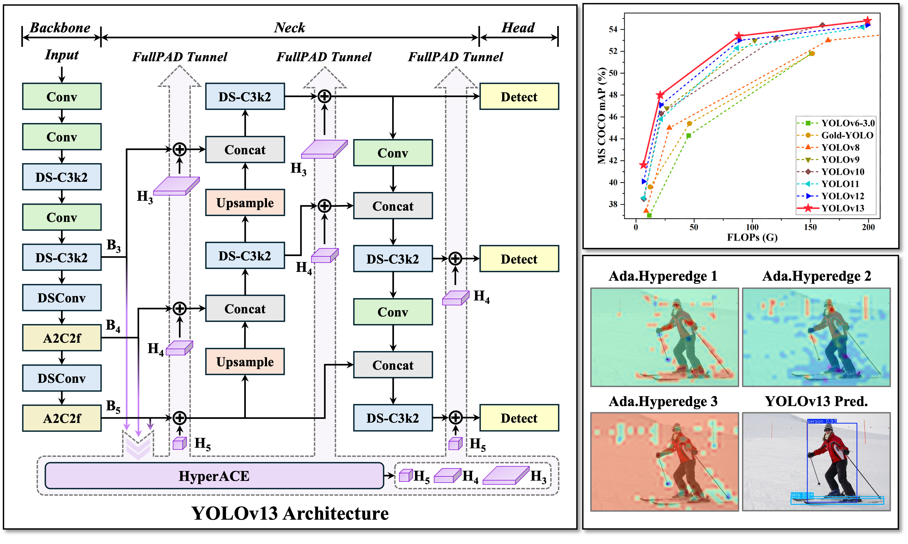

[English](./README.md) | 简体中文

# Note
这部分内容将在2026年1月1日从 RDK S100 Model Zoo 移除，请参考最新 YOLO All-in-One 文档和代码: [YOLO All-in-One CN](https://github.com/D-Robotics/rdk_model_zoo_s/blob/s100/samples/Vision/Ultralytics_YOLO/README_cn.md)

This content will be removed from the RDK S100 Model Zoo on January 1, 2026. Please refer to the latest YOLO All-in-One documentation and code: [YOLO All-in-One EN](https://github.com/D-Robotics/rdk_model_zoo_s/blob/s100/samples/Vision/Ultralytics_YOLO/README.md)

# Ultralytics YOLO Detect

## Abstract
```bash
D-Robotics OpenExplore Version: >= 3.2.0
```

## Support Models: 

```bash
- YOLOv13 - Detect
```

## YOLOv13介绍

<p align="center">
    
<p>
<h2 align="center">YOLOv13: Real-Time Object Detection with Hypergraph-Enhanced Adaptive Visual Perception</h2>


  
<div align="center">
    
</div>

YOLOv13 是清华大学智能媒体与认知实验室推出的新一代实时目标检测模型，具备卓越的性能与效率。其核心技术包括 HyperACE（基于超图的自适应相关性增强）、FullPAD（全管道聚合与分布范式）以及轻量级卷积替换。HyperACE 通过超图结构挖掘像素间的高阶相关性，提升多尺度特征融合效果；FullPAD 在整个网络流程中实现细粒度信息流动和表示协同；轻量化设计则在保持感受野的同时减少计算量，加快推理速度。实验表明，YOLOv13 在 COCO 数据集上表现优异，尤其在精度、速度和参数效率方面优于现有模型。

参考: 

1. https://github.com/iMoonLab/yolov13/

2. https://arxiv.org/abs/2506.17733

3. https://www.gaoyue.org/


## 快速体验

```bash
# Download RDK S100 Model Zoo
$ git clone https://github.com/D-Robotics/rdk_model_zoo_s.git

# Make Sure your are in this file
$ cd samples/Vision/YOLOv13_iMoonLab

# Check your workspace
$ tree -L 2
.
|-- README.md     # English Document
|-- README_cn.md  # Chinese Document
|-- py
|   |-- eval_ultralytics_YOLO_Detect_YUV420SP.py # Advance Evaluation
|   `-- ultralytics_YOLO_Detect_YUV420SP.py      # Quick Start
`-- source
    |-- imgs
    |-- reference_hbm_models    # Reference HBM Models
    |-- reference_logs          # Reference logs
    `-- reference_yamls         # Reference yaml configs
```

如果您的beta测试版系统的Python接口不可用，可以参考以下文档临时回退：

```bash
https://horizonrobotics.feishu.cn/docx/AnVjd1LpeoQp8HxWE3pcPCK2nSg
```

直接运行, 会自动下载模型文件.

```bash
$ python3 py/ultralytics_YOLO_Detect_YUV420SP.py 
```

如果您想替换其他的模型, 或者使用其他的图片, 可以修改脚本文件内的参数.
```bash
$ python3 py/ultralytics_YOLO_Detect_YUV420SP.py -h

options:
  -h, --help            show this help message and exit
  --model-path MODEL_PATH
                        Path to BPU Quantized *.bin Model. RDK X3(Module): Bernoulli2. RDK Ultra: Bayes. RDK X5(Module): Bayes-e. RDK S100: Nash-e. RDK S100P: Nash-m.
  --test-img TEST_IMG   Path to Load Test Image.
  --img-save-path IMG_SAVE_PATH
                        Path to Load Test Image.
  --classes-num CLASSES_NUM
                        Classes Num to Detect.
  --nms-thres NMS_THRES
                        IoU threshold.
  --score-thres SCORE_THRES
                        confidence threshold.
  --reg REG             DFL reg layer.
```


## BenchMark - Performance

### RDK S100P

| Model | Size(Pixels) | Classes |  BPU Task Latency  /<br>BPU Throughput (Threads) | CPU Latency<br>(Single Core) | params(M) | FLOPs(B) |
|----------|---------|----|---------|---------|----------|----------|  
| YOLOv13n  | 640×640 | 80 | 2.8 ms / 353.5 FPS (1 thread  ) <br/> 3.9 ms / 509.0 FPS (2 threads) | 2 ms |  2.5  M  |  6.4   B |  
| YOLOv13s  | 640×640 | 80 | 4.3 ms / 231.7 FPS (1 thread  ) <br/> 7.1 ms / 278.5 FPS (2 threads) | 2 ms |  9.0  M  |  20.8  B |  
| YOLOv13l  | 640×640 | 80 | 12.1 ms / 82.5 FPS (1 thread  ) <br/> 22.7 ms / 87.7 FPS (2 threads) | 2 ms |  27.6 M  |  88.4  B |  
| YOLOv13x  | 640×640 | 80 | 19.7 ms / 50.7 FPS (1 thread  ) <br/> 37.8 ms / 52.7 FPS (2 threads) | 2 ms |  64.0 M  |  199.2 B |  


### RDK S100

| Model | Size(Pixels) | Classes |  BPU Task Latency  /<br>BPU Throughput (Threads) | CPU Latency<br>(Single Core) | params(M) | FLOPs(B) |
|----------|---------|----|---------|---------|----------|----------|
| YOLOv13n  | 640×640 | 80 | 3.8 ms / 262.0 FPS (1 thread  ) <br/> 5.2 ms / 378.3 FPS (2 threads) | 2 ms |  2.5  M  |  6.4   B |  
| YOLOv13s  | 640×640 | 80 | 5.8 ms / 169.5 FPS (1 thread  ) <br/> 9.7 ms / 204.9 FPS (2 threads) | 2 ms |  9.0  M  |  20.8  B |  
| YOLOv13l  | 640×640 | 80 | 16.6 ms / 59.8 FPS (1 thread  ) <br/> 31.1 ms / 63.9 FPS (2 threads) | 2 ms |  27.6 M  |  88.4  B |  
| YOLOv13x  | 640×640 | 80 | 26.9 ms / 37.1 FPS (1 thread  ) <br/> 51.6 ms / 38.6 FPS (2 threads) | 2 ms |  64.0 M  |  199.2 B |   


### Performance Test Instructions
1. 此处测试的均为YUV420SP (nv12) 输入的模型的性能数据. NCHWRGB输入的模型的性能数据与其无明显差距.
2. BPU延迟与BPU吞吐量. 
 - 单线程延迟为单帧,单线程,单BPU核心的延迟,BPU推理一个任务最理想的情况. 
 - 多线程帧率为多个线程同时向BPU塞任务, 每个BPU核心可以处理多个线程的任务, 一般工程中4个线程可以控制单帧延迟较小,同时吃满所有BPU到100%,在吞吐量(FPS)和帧延迟间得到一个较好的平衡. S100 / S100P的BPU整体比较厉害, 一般2个线程就可以将BPU吃满, 帧延迟和吞吐量都非常出色. 
 - 表格中一般记录到吞吐量不再随线程数明显增加的数据. 
 - BPU延迟和BPU吞吐量使用以下命令在板端测试
```bash
hrt_model_exec perf --thread_num 2 --model_file yolov8n_detect_bayese_640x640_nv12_modified.bin

python3 ../../../resource/tools/batch_perf/batch_perf.py --max 4 --file source/reference_hbm_models/
```
3. 测试板卡为最佳状态. 

 - S100P的状态为最佳状态: CPU为6 × A78AE @ 2.0GHz, 全核心Performance调度, BPU为1 × Nash-m @ 1.5GHz, 128TOPS @ int8.
 - S100的状态为最佳状态: CPU为6 × A78AE @ 1.5GHz, 全核心Performance调度, BPU为1 × Nash-e @ 1.0GHz, 80TOPS @ int8.

```bash
sudo bash -c "echo performance > /sys/devices/system/cpu/cpufreq/policy0/scaling_governor"
sudo bash -c "echo performance > /sys/devices/system/cpu/cpufreq/policy4/scaling_governor"
sudo bash -c "echo performance > /sys/devices/system/bpu/bpu0/devfreq/28108000.bpu/governor"
```

## Benchmark - Accuracy

### RDK S100 / RDK S100P
Object Detection (COCO2017)
| Model | Pytorch | YUV420SP<br/>Python | YUV420SP<br/>C/C++ | NCHWRGB<br/>C/C++ |
|---------|---------|-------|---------|---------|
| YOLOv13n  | 0.342 | 0.319 (93.27%) | (%) | (%) |
| YOLOv13s  | 0.402 | 0.381 (94.78%) | (%) | (%) |
| YOLOv13l  | 0.458 | 0.443 (96.73%) | (%) | (%) |
| YOLOv13x  | 0.473 | 0.458 (96.83%) | (%) | (%) |


### Accuracy Test Instructions

1. 所有的精度数据使用微软官方的无修改的`pycocotools`库进行计算, 取的精度标准为`Average Precision  (AP) @[ IoU=0.50:0.95 | area=   all | maxDets=100 ]`的数据. 
2. 所有的测试数据均使用`COCO2017`数据集的val验证集的5000张照片, 在板端直接推理, dump保存为json文件, 送入第三方测试工具`pycocotools`库进行计算, 分数的阈值为0.25, nms的阈值为0.7. 
3. pycocotools计算的精度比ultralytics计算的精度会低一些是正常现象, 主要原因是pycocotools是取矩形面积, ultralytics是取梯形面积, 我们主要是关注同样的一套计算方式去测试定点模型和浮点模型的精度, 从而来评估量化过程中的精度损失. 
4. BPU模型在量化NCHW-RGB888输入转换为YUV420SP(nv12)输入后, 也会有一部分精度损失, 这是由于色彩空间转化导致的, 在训练时加入这种色彩空间转化的损失可以避免这种精度损失. 
5. Python接口和C/C++接口的精度结果有细微差异, 主要在于Python和C/C++的一些数据结构进行memcpy和转化的过程中, 对浮点数的处理方式不同, 导致的细微差异.
6. 测试脚本请参考RDK Model Zoo的eval部分: https://github.com/D-Robotics/rdk_model_zoo/tree/main/demos/tools/eval_pycocotools
7. 本表格是使用PTQ(训练后量化)使用50张图片进行校准和编译的结果, 用于模拟普通开发者第一次直接编译的精度情况, 并没有进行精度调优或者QAT(量化感知训练), 满足常规使用验证需求, 不代表精度上限.


## 进阶开发

### 环境、项目准备

注: 任何No such file or directory, No module named "xxx", command not found.等报错请仔细检查, 请勿逐条复制运行, 如果对修改过程不理解请前往开发者社区从YOLOv5开始了解. 

 - 下载iMoonLab/yolov13仓库, 并参考ultralytics官方文档, 配置好环境.
```bash
git clone https://github.com/iMoonLab/yolov13.git
```
 - 进入本地仓库, 下载论文作者提供的YOLOv13n预训练权重.
```bash
cd yolov13
wget https://github.com/iMoonLab/yolov13/releases/download/yolov13/yolov13n.pt
```

### 模型训练

 - 模型训练请参考ultralytics官方文档, 这个文档由ultralytics维护, 质量非常的高. 网络上也有非常多的参考材料, 得到一个像官方一样的预训练权重的模型并不困难. 
 - 请注意, 训练时无需修改任何程序, 无需修改forward方法. 

Ultralytics YOLO 官方文档: https://docs.ultralytics.com/modes/train/


### 导出为onnx

 - 卸载yolo相关的命令行命令, 这样直接修改`./ultralytics/ultralytics`目录内的内容即可生效.

```bash
$ conda list | grep ultralytics
$ pip list | grep ultralytics # 或者
# 如果存在, 则卸载
$ conda uninstall ultralytics 
$ pip uninstall ultralytics   # 或者
```

如果不是很顺利, 可以通过以下Python命令确认需要修改的`ultralytics`目录的位置.

```bash
>>> import ultralytics
>>> ultralytics.__path__
['/home/wuchao/miniconda3/envs/yolo/lib/python3.11/site-packages/ultralytics']
# 或者
['/home/wuchao/YOLO11/ultralytics_v11/ultralytics']
```

 - 修改Detect的输出头, 直接将三个特征层的Bounding Box信息和Classify信息分开输出, 一共6个输出头. 

文件目录: ./ultralytics/ultralytics/nn/modules/head.py, 约第58行, `Detect`类的forward方法替换成以下内容.

注: 建议您保留好原本的`forward`方法, 例如改一个其他的名字`forward_`, 方便在训练的时候换回来. 

```python
def forward(self, x):
    result = []
    for i in range(self.nl):
        result.append(self.cv3[i](x[i]).permute(0, 2, 3, 1).contiguous())
        result.append(self.cv2[i](x[i]).permute(0, 2, 3, 1).contiguous())
    return result

## 如果输出头顺序刚好是bbox和cls反的, 可以使用如下修改方式, 调换cv2和cv3的append顺序
## 然后再重新导出onnx, 编译为bin模型
def forward(self, x):
    result = []
    for i in range(self.nl):
        result.append(self.cv2[i](x[i]).permute(0, 2, 3, 1).contiguous())
        result.append(self.cv3[i](x[i]).permute(0, 2, 3, 1).contiguous())
    return result
```

 - 运行以下Python脚本进行ONNX导出
如果有**No module named onnxsim**报错, 安装一个即可. 注意, 如果生成的onnx模型显示ir版本过高, 可以将simplify=False. 两种设置对最终bin模型没有影响, 打开后可以提升onnx模型在netron中的可读性.

```python
from ultralytics import YOLO
YOLO('yolov11n.pt').export(imgsz=640, format='onnx', simplify=False, opset=19)
```

### 准备校准数据

参考RDK Model Zoo S提供的极简的校准数据准备脚本: `https://github.com/D-Robotics/rdk_model_zoo_s/blob/s100/resource/tools/generate_calibration_data/generate_cal_data.py `进行校准数据的准备. 


### 确认移除反量化节点的名称

Netron可视化工具:` https://netron.app/`

通过Netron查看对ONNX模型进行可视化, 确认需要移除的节点名称, 这里有一个小口诀, 就是带64的都移除. 这里的64 = 4 * REG, REG = 16. 注意, 不同版本的Ultralytics导出的ONNX的名称是不同的, 请勿直接套用.


看到大小为[1, 80, 80, 64], [1, 40, 40, 64], [1, 20, 20, 64]的三个输出的名称, 对应的yaml中填入对应的名称.

```yaml
model_parameters:
  onnx_model: 'ultralytcs_YOLO.onnx'
  march: nash-e  # S100: nash-e, S100P: nash-m.
  layer_out_dump: False
  working_dir: 'ultralytcs_YOLO_output'
  output_model_file_prefix: 'ultralytcs_YOLO'
  remove_node_name: "/model.32/cv2.0/cv2.2.2/Conv;/model.32/cv2.1/cv2.1.2/Conv;/model.32/cv2.2/cv2.2.2/Conv;"
```

### 模型编译
```bash
(bpu_docker) $ hb_compile --config config.yaml
```

### 异常处理

如果模型的输出情况与Model Zoo参考模型不一致, 原因可能是移除的节点名称错误, 可通过查看bc模型的信息来确认.

```bash
# 快速产生一个bc模型
hb_compile --fast-perf --march nash-e --skip compile --model yolov13n.onnx
# 查看bc模型的输出节点信息
hb_model_info yolov13n_quantized_model.bc
```

可查阅到以下信息

```bash
2025-06-24 03:17:30,044 INFO ############# Removable node info #############
2025-06-24 03:17:30,044 INFO Node Name                    Node Type
2025-06-24 03:17:30,045 INFO ---------------------------- ----------
2025-06-24 03:17:30,045 INFO /model.32/cv3.0/cv3.0.2/Conv Dequantize
2025-06-24 03:17:30,045 INFO /model.32/cv2.0/cv2.0.2/Conv Dequantize
2025-06-24 03:17:30,045 INFO /model.32/cv3.1/cv3.1.2/Conv Dequantize
2025-06-24 03:17:30,045 INFO /model.32/cv2.1/cv2.1.2/Conv Dequantize
2025-06-24 03:17:30,045 INFO /model.32/cv3.2/cv3.2.2/Conv Dequantize
2025-06-24 03:17:30,045 INFO /model.32/cv2.2/cv2.2.2/Conv Dequantize
```

Model Zoo提供编译日志, bc模型信息日志和hbm模型日志, 用于比较您自己获得的模型和Model Zoo参考模型的区别.

```bash
./samples/Vision/YOLOv13_iMoonLab/source/reference_logs/
|-- hb_compile_yolov13.txt
|-- hb_model_info_yolov13.txt
`-- hrt_model_exec_model_info_yolov13.txt
```

## 参考

[ultralytics](https://docs.ultralytics.com/)

