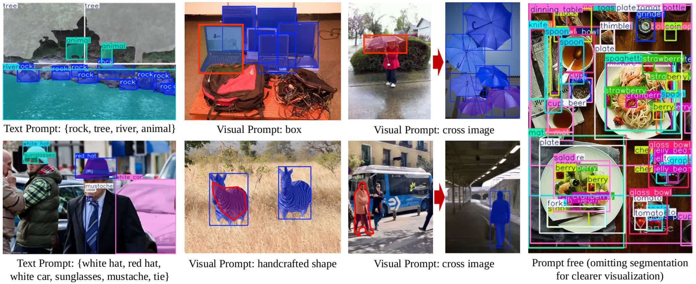
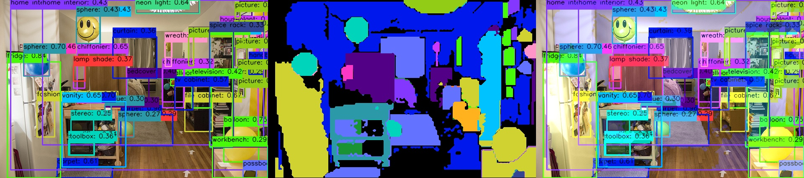
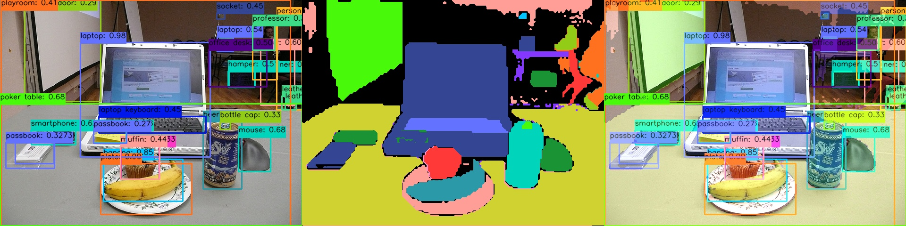
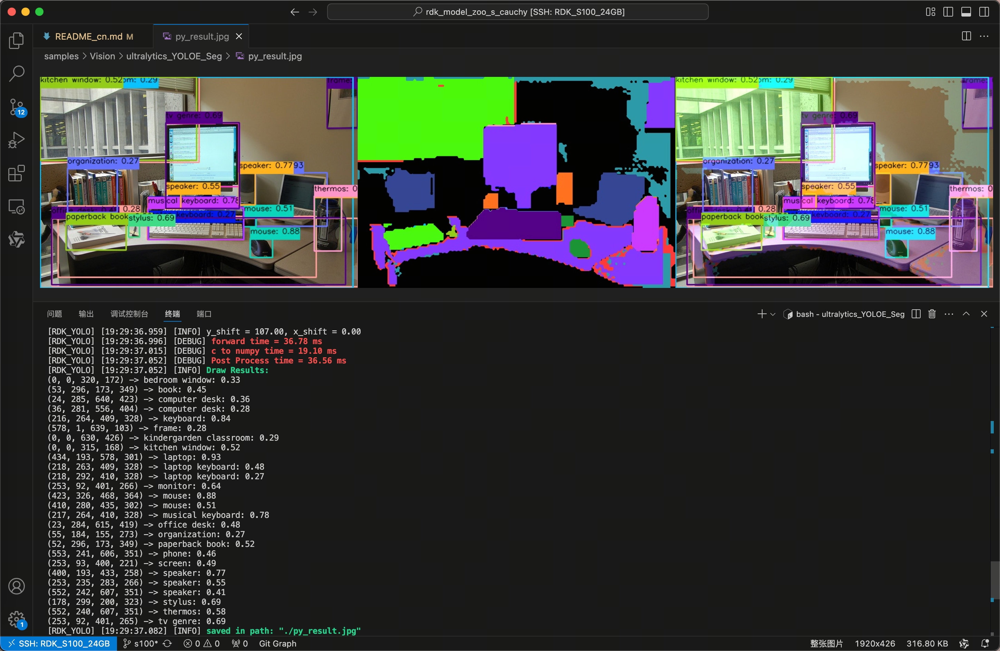

English| [简体中文](./README_cn.md)


# YOLOE-11 Instance Segmentation Prompt Free

## Abstract

```bash
D-Robotics OpenExplore Version: >= 3.0.31
Ultralytics YOLO Version: >= 8.3.0
```

## Support

```bash
YOLOE-11 Instance Segmentation Prompt Free
YOLOE-v8 Instance Segmentation Prompt Free
```

## Introduction to YOLOE





**YOLOE (Real-Time Seeing Anything)** is a new advancement in zero-shot, promptable YOLO models, specifically designed for open-vocabulary detection and segmentation. Unlike previous YOLO models that were limited to fixed categories, YOLOE can detect any object category in real time using textual, visual, or internal vocabulary prompts. Built upon YOLOv10 and inspired by YOLO-World, YOLOE achieves state-of-the-art zero-shot performance with almost no impact on speed or accuracy.

Paper from Tsinghua University: [https://arxiv.org/pdf/2503.07465v1](https://arxiv.org/pdf/2503.07465v1)

This directory attempts to export its **Prompt-Free** version, which does not require input text prompts and can detect **4,585 object categories**, while also performing **instance segmentation**. Please refer to the images below for runtime results — it’s clear that the perceived information is very rich.

  
  


**Note**: This is an exploratory case provided for community reference only. It has not undergone deep optimization and does not represent final commercial deployment readiness or the upper limit of board-level application development.


## Quick Start

```bash
# Make sure you are in this directory
$ cd samples/Vision/ultralytics_YOLOE_Seg/

# Check your workspace
$ tree -L 2
.
|-- README.md      # English Document
|-- README_cn.md   # Chinese Document
|-- py
|   |-- cauchy_yoloe_seg_pf_export.py       # Advance Evaluation
|   `-- ultralytics_YOLOE_Seg_YUV420SP.py   # Quick Start
`-- source
    |-- imgs
    |-- reference_hbm_model               # Reference HBM Models
    |-- reference_logs                    # Reference logs
    |-- reference_yamls                   # Reference yaml configs
    `-- thu_yoloe_prompt_free_names.list  # List of 4585 class names
```

Run directly, and the script will automatically download the model file.

```bash
$ python3 py/ultralytics_YOLOE_Seg_YUV420SP.py
```

If you want to use a different model or image, you can modify the parameters in the script:

```bash
$ python3 py/ultralytics_YOLOE_Seg_YUV420SP.py -h

options:
  -h, --help            show this help message and exit
  --model-path MODEL_PATH
                        Path to BPU Quantized *.hbm Model. RDK X3(Module): Bernoulli2. RDK Ultra: Bayes. RDK X5(Module): Bayes-e. RDK S100: Nash-e. RDK S100P: Nash-m.
  --test-img TEST_IMG   Path to Load Test Image.
  --img-save-path IMG_SAVE_PATH
                        Path to Save Output Image.
  --classes-num CLASSES_NUM
                        Number of classes to detect.
  --nms-thres NMS_THRES
                        IoU threshold for NMS.
  --score-thres SCORE_THRES
                        Confidence score threshold.
  --reg REG             DFL regression layer count.
  --mc MC               Mask coefficients count.
  --is-open IS_OPEN     True: Apply morphologyEx
  --is-point IS_POINT   True: Draw edge points
```

## Result Analysis



The program automatically downloads the **YOLOE 11s Seg BPU HBM model**, performs object detection on the input image, and saves the visualization result as `py_result.jpg` in the current working directory.


## BenchMark - Performance

### RDK S100P

| Model | Size(Pixels) | Classes |  BPU Task Latency  /<br>BPU Throughput (Threads) | CPU Latency<br>(Single Core) | params(M) | FLOPs(B) |
|----------|---------|----|---------|---------|----------|----------|
| YOLOE-v8s-Seg | 640×640 | 4585 | 27.1 ms / 36.5 FPS (1 thread  ) <br/> 32.8 ms / 60.2 FPS (2 threads) <br/> 40.1 ms / 73.8 FPS (3 threads) | ms | 11.4 M | 52.3  B |
| YOLOE-v8m-Seg | 640×640 | 4585 | 29.2 ms / 33.8 FPS (1 thread  ) <br/> 35.1 ms / 56.3 FPS (2 threads) <br/> 42.2 ms / 70.1 FPS (3 threads) | ms | 33.5 M | 124.7 B |
| YOLOE-v8l-Seg | 640×640 | 4585 | 41.1 ms / 24.1 FPS (1 thread  ) <br/> 50.4 ms / 39.3 FPS (2 threads) <br/> 75.6 ms / 39.3 FPS (3 threads) | ms | 55.0 M | 239.8 B |
| YOLOE-11s-Seg | 640×640 | 4585 | 27.1 ms / 36.5 FPS (1 thread  ) <br/> 33.1 ms / 59.7 FPS (2 threads) <br/> 40.3 ms / 73.3 FPS (3 threads) | ms | 13.7 M | 45.2  B |
| YOLOE-11m-Seg | 640×640 | 4585 | 26.6 ms / 37.1 FPS (1 thread  ) <br/> 32.1 ms / 61.5 FPS (2 threads) <br/> 40.3 ms / 73.4 FPS (3 threads) | ms | 31.4 M | 140.8 B |
| YOLOE-11l-Seg | 640×640 | 4585 | 27.7 ms / 35.6 FPS (1 thread  ) <br/> 33.9 ms / 58.3 FPS (2 threads) <br/> 40.8 ms / 72.5 FPS (3 threads) | ms | 36.7 M | 161.6 B |


### RDK S100

| Model | Size(Pixels) | Classes |  BPU Task Latency  /<br>BPU Throughput (Threads) | CPU Latency<br>(Single Core) | params(M) | FLOPs(B) |
|----------|---------|----|---------|---------|----------|----------|
| YOLOE-v8s-Seg | 640×640 | 4585 | 33.6 ms / 29.4 FPS (1 thread  ) <br/> 37.7 ms / 52.4 FPS (2 threads) <br/> 43.3 ms / 68.2 FPS (3 threads) | ms | 11.4 M | 52.3 B |
| YOLOE-v8m-Seg | 640×640 | 4585 | 36.8 ms / 26.9 FPS (1 thread  ) <br/> 40.7 ms / 48.5 FPS (2 threads) <br/> 44.2 ms / 66.8 FPS (3 threads) | ms | 33.5 M | 124.7 B |
| YOLOE-v8l-Seg | 640×640 | 4585 | 52.7 ms / 18.8 FPS (1 thread  ) <br/> 61.2 ms / 32.3 FPS (2 threads) <br/> 91.9 ms / 32.3 FPS (3 threads) | ms | 55.0 M | 239.8 B |
| YOLOE-11s-Seg | 640×640 | 4585 | 33.7 ms / 29.3 FPS (1 thread  ) <br/> 37.4 ms / 52.7 FPS (2 threads) <br/> 43.3 ms / 68.3 FPS (3 threads) | ms | 13.7 M | 45.2 B |
| YOLOE-11m-Seg | 640×640 | 4585 | 34.7 ms / 28.5 FPS (1 thread  ) <br/> 38.8 ms / 50.8 FPS (2 threads) <br/> 43.9 ms / 67.2 FPS (3 threads) | ms | 31.4 M | 140.8 B |
| YOLOE-11l-Seg | 640×640 | 4585 | 36.1 ms / 27.3 FPS (1 thread  ) <br/> 39.9 ms / 49.4 FPS (2 threads) <br/> 45.1 ms / 65.4 FPS (3 threads) | ms | 36.7 M | 161.6 B |


### Performance Test Instructions

1. The performance data tested here are all for models with YUV420SP (nv12) input. There is no significant difference in performance data for models with NCHWRGB input.
2. BPU Latency and BPU Throughput.
- Single-thread latency refers to the delay of processing a single frame by a single thread on a single BPU core, representing the ideal scenario for BPU inference task.
- Multi-thread frame rate means multiple threads simultaneously send tasks to the BPU, where each BPU core can handle tasks from multiple threads. Generally, in engineering projects, controlling the frame delay to be relatively small with 4 threads while fully utilizing the BPU up to 100% can achieve a good balance between throughput (FPS) and frame latency. The BPU of S100/S100P performs quite well, usually requiring only 2 threads to fully utilize the BPU, achieving outstanding frame latency and throughput.
- Data recorded in the table typically reaches a point where throughput does not significantly increase with the number of threads.
- BPU latency and BPU throughput were tested on the board using the following commands:
```bash
hrt_model_exec perf --thread_num 2 --model_file yolov8n_detect_bayese_640x640_nv12_modified.bin

python3 ../../../resource/tools/batch_perf/batch_perf.py --max 3 --file source/reference_hbm_models/
```

3. The test boards were in their optimal state.
- Optimal state for S100P: CPU consists of 6 × A78AE @ 2.0GHz with full-core Performance scheduling, BPU is 1 × Nash-m @ 1.5GHz, delivering 128TOPS at int8.
- Optimal state for S100: CPU consists of 6 × A78AE @ 1.5GHz with full-core Performance scheduling, BPU is 1 × Nash-e @ 1.0GHz, delivering 80TOPS at int8.

```bash
sudo bash -c "echo performance > /sys/devices/system/cpu/cpufreq/policy0/scaling_governor"
sudo bash -c "echo performance > /sys/devices/system/cpu/cpufreq/policy4/scaling_governor"
sudo bash -c "echo performance > /sys/devices/system/bpu/bpu0/devfreq/28108000.bpu/governor"
```

## Advanced Development

### Export to ONNX

Use the export script provided by RDK Model Zoo:  
`https://github.com/D-Robotics/rdk_model_zoo/blob/main/demos/Seg/YOLOE-11-Seg-Prompt-Free/YOLOE-11-Seg-Prompt-Free_YUV420SP/cauchy_yoloe11segPF_export.py`.  
This script automatically replaces relevant modules in an equivalent manner and does not require retraining.

Readers who are interested in further exploration are encouraged to review the source code on their own.

### Other Steps

Other steps are essentially the same as those for Ultralytics YOLO Seg, except that the number of classes has been changed from 80 to 4585.

## References

[ultralytics](https://docs.ultralytics.com/)

