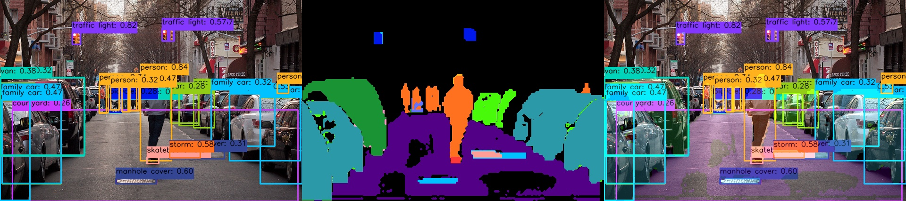

[English](./README.md) | 简体中文


[English](./README.md) | 简体中文

# YOLOE-11 Instance Segmentation Prompt Free

## Support


## YOLOE介绍


YOLOE（实时看见一切）是零样本、可提示的 YOLO 模型的一项新进展，专为开放词汇检测和分割设计。与以往只能局限于固定类别的 YOLO 模型不同，YOLOE 使用文本、图像或内部词汇提示，能够实现实时检测任何对象类别。YOLOE 基于 YOLOv10 构建，并受到 YOLO-World 的启发，在几乎不影响速度和精度的情况下实现了最先进的零样本性能。

清华的论文: https://arxiv.org/pdf/2503.07465v1

本目录尝试导出其Prompt Free的模型, 不需要输入文本的提示词, 可以检测4585个类别, 并对其进行实例分割, 运行效果参考以下图, 可以观察到, 感知到的信息还是非常丰富的.





注: 本案例为探索性案例, 仅供社区参考, 未做深入优化, 不代表任何商业量产交付的最终效果, 不代表板卡应用开发的上限.


## 快速体验

## BenchMark - Performance

### RDK S100P

| Model | Size(Pixels) | Classes |  BPU Task Latency  /<br>BPU Throughput (Threads) | CPU Latency<br>(Single Core) | params(M) | FLOPs(B) |
|----------|---------|----|---------|---------|----------|----------|
| YOLOE-v8s-Seg | 640×640 | 4585 | 27.1 ms / 36.5 FPS (1 thread  ) <br/> 32.8 ms / 60.2 FPS (2 threads) <br/> 40.1 ms / 73.8 FPS (3 threads) | ms | 11.4 M | 52.3  B |
| YOLOE-v8m-Seg | 640×640 | 4585 | 29.2 ms / 33.8 FPS (1 thread  ) <br/> 35.1 ms / 56.3 FPS (2 threads) <br/> 42.2 ms / 70.1 FPS (3 threads) | ms | 33.5 M | 124.7 B |
| YOLOE-v8l-Seg | 640×640 | 4585 | 41.1 ms / 24.1 FPS (1 thread  ) <br/> 50.4 ms / 39.3 FPS (2 threads) <br/> 75.6 ms / 39.3 FPS (3 threads) | ms | 55.0 M | 239.8 B |
| YOLOE-11s-Seg | 640×640 | 4585 | 27.1 ms / 36.5 FPS (1 thread  ) <br/> 33.1 ms / 59.7 FPS (2 threads) <br/> 40.3 ms / 73.3 FPS (3 threads) | ms | 13.7 M | 45.2  B |
| YOLOE-11m-Seg | 640×640 | 4585 | 26.6 ms / 37.1 FPS (1 thread  ) <br/> 32.1 ms / 61.5 FPS (2 threads) <br/> 40.3 ms / 73.4 FPS (3 threads) | ms | 31.4 M | 140.8 B |
| YOLOE-11l-Seg | 640×640 | 4585 | 27.7 ms / 35.6 FPS (1 thread  ) <br/> 33.9 ms / 58.3 FPS (2 threads) <br/> 40.8 ms / 72.5 FPS (3 threads) | ms | 36.7 M | 161.6 B |


### RDK S100

| Model | Size(Pixels) | Classes |  BPU Task Latency  /<br>BPU Throughput (Threads) | CPU Latency<br>(Single Core) | params(M) | FLOPs(B) |
|----------|---------|----|---------|---------|----------|----------|
| YOLOE-v8s-Seg | 640×640 | 4585 | 33.6 ms / 29.4 FPS (1 thread  ) <br/> 37.7 ms / 52.4 FPS (2 threads) <br/> 43.3 ms / 68.2 FPS (3 threads) | ms | 11.4 M | 52.3 B |
| YOLOE-v8m-Seg | 640×640 | 4585 | 36.8 ms / 26.9 FPS (1 thread  ) <br/> 40.7 ms / 48.5 FPS (2 threads) <br/> 44.2 ms / 66.8 FPS (3 threads) | ms | 33.5 M | 124.7 B |
| YOLOE-v8l-Seg | 640×640 | 4585 | 52.7 ms / 18.8 FPS (1 thread  ) <br/> 61.2 ms / 32.3 FPS (2 threads) <br/> 91.9 ms / 32.3 FPS (3 threads) | ms | 55.0 M | 239.8 B |
| YOLOE-11s-Seg | 640×640 | 4585 | 33.7 ms / 29.3 FPS (1 thread  ) <br/> 37.4 ms / 52.7 FPS (2 threads) <br/> 43.3 ms / 68.3 FPS (3 threads) | ms | 13.7 M | 45.2 B |
| YOLOE-11m-Seg | 640×640 | 4585 | 34.7 ms / 28.5 FPS (1 thread  ) <br/> 38.8 ms / 50.8 FPS (2 threads) <br/> 43.9 ms / 67.2 FPS (3 threads) | ms | 31.4 M | 140.8 B |
| YOLOE-11l-Seg | 640×640 | 4585 | 36.1 ms / 27.3 FPS (1 thread  ) <br/> 39.9 ms / 49.4 FPS (2 threads) <br/> 45.1 ms / 65.4 FPS (3 threads) | ms | 36.7 M | 161.6 B |


### Performance Test Instructions
1. 此处测试的均为YUV420SP (nv12) 输入的模型的性能数据. NCHWRGB输入的模型的性能数据与其无明显差距.
2. BPU延迟与BPU吞吐量。
 - 单线程延迟为单帧,单线程,单BPU核心的延迟,BPU推理一个任务最理想的情况。
 - 多线程帧率为多个线程同时向BPU塞任务, 每个BPU核心可以处理多个线程的任务, 一般工程中4个线程可以控制单帧延迟较小,同时吃满所有BPU到100%,在吞吐量(FPS)和帧延迟间得到一个较好的平衡。S100 / S100P的BPU整体比较厉害, 一般2个线程就可以将BPU吃满, 帧延迟和吞吐量都非常出色。
 - 表格中一般记录到吞吐量不再随线程数明显增加的数据。
 - BPU延迟和BPU吞吐量使用以下命令在板端测试
```bash
hrt_model_exec perf --thread_num 2 --model_file yolov8n_detect_bayese_640x640_nv12_modified.bin

python3 ../../../resource/tools/batch_perf/batch_perf.py --max 6 --file source/reference_hbm_models/
```
3. 测试板卡为最佳状态。

 - S100P的状态为最佳状态：CPU为6 × A78AE @ 2.0GHz, 全核心Performance调度, BPU为1 × Nash-m @ 1.5GHz, 128TOPS @ int8.
 - S100的状态为最佳状态：CPU为6 × A78AE @ 1.5GHz, 全核心Performance调度, BPU为1 × Nash-e @ 1.0GHz, 80TOPS @ int8.

```bash
sudo bash -c "echo performance > /sys/devices/system/cpu/cpufreq/policy0/scaling_governor"
sudo bash -c "echo performance > /sys/devices/system/cpu/cpufreq/policy4/scaling_governor"
sudo bash -c "echo performance > /sys/devices/system/bpu/bpu0/devfreq/28108000.bpu/governor"
```


# 进阶开发


## 步骤参考


### 导出为onnx

使用RDK Model Zoo提供的导出脚本：`https://github.com/D-Robotics/rdk_model_zoo/blob/main/demos/Seg/YOLOE-11-Seg-Prompt-Free/YOLOE-11-Seg-Prompt-Free_YUV420SP/cauchy_yoloe11segPF_export.py`，该脚本内会自动等价替换相关模块, 并且不需要重新训练.

其他步骤除类别数从80变为4585外, 和Ultralytics YOLO Seg无明显区别.

## 反馈
本文如果有表达不清楚的地方欢迎前往地瓜开发者社区进行提问和交流.

[地瓜机器人开发者社区](developer.d-robotics.cc).

## 参考

[ultralytics](https://docs.ultralytics.com/)


## Reference

Ultralytics Version: 8.3.128 or higher.
