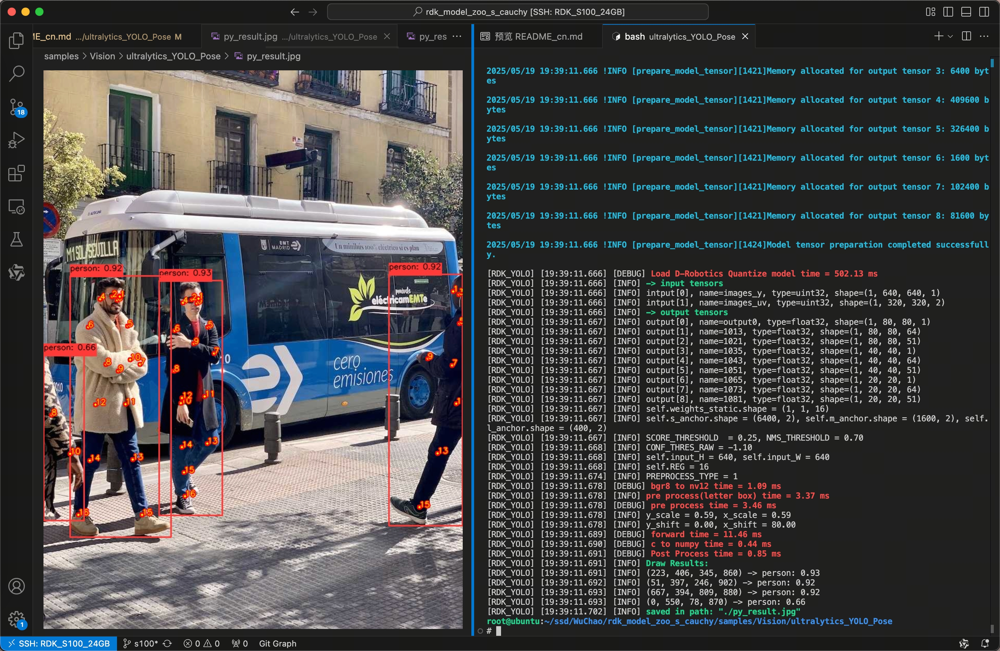
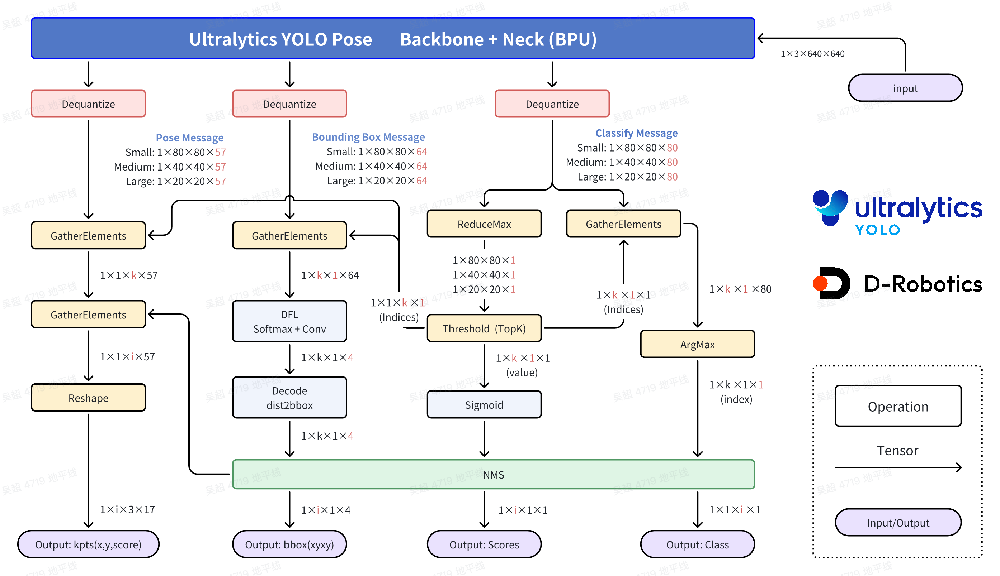

[English](./README.md) | 简体中文

# Ultralytics YOLO Pose

## Abstract
```bash
D-Robotics OpenExplore Version: >= 3.0.31
Ultralytics YOLO Version: >= 8.3.0
```

## Support Models: 

```bash
- YOLOv8 - Pose
- YOLO11 - Pose
```

## YOLO介绍


YOLO (You Only Look Once)是一种流行的物体检测和图像分割模型,由华盛顿大学的约瑟夫-雷德蒙(Joseph Redmon)和阿里-法哈迪(Ali Farhadi)开发.YOLO 于 2015 年推出,因其高速度和高精确度而迅速受到欢迎.


 - 2016 年发布的YOLOv2 通过纳入批量归一化、锚框和维度集群改进了原始模型.
2018 年推出的YOLOv3 使用更高效的骨干网络、多锚和空间金字塔池进一步增强了模型的性能.
 - YOLOv4于 2020 年发布, 引入了 Mosaic 数据增强、新的无锚检测头和新的损失函数等创新技术.
 - YOLOv5进一步提高了模型的性能, 并增加了超参数优化、集成实验跟踪和自动导出为常用导出格式等新功能.
 - YOLOv6于 2022 年由美团开源, 目前已用于该公司的许多自主配送机器人.
 - YOLOv7增加了额外的任务, 如 COCO 关键点数据集的姿势估计.
 - YOLOv8是YOLO 的最新版本, 由Ultralytics 提供.YOLOv8 YOLOv8 支持全方位的视觉 AI 任务, 包括检测、分割、姿态估计、跟踪和分类.这种多功能性使用户能够在各种应用和领域中利用YOLOv8 的功能.
 - YOLOv9 引入了可编程梯度信息(PGI) 和广义高效层聚合网络(GELAN)等创新方法.
 - YOLOv10是由清华大学的研究人员使用Ultralytics Python 软件包创建的.该版本通过引入端到端头(End-to-End head),消除了非最大抑制(NMS)要求, 实现了实时目标检测的进步.
 - YOLO11 NEW 🚀: Ultralytics的最新YOLO模型在多个任务上实现了最先进的（SOTA）性能.
 - YOLO12构建以注意力为核心的YOLO框架, 通过创新方法和架构改进, 打破CNN模型在YOLO系列中的主导地位, 实现具有快速推理速度和更高检测精度的实时目标检测.


## 快速体验

```bash
# Make Sure your are in this file
$ cd samples/Vision/ultralytics_YOLO_Pose

# Check your workspace
$ tree -L 2
.
|-- README.md     # English Document
|-- README_cn.md  # Chinese Document
|-- py
|   `-- ultralitics_YOLO_Pose_YUV420SP.py      # Quick Start
`-- source
    |-- imgs
    |-- reference_hbm_models    # Reference HBM Models
    |-- reference_logs          # Reference logs
    `-- reference_yamls         # Reference yaml configs
```

直接运行, 会自动下载模型文件.

```bash
$ python3 py/ultralitics_YOLO_Pose_YUV420SP.py
```

如果您想替换其他的模型, 或者使用其他的图片, 可以修改脚本文件内的参数.
```bash
$ python3 py/ultralitics_YOLO_Pose_YUV420SP.py -h

options:
  -h, --help            show this help message and exit
  --model-path MODEL_PATH
                        Path to BPU Quantized *.bin Model. RDK X3(Module): Bernoulli2. RDK Ultra: Bayes. RDK X5(Module): Bayes-e. RDK S100: Nash-e. RDK S100P: Nash-m.
  --test-img TEST_IMG   Path to Load Test Image.
  --img-save-path IMG_SAVE_PATH
                        Path to Load Test Image.
  --nms-thres NMS_THRES
                        IoU threshold.
  --score-thres SCORE_THRES
                        confidence threshold.
  --reg REG             DFL reg layer.
  --kpt-conf-thres KPT_CONF_THRES
                        confidence threshold.
```


## 结果分析



程序自动下载 YOLO11n - Pose 的 BPU HBM 模型, 并完成了对图片的目标检测任务, 可视化结果保存在当前目录下的`py_result.jpg`文件.

## BenchMark - Performance

### RDK S100P

| Model | Size(Pixels) | Classes |  BPU Task Latency  /<br>BPU Throughput (Threads) | CPU Latency<br>(Single Core) | params(M) | FLOPs(B) |
|----------|---------|----|---------|---------|----------|----------|
| YOLOv8n-Pose | 640×640 | 80 | 1.8 ms / 527.3 FPS (1 thread  ) <br/> 2.0 ms / 951.9 FPS (2 threads) <br/> 2.7 ms / 1062.4 FPS (3 threads) | 1 ms | 3.3  M | 9.2   B |
| YOLOv8s-Pose | 640×640 | 80 | 2.6 ms / 374.3 FPS (1 thread  ) <br/> 3.4 ms / 577.9 FPS (2 threads)  | 1 ms | 11.6 M | 30.2  B |
| YOLOv8m-Pose | 640×640 | 80 | 4.4 ms / 224.5 FPS (1 thread  ) <br/> 6.9 ms / 285.2 FPS (2 threads)  | 1 ms | 26.4 M | 81.0  B |
| YOLOv8l-Pose | 640×640 | 80 | 8.1 ms / 122.7 FPS (1 thread  ) <br/> 14.3 ms / 138.8 FPS (2 threads) | 1 ms | 44.4 M | 168.6 B |
| YOLOv8x-Pose | 640×640 | 80 | 12.1 ms / 82.4 FPS (1 thread  ) <br/> 22.2 ms / 89.4 FPS (2 threads)  | 1 ms | 69.4 M | 263.2 B |
| YOLO11n-Pose | 640×640 | 80 | 1.8 ms / 524.8 FPS (1 thread  ) <br/> 2.1 ms / 924.0 FPS (2 threads) <br/> 2.9 ms / 1005.0 FPS (3 threads) | 1 ms | 2.9  M | 7.6   B |
| YOLO11s-Pose | 640×640 | 80 | 2.6 ms / 370.9 FPS (1 thread  ) <br/> 3.4 ms / 573.7 FPS (2 threads)  | 1 ms | 9.9  M | 23.2  B |
| YOLO11m-Pose | 640×640 | 80 | 4.8 ms / 204.7 FPS (1 thread  ) <br/> 7.7 ms / 256.5 FPS (2 threads)  | 1 ms | 20.9 M | 71.7  B |
| YOLO11l-Pose | 640×640 | 80 | 5.9 ms / 167.6 FPS (1 thread  ) <br/> 9.9 ms / 199.4 FPS (2 threads)  | 1 ms | 26.2 M | 90.7  B |
| YOLO11x-Pose | 640×640 | 80 | 10.4 ms / 95.3 FPS (1 thread  ) <br/> 18.8 ms / 105.3 FPS (2 threads) | 1 ms | 58.8 M | 203.3 B |

### RDK S100

| Model | Size(Pixels) | Classes |  BPU Task Latency  /<br>BPU Throughput (Threads) | CPU Latency<br>(Single Core) | params(M) | FLOPs(B) |
|----------|---------|----|---------|---------|----------|----------|
| YOLOv8n-Pose | 640×640 | 80 | 2.4 ms / 406.9 FPS (1 thread  ) <br/> 2.6 ms / 736.2 FPS (2 threads) <br/> 3.6 ms / 795.1 FPS (3 threads) | 1 ms | 3.3  M | 9.2   B |
| YOLOv8s-Pose | 640×640 | 80 |  3.5 ms / 276.9 FPS (1 thread  ) <br/> 4.7 ms / 411.5 FPS (2 threads) | 1 ms | 11.6 M | 30.2  B |
| YOLOv8m-Pose | 640×640 | 80 |  6.1 ms / 161.0 FPS (1 thread  ) <br/> 9.9 ms / 200.5 FPS (2 threads) | 1 ms | 26.4 M | 81.0  B |
| YOLOv8l-Pose | 640×640 | 80 |  11.3 ms / 88.0 FPS (1 thread  ) <br/> 20.1 ms / 98.8 FPS (2 threads) | 1 ms | 44.4 M | 168.6 B |
| YOLOv8x-Pose | 640×640 | 80 |  17.2 ms / 57.9 FPS (1 thread  ) <br/> 31.8 ms / 62.5 FPS (2 threads) | 1 ms | 69.4 M | 263.2 B |
| YOLO11n-Pose | 640×640 | 80 | 2.4 ms / 395.2 FPS (1 thread  ) <br/> 2.7 ms / 714.3 FPS (2 threads) <br/> 3.9 ms / 749.0 FPS (3 threads) | 1 ms | 2.9  M | 7.6   B |
| YOLO11s-Pose | 640×640 | 80 |  3.5 ms / 276.2 FPS (1 thread  ) <br/> 4.8 ms / 411.1 FPS (2 threads) | 1 ms | 9.9  M | 23.2  B |
| YOLO11m-Pose | 640×640 | 80 | 6.6 ms / 149.7 FPS (1 thread  ) <br/> 10.9 ms / 181.8 FPS (2 threads) | 1 ms | 20.9 M | 71.7  B |
| YOLO11l-Pose | 640×640 | 80 | 8.1 ms / 121.6 FPS (1 thread  ) <br/> 13.8 ms / 143.1 FPS (2 threads) | 1 ms | 26.2 M | 90.7  B |
| YOLO11x-Pose | 640×640 | 80 |  14.5 ms / 68.8 FPS (1 thread  ) <br/> 26.6 ms / 74.8 FPS (2 threads) | 1 ms | 58.8 M | 203.3 B |


### Performance Test Instructions
1. 此处测试的均为YUV420SP (nv12) 输入的模型的性能数据. NCHWRGB输入的模型的性能数据与其无明显差距.
2. BPU延迟与BPU吞吐量.
 - 单线程延迟为单帧,单线程,单BPU核心的延迟,BPU推理一个任务最理想的情况.
 - 多线程帧率为多个线程同时向BPU塞任务, 每个BPU核心可以处理多个线程的任务, 一般工程中4个线程可以控制单帧延迟较小,同时吃满所有BPU到100%,在吞吐量(FPS)和帧延迟间得到一个较好的平衡.S100 / S100P的BPU整体比较厉害, 一般2个线程就可以将BPU吃满, 帧延迟和吞吐量都非常出色.
 - 表格中一般记录到吞吐量不再随线程数明显增加的数据.
 - BPU延迟和BPU吞吐量使用以下命令在板端测试
```bash
hrt_model_exec perf --thread_num 2 --model_file yolov8n_detect_bayese_640x640_nv12_modified.bin

python3 ../../../resource/tools/batch_perf/batch_perf.py --max 3 --file source/reference_hbm_models/
```
3. 测试板卡为最佳状态.

 - S100P的状态为最佳状态：CPU为6 × A78AE @ 2.0GHz, 全核心Performance调度, BPU为1 × Nash-m @ 1.5GHz, 128TOPS @ int8.
 - S100的状态为最佳状态：CPU为6 × A78AE @ 1.5GHz, 全核心Performance调度, BPU为1 × Nash-e @ 1.0GHz, 80TOPS @ int8.

```bash
sudo bash -c "echo performance > /sys/devices/system/cpu/cpufreq/policy0/scaling_governor"
sudo bash -c "echo performance > /sys/devices/system/cpu/cpufreq/policy4/scaling_governor"
sudo bash -c "echo performance > /sys/devices/system/bpu/bpu0/devfreq/28108000.bpu/governor"
```


## 进阶开发


### kpt定义
Ultralytics YOLO Pose 的关键点基于目标检测，kpt的定义参考如下
```python
COCO_keypoint_indexes = {
    0: 'nose',
    1: 'left_eye',
    2: 'right_eye',
    3: 'left_ear',
    4: 'right_ear',
    5: 'left_shoulder',
    6: 'right_shoulder',
    7: 'left_elbow',
    8: 'right_elbow',
    9: 'left_wrist',
    10: 'right_wrist',
    11: 'left_hip',
    12: 'right_hip',
    13: 'left_knee',
    14: 'right_knee',
    15: 'left_ankle',
    16: 'right_ankle'
}
```

### 计算流程介绍



Ultralytics YOLO Pose 模型的目标检测部分与 Ultralytics YOLO Detect一致, 对应的感受野会多出Channel = 57的特征图, 对应着17个Key Points, 分别是相对于特征图下采样倍数的坐标x, y和这个点对应的分数score.

我们通过目标检测部分, 得知在某个位置的Key Points符合要求后, 将其乘以对应感受野的下采样倍数，即可得到基于输入尺寸的Key Points坐标.

### 环境、项目准备

注：任何No such file or directory, No module named "xxx", command not found.等报错请仔细检查，请勿逐条复制运行，如果对修改过程不理解请前往开发者社区从YOLOv5开始了解.

 - 下载ultralytics/ultralytics仓库，并参考ultralytics官方文档，配置好环境

```bash
git clone https://github.com/ultralytics/ultralytics.git
```

 - 进入本地仓库，下载官方的预训练权重，这里以290万参数的YOLO11n-Pose模型为例

```bash
cd ultralytics
wget https://github.com/ultralytics/assets/releases/download/v8.3.0/yolo11n-pose.pt
```

### 模型训练

 - 模型训练请参考ultralytics官方文档, 这个文档由ultralytics维护, 质量非常的高.网络上也有非常多的参考材料, 得到一个像官方一样的预训练权重的模型并不困难.
 - 请注意, 训练时无需修改任何程序, 无需修改forward方法.

Ultralytics YOLO 官方文档: https://docs.ultralytics.com/modes/train/


### 导出为onnx

 - 卸载yolo相关的命令行命令，这样直接修改`./ultralytics/ultralytics`目录即可生效.

```bash
$ conda list | grep ultralytics
$ pip list | grep ultralytics # 或者
# 如果存在，则卸载
$ conda uninstall ultralytics 
$ pip uninstall ultralytics   # 或者
```

如果不是很顺利，可以通过以下Python命令确认需要修改的`ultralytics`目录的位置.

```bash
>>> import ultralytics
>>> ultralytics.__path__
['/home/wuchao/miniconda3/envs/yolo/lib/python3.11/site-packages/ultralytics']
# 或者
['/home/wuchao/YOLO11/ultralytics_v11/ultralytics']
```

文件目录：./ultralytics/ultralytics/nn/modules/head.py，约第242行，`Pose`类的forward方法替换成以下内容.
注：建议您保留好原本的`forward`方法，例如改一个其他的名字`forward_`, 方便在训练的时候换回来.

```python
def forward(self, x):  # RDK
    result = []
    for i in range(self.nl):
        result.append(self.cv3[i](x[i]).permute(0, 2, 3, 1).contiguous())
        result.append(self.cv2[i](x[i]).permute(0, 2, 3, 1).contiguous())
        result.append(self.cv4[i](x[i]).permute(0, 2, 3, 1).contiguous())
    return result

## 如果输出头顺序刚好是bbox和cls反的, 可以使用如下修改方式, 调换cv2和cv3的append顺序
## 然后再重新导出onnx, 编译为bin模型

def forward(self, x):  # RDK
    result = []
    for i in range(self.nl):
        result.append(self.cv2[i](x[i]).permute(0, 2, 3, 1).contiguous())
        result.append(self.cv3[i](x[i]).permute(0, 2, 3, 1).contiguous())
        result.append(self.cv4[i](x[i]).permute(0, 2, 3, 1).contiguous())
    return result
```

 - 其他可选优化的模块请参考本仓库 Ultralytics YOLO Detect 的 README.

 - 运行以下Python脚本，如果有**No module named onnxsim**报错，安装一个即可
 - 注意，如果生成的onnx模型显示ir版本过高，可以将simplify=False.两种设置对最终bin模型没有影响，打开后可以提升onnx模型在netron中的可读性.
```python
from ultralytics import YOLO
YOLO('yolo11n-pose.pt').export(imgsz=640, format='onnx', simplify=False, opset=19)
```

### 准备校准数据

参考RDK Model Zoo S提供的极简的校准数据准备脚本: `samples/Vision/ultralytics_YOLO_Detect/source/generate_cal_data.py `进行校准数据的准备。

### 模型编译
```bash
(bpu_docker) $ hb_compile --config config.yaml
```

### 异常处理

Model Zoo提供编译日志, bc模型信息日志和hbm模型日志, 用于比较您自己获得的模型和Model Zoo参考模型的区别.

```bash
./samples/Vision/ultralytics_YOLO_Pose/source/reference_logs/
|-- hb_combine_yolo11n_pose.txt
|-- hb_combine_yolov8n_pose.txt
|-- hb_model_info_yolo11n_pose.txt
|-- hb_model_info_yolov8n_pose.txt
|-- hrt_model_exec_model_info_yolo11n_pose.txt
`-- hrt_model_exec_model_info_yolov8n_pose.txt
```

## 参考

[ultralytics](https://docs.ultralytics.com/)