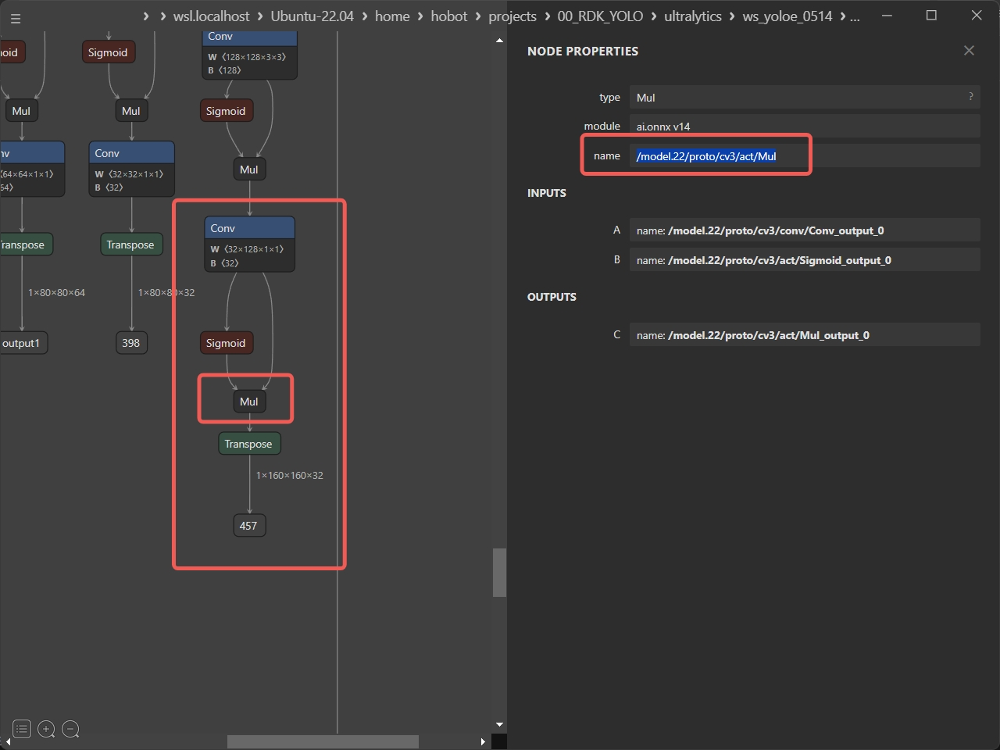

English| [简体中文](./README_cn.md)

# Ultralytics YOLO Instance Segmentation

## Abstract

```bash
D-Robotics OpenExplore Version: >= 3.0.31
Ultralytics YOLO Version: >= 8.3.0
```

## Support Models: 

```bash
- YOLOv8 - Seg
- YOLO11 - Seg
```

## Introduction to YOLO


YOLO (You Only Look Once) is a popular object detection and image segmentation model developed by Joseph Redmon and Ali Farhadi of the University of Washington. YOLO was introduced in 2015 and quickly gained popularity due to its high speed and accuracy.

 - YOLOv2, released in 2016, improved upon the original model by incorporating batch normalization, anchor boxes, and dimension clustering.
 - YOLOv3: The third iteration of the YOLO model family, originally by Joseph Redmon, known for its efficient real-time object detection capabilities.
 - YOLOv4: A darknet-native update to YOLOv3, released by Alexey Bochkovskiy in 2020.
 - YOLOv5: An improved version of the YOLO architecture by Ultralytics, offering better performance and speed trade-offs compared to previous versions.
 - YOLOv6: Released by Meituan in 2022, and in use in many of the company's autonomous delivery robots.
 - YOLOv7: Updated YOLO models released in 2022 by the authors of YOLOv4.
 - YOLOv8: The latest version of the YOLO family, featuring enhanced capabilities such as instance segmentation, pose/keypoints estimation, and classification.
 - YOLOv9: An experimental model trained on the Ultralytics YOLOv5 codebase implementing Programmable Gradient Information (PGI).
 - YOLOv10: By Tsinghua University, featuring NMS-free training and efficiency-accuracy driven architecture, delivering state-of-the-art performance and latency.
 - YOLO11 🚀: Ultralytics' latest YOLO models delivering state-of-the-art (SOTA) performance across multiple tasks.
 - YOLO12 builds a YOLO framework centered around attention mechanisms, employing innovative methods and architectural improvements to break the dominance of CNN models within the YOLO series. This enables real-time object detection with faster inference speeds and higher detection accuracy.


## Quick Experience

```bash
# Make Sure your are in this file
$ cd samples/Vision/ultralytics_YOLO_Seg

# Check your workspace
$ tree -L 2
.
|-- README.md     # English Document
|-- README_cn.md  # Chinese Document
|-- py
|   |-- eval_ultralytics_YOLO_Seg_YUV420SP.py # Advance Evaluation
|   `-- ultralytics_YOLO_Seg_YUV420SP.py      # Quick Start
`-- source
    |-- imgs
    |-- reference_hbm_models    # Reference HBM Models
    |-- reference_logs          # Reference logs
    `-- reference_yamls         # Reference yaml configs
```

Run it directly and the model file will be downloaded automatically.

```bash
$ python3 py/ultralytics_YOLO_Seg_YUV420SP.py 
```

If you want to replace other models or use other pictures, you can modify the parameters in the script file.

```bash
$ python3 py/ultralytics_YOLO_Seg_YUV420SP.py -h

options:
  -h, --help            show this help message and exit
  --model-path MODEL_PATH
                        Path to BPU Quantized *.bin Model. RDK X3(Module): Bernoulli2. RDK
                        Ultra: Bayes. RDK X5(Module): Bayes-e. RDK S100: Nash-e. RDK S100P:
                        Nash-m.
  --test-img TEST_IMG   Path to Load Test Image.
  --img-save-path IMG_SAVE_PATH
                        Path to Load Test Image.
  --classes-num CLASSES_NUM
                        Classes Num to Detect.
  --nms-thres NMS_THRES
                        IoU threshold.
  --score-thres SCORE_THRES
                        confidence threshold.
  --reg REG             DFL reg layer.
  --mc MC               Mask Coefficients
  --is-open IS_OPEN     Ture: morphologyEx
  --is-point IS_POINT   Ture: Draw edge points
```


## Result Analysis


The program automatically downloads the BPU HBM model of YOLO11n - Seg and completes the object detection task of the pictures. The visualization results are saved in the `py_result.jpg` file in the current directory.

## BenchMark - Performance

### RDK S100P

| Model | Size(Pixels) | Classes |  BPU Task Latency  /<br>BPU Throughput (Threads) | CPU Latency<br>(Single Core) | params(M) | FLOPs(B) |
|----------|---------|----|---------|---------|----------|----------|
| YOLOv8n-Seg | 640×640 | 80 | 1.7 ms / 547.5 FPS (1 thread  ) <br/> 2.1 ms / 923.0 FPS (2 threads) <br/> 3.1 ms / 941.6 FPS (3 threads) | ms | 3.4  M | 12.6  B |
| YOLOv8s-Seg | 640×640 | 80 | 2.8 ms / 348.5 FPS (1 thread  ) <br/> 4.0 ms / 485.5 FPS (2 threads)  | ms | 11.8 M | 42.6  B |
| YOLOv8m-Seg | 640×640 | 80 | 4.9 ms / 198.7 FPS (1 thread  ) <br/> 8.3 ms / 236.6 FPS (2 threads)  | ms | 27.3 M | 100.2 B |
| YOLOv8l-Seg | 640×640 | 80 | 9.2 ms / 107.4 FPS (1 thread  ) <br/> 16.8 ms / 117.7 FPS (2 threads) | ms | 46.0 M | 220.5 B |
| YOLOv8x-Seg | 640×640 | 80 | 14.1 ms / 70.5 FPS (1 thread  ) <br/> 26.5 ms / 75.0 FPS (2 threads)  | ms | 71.8 M | 344.1 B |
| YOLO11n-Seg | 640×640 | 80 | 1.8 ms / 528.8 FPS (1 thread  ) <br/> 2.1 ms / 912.7 FPS (2 threads)  | ms | 2.9  M | 10.4  B |
| YOLO11s-Seg | 640×640 | 80 | 2.8 ms / 346.2 FPS (1 thread  ) <br/> 4.1 ms / 475.9 FPS (2 threads)  | ms | 10.1 M | 35.5  B |
| YOLO11m-Seg | 640×640 | 80 | 6.0 ms / 163.9 FPS (1 thread  ) <br/> 10.5 ms / 188.6 FPS (2 threads) | ms | 22.4 M | 123.3 B |
| YOLO11l-Seg | 640×640 | 80 | 7.1 ms / 138.5 FPS (1 thread  ) <br/> 12.6 ms / 156.2 FPS (2 threads) | ms | 27.6 M | 142.2 B |
| YOLO11x-Seg | 640×640 | 80 | 13.1 ms / 76.0 FPS (1 thread  ) <br/> 24.4 ms / 81.3 FPS (2 threads)  | ms | 62.1 M | 319.0 B |


### RDK S100

| Model | Size(Pixels) | Classes |  BPU Task Latency  /<br>BPU Throughput (Threads) | CPU Latency<br>(Single Core) | params(M) | FLOPs(B) |
|----------|---------|----|---------|---------|----------|----------|
| YOLOv8n-Seg | 640×640 | 80 |  2.3 ms / 407.1 FPS (1 thread  ) <br/> 2.8 ms / 685.7 FPS (2 threads) | ms | 3.4  M | 12.6  B |
| YOLOv8s-Seg | 640×640 | 80 |  3.7 ms / 259.3 FPS (1 thread  ) <br/> 5.7 ms / 341.6 FPS (2 threads) | ms | 11.8 M | 42.6  B |
| YOLOv8m-Seg | 640×640 | 80 | 7.0 ms / 141.4 FPS (1 thread  ) <br/> 12.0 ms / 165.2 FPS (2 threads) | ms | 27.3 M | 100.2 B |
| YOLOv8l-Seg | 640×640 | 80 |  13.0 ms / 76.3 FPS (1 thread  ) <br/> 23.9 ms / 83.0 FPS (2 threads) | ms | 46.0 M | 220.5 B |
| YOLOv8x-Seg | 640×640 | 80 |  20.1 ms / 49.6 FPS (1 thread  ) <br/> 38.1 ms / 52.1 FPS (2 threads) | ms | 71.8 M | 344.1 B |
| YOLO11n-Seg | 640×640 | 80 |  2.4 ms / 405.4 FPS (1 thread  ) <br/> 2.9 ms / 659.8 FPS (2 threads) | ms | 2.9  M | 10.4  B |
| YOLO11s-Seg | 640×640 | 80 |  3.8 ms / 254.2 FPS (1 thread  ) <br/> 5.8 ms / 339.0 FPS (2 threads) | ms | 10.1 M | 35.5  B |
| YOLO11m-Seg | 640×640 | 80 | 8.5 ms / 116.5 FPS (1 thread  ) <br/> 15.0 ms / 132.3 FPS (2 threads) | ms | 22.4 M | 123.3 B |
| YOLO11l-Seg | 640×640 | 80 |  9.9 ms / 99.5 FPS (1 thread  ) <br/> 17.9 ms / 110.6 FPS (2 threads) | ms | 27.6 M | 142.2 B |
| YOLO11x-Seg | 640×640 | 80 |  18.5 ms / 53.9 FPS (1 thread  ) <br/> 34.9 ms / 57.0 FPS (2 threads) | ms | 62.1 M | 319.0 B |


### Performance Test Instructions

1. The performance data tested here are all for models with YUV420SP (nv12) input. There is no significant difference in performance data for models with NCHWRGB input.
2. BPU Latency and BPU Throughput.
- Single-thread latency refers to the delay of processing a single frame by a single thread on a single BPU core, representing the ideal scenario for BPU inference task.
- Multi-thread frame rate means multiple threads simultaneously send tasks to the BPU, where each BPU core can handle tasks from multiple threads. Generally, in engineering projects, controlling the frame delay to be relatively small with 4 threads while fully utilizing the BPU up to 100% can achieve a good balance between throughput (FPS) and frame latency. The BPU of S100/S100P performs quite well, usually requiring only 2 threads to fully utilize the BPU, achieving outstanding frame latency and throughput.
- Data recorded in the table typically reaches a point where throughput does not significantly increase with the number of threads.
- BPU latency and BPU throughput were tested on the board using the following commands:
```bash
hrt_model_exec perf --thread_num 2 --model_file yolov8n_detect_bayese_640x640_nv12_modified.bin

python3 ../../../resource/tools/batch_perf/batch_perf.py --max 3 --file source/reference_hbm_models/
```

3. The test boards were in their optimal state.
- Optimal state for S100P: CPU consists of 6 × A78AE @ 2.0GHz with full-core Performance scheduling, BPU is 1 × Nash-m @ 1.5GHz, delivering 128TOPS at int8.
- Optimal state for S100: CPU consists of 6 × A78AE @ 1.5GHz with full-core Performance scheduling, BPU is 1 × Nash-e @ 1.0GHz, delivering 80TOPS at int8.

```bash
sudo bash -c "echo performance > /sys/devices/system/cpu/cpufreq/policy0/scaling_governor"
sudo bash -c "echo performance > /sys/devices/system/cpu/cpufreq/policy4/scaling_governor"
sudo bash -c "echo performance > /sys/devices/system/bpu/bpu0/devfreq/28108000.bpu/governor"
```

## Benchmark - Accuracy

### RDK S100 / RDK S100P

Instance Segmentation (COCO2017)

| Model | Pytorch<br/>BBox / Mask | YUV420SP - Python<br/>BBox / Mask | YUV420SP - C/C++<br/>BBox / Mask | NCHWRGB - C/C++<br/>BBox / Mask |
|---------|---------|-------|---------|---------|
| YOLOv8n-Seg | 0.300 / 0.241 | 0.283(94.33%) / 0.218(90.46%) |  |  |
| YOLOv8s-Seg | 0.380 / 0.299 | 0.361(95.00%) / 0.281(93.98%) |  |  |
| YOLOv8m-Seg | 0.423 / 0.330 | 0.407(96.22%) / 0.316(95.76%) |  |  |
| YOLOv8l-Seg | 0.444 / 0.344 | 0.426(95.95%) / 0.333(96.80%) |  |  |
| YOLOv8x-Seg | 0.456 / 0.351 | 0.436(95.61%) / 0.335(95.44%) |  |  |
| YOLO11n-Seg | 0.319 / 0.258 | 0.294(92.16%) / 0.227(87.98%) |  |  |
| YOLO11s-Seg | 0.388 / 0.306 | 0.367(94.59%) / 0.285(93.14%) |  |  |
| YOLO11m-Seg | 0.436 / 0.340 | 0.414(94.95%) / 0.318(93.53%) |  |  |
| YOLO11l-Seg | 0.452 / 0.350 | 0.430(95.13%) / 0.329(94.00%) |  |  |
| YOLO11x-Seg | 0.466 / 0.358 | 0.443(95.06%) / 0.337(94.13%) |  |  |

### Accuracy Test Instructions

1. All accuracy data was calculated using Microsoft's unmodified `pycocotools` library, focusing on `Average Precision (AP) @[ IoU=0.50:0.95 | area=all | maxDets=100 ]`.
2. All test data used the COCO2017 dataset's validation set of 5000 images, inferred directly on-device, saved as JSON files, and processed through third-party testing tools (`pycocotools`) with score thresholds set at 0.25 and NMS thresholds at 0.7.
3. Lower accuracy from `pycocotools` compared to Ultralytics' calculations is normal due to differences in area calculation methods. Our focus is on evaluating quantization-induced precision loss using consistent calculation methods.
4. Some accuracy loss occurs when converting NCHW-RGB888 input to YUV420SP(nv12) input for BPU models, mainly due to color space conversion. Incorporating this during training can mitigate such losses.
5. Slight discrepancies between Python and C/C++ interface accuracies arise from different handling of floating-point numbers during memcpy and conversions.
6. Test scripts can be found in the RDK Model Zoo eval section: [RDK Model Zoo Eval](https://github.com/D-Robotics/rdk_model_zoo/tree/main/demos/tools/eval_pycocotools)
7. This table reflects PTQ results using 50 images for calibration and compilation, simulating typical developer scenarios without fine-tuning or QAT, suitable for general validation needs but not indicative of maximum accuracy.


## Advanced Development

### High-Performance Computation Process Introduction

[](source/imgs/ultralytics_YOLO_Seg_DataFlow.png)

- In the **Mask Coefficients** part, two GatherElements operations are used to obtain the final Mask Coefficients information of the Grid Cell that meets the requirements, i.e., 32 coefficients. These 32 coefficients are linearly combined with the Mask Protos part, which can also be considered as a weighted sum, to get the Mask information corresponding to the target of this Grid Cell.

Please refer to the documentation for the Ultralytics YOLO Detect section for the following:

- The **Classify** part includes Dequantize operations.
- The **Classify** part includes ReduceMax operations.
- The **Classify** part includes Threshold (TopK) operations.
- The **Classify** part includes GatherElements and ArgMax operations.
- The **Bounding Box** part includes GatherElements and Dequantize operations.
- The **Bounding Box** part includes DFL: SoftMax + Conv operations.
- The **Bounding Box** part includes Decode: dist2bbox(ltrb2xyxy) operations.
- nms operations.


### Environment, Project Preparation

Note: Any errors such as "No such file or directory", "No module named 'xxx'", "command not found" should be carefully checked. Do not copy and run commands one by one if you do not understand the modification process; instead, visit the developer community starting from YOLOv5 for better understanding.

- Download the `ultralytics/ultralytics` repository and set up the environment according to the official YOLO11 documentation.
- 
```bash
git clone https://github.com/ultralytics/ultralytics.git
```

- Navigate into the local repository and download the official pre-trained weights. Here, we use the YOLO11n-Seg model with 3.4 million parameters as an example.
- 
```bash
cd ultralytics
wget https://github.com/ultralytics/assets/releases/download/v8.3.0/yolo11n-seg.pt
```

### Model Training

- Refer to the official documentation of ultralytics for model training. This document is maintained by ultralytics and is of very high quality. There are also numerous reference materials online, making it not difficult to obtain a pre-trained weight model like the official one.
- Please note, no modifications are needed to any program or the forward method during training.

Official Documentation of Ultralytics YOLO: [https://docs.ultralytics.com/modes/train/](https://docs.ultralytics.com/modes/train/)

### Export to ONNX

- Uninstall the command-line commands related to yolo so that direct modifications to the `./ultralytics/ultralytics` directory can take effect.
```bash
$ conda list | grep ultralytics
$ pip list | grep ultralytics # or
# If exists, uninstall
$ conda uninstall ultralytics 
$ pip uninstall ultralytics   # or
```

If it does not go smoothly, you can confirm the location of the `ultralytics` directory that needs modification using the following Python command:

```bash
>>> import ultralytics
>>> ultralytics.__path__
['/home/wuchao/miniconda3/envs/yolo/lib/python3.11/site-packages/ultralytics']
# or
['/home/wuchao/YOLO11/ultralytics_v11/ultralytics']
```

- Modify the output head
File Directory: `./ultralytics/ultralytics/nn/modules/head.py`, around line 180, replace the `forward` function of the `Segment` class with the following content. Besides the 6 heads for detection, there are also 3 mask coefficient tensors (`32×(80×80+40×40+20×20)`) and one `32×160×160` base tensor for synthesizing the result.

```python
def forward(self, x):  # RDK
    result = []
    for i in range(self.nl):
        result.append(self.cv3[i](x[i]).permute(0, 2, 3, 1).contiguous())
        result.append(self.cv2[i](x[i]).permute(0, 2, 3, 1).contiguous())
        result.append(self.cv4[i](x[i]).permute(0, 2, 3, 1).contiguous())
    result.append(self.proto(x[0]).permute(0, 2, 3, 1).contiguous())
    return result

# If the order of the exported ONNX is incorrect, you can adjust the order of each self.cv*[i] to correct it.
## Then re-export the ONNX and compile it into an hbm model

def forward(self, x):  # RDK
    result = []
    for i in range(self.nl):
        result.append(self.cv2[i](x[i]).permute(0, 2, 3, 1).contiguous())
        result.append(self.cv3[i](x[i]).permute(0, 2, 3, 1).contiguous())
        result.append(self.cv4[i](x[i]).permute(0, 2, 3, 1).contiguous())
    result.append(self.proto(x[0]).permute(0, 2, 3, 1).contiguous())
    return result
```

- Run the following Python script. If there is a **No module named onnxsim** error, install it accordingly.

```python
from ultralytics import YOLO
YOLO('yolo11n-seg.pt').export(imgsz=640, format='onnx', simplify=False, opset=11)
```

### Prepare Calibration Data

Refer to the minimal calibration data preparation script provided by RDK Model Zoo S: `samples/Vision/ultralytics_YOLO_Detect/source/generate_cal_data.py` for preparing calibration data.

### Confirm Removal of Dequantization Node Names

Netron visualization tool: [https://netron.app/](https://netron.app/)

Use Netron to visualize the ONNX model and confirm the names of nodes to be removed. A rule of thumb is to remove nodes containing "64" and "32". Note that different versions of Ultralytics may export ONNX models with different names, so do not directly apply previous node names.


Specifically, the Mul operator should have the `_output_0_HzCalibration` suffix added, while others do not need this.



For example, the names of seven outputs with sizes `[1, 80, 80, 64], [1, 80, 80, 32], [1, 40, 40, 64], [1, 40, 40, 32], [1, 20, 20, 64], [1, 20, 20, 32], [1, 320, 320, 32]` are `/model.23/cv2.0/cv2.0.2/Conv;/model.23/cv4.0/cv4.0.2/Conv;/model.23/cv2.1/cv2.1.2/Conv;/model.23/cv4.1/cv4.1.2/Conv;/model.23/cv2.2/cv2.2.2/Conv;/model.23/cv4.2/cv4.2.2/Conv;/model.23/proto/cv3/act/Mul`.

Corresponding YAML entries should include these names:
```yaml
model_parameters:
    onnx_model: 'yolo11n-seg.onnx'
    march: nash-e  # S100: nash-e, S100P: nash-m.
    layer_out_dump: False
    working_dir: 'bpu_outputs'
    output_model_file_prefix: 'yolo11n_seg_nashe_640x640_nv12' 
    remove_node_name: '/model.23/cv2.0/cv2.0.2/Conv;/model.23/cv4.0/cv4.0.2/Conv;/model.23/cv2.1/cv2.1.2/Conv;/model.23/cv4.1/cv4.1.2/Conv;/model.23/cv2.2/cv2.2.2/Conv;/model.23/cv4.2/cv4.2.2/Conv;/model.23/proto/cv3/act/Mul_output_0_HzCalibration'
    # YOLOv8-Seg: /model.22/cv2.0/cv2.0.2/Conv;/model.22/cv4.0/cv4.0.2/Conv;/model.22/cv2.1/cv2.1.2/Conv;/model.22/cv4.1/cv4.1.2/Conv;/model.22/cv2.2/cv2.2.2/Conv;/model.22/cv4.2/cv4.2.2/Conv;/model.22/proto/cv3/act/Mul_output_0_HzCalibration;
    # YOLO11-Seg: /model.23/cv2.0/cv2.0.2/Conv;/model.23/cv4.0/cv4.0.2/Conv;/model.23/cv2.1/cv2.1.2/Conv;/model.23/cv4.1/cv4.1.2/Conv;/model.23/cv2.2/cv2.2.2/Conv;/model.23/cv4.2/cv4.2.2/Conv;/model.23/proto/cv3/act/Mul_output_0_HzCalibration;

```

### Model Compilation
```bash
(bpu_docker) $ hb_compile --config config.yaml
```

### Exception Handling

If the output of your model differs from the Model Zoo reference model, the reason might be incorrect removal of node names. You can confirm this by checking the bc model's information.

```bash
# Quickly generate a bc model
hb_compile --fast-perf --march nash-e --skip compile --model yolo11n.onnx
# Check the output node information of the bc model
hb_model_info yolo11n_quantized_model.bc
```

You can find the following information:
```bash
INFO ############# Removable node info #############
INFO Node Name                                          Node Type
INFO -------------------------------------------------- ----------
INFO /model.23/cv3.0/cv3.0.2/Conv                       Dequantize
INFO /model.23/cv2.0/cv2.0.2/Conv                       Dequantize
INFO /model.23/cv4.0/cv4.0.2/Conv                       Dequantize
INFO /model.23/cv3.1/cv3.1.2/Conv                       Dequantize
INFO /model.23/cv2.1/cv2.1.2/Conv                       Dequantize
INFO /model.23/cv4.1/cv4.1.2/Conv                       Dequantize
INFO /model.23/cv3.2/cv3.2.2/Conv                       Dequantize
INFO /model.23/cv2.2/cv2.2.2/Conv                       Dequantize
INFO /model.23/cv4.2/cv4.2.2/Conv                       Dequantize
INFO /model.23/proto/cv3/act/Mul_output_0_HzCalibration Dequantize
```

Model Zoo provides compilation logs, bc model information logs, and hbm model logs for comparing your obtained model with the reference models from Model Zoo.

```bash
./samples/Vision/ultralytics_YOLO_Seg/source/reference_logs/
|-- hb_combine_yolo11n_seg.txt
|-- hb_combine_yolov8n_seg.txt
|-- hb_model_info_yolo11n_seg.txt
|-- hb_model_info_yolov8n_seg.txt
|-- hrt_model_exec_model_info_yolo11n_seg.txt
`-- hrt_model_exec_model_info_yolov8n_seg.txt
```

## Reference

[ultralytics](https://docs.ultralytics.com/)