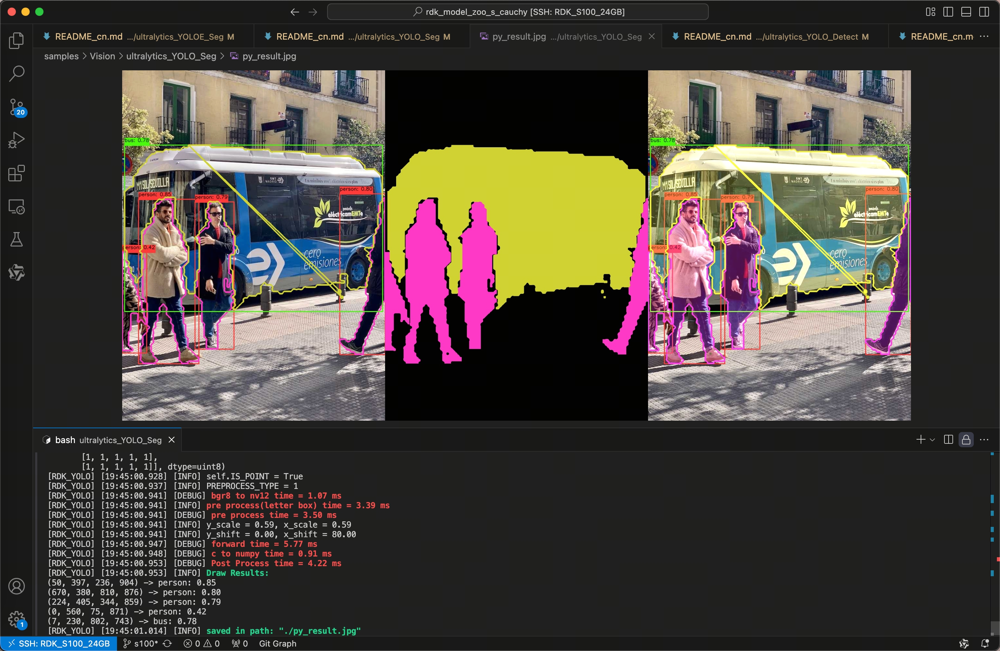
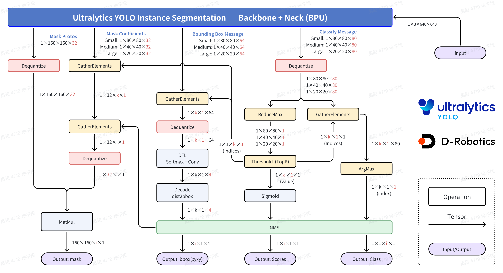

[English](./README.md) | 简体中文

# Ultralytics YOLO Instance Segmentation

## Abstract

```bash
D-Robotics OpenExplore Version: >= 3.0.31
Ultralytics YOLO Version: >= 8.3.0
```

## Support Models: 

```bash
- YOLOv8 - Seg
- YOLO11 - Seg
```

## YOLO介绍


YOLO(You Only Look Once)是一种流行的物体检测和图像分割模型,由华盛顿大学的约瑟夫-雷德蒙(Joseph Redmon)和阿里-法哈迪(Ali Farhadi)开发。YOLO 于 2015 年推出,因其高速度和高精确度而迅速受到欢迎。


 - 2016 年发布的YOLOv2 通过纳入批量归一化、锚框和维度集群改进了原始模型。
2018 年推出的YOLOv3 使用更高效的骨干网络、多锚和空间金字塔池进一步增强了模型的性能。
 - YOLOv4于 2020 年发布, 引入了 Mosaic 数据增强、新的无锚检测头和新的损失函数等创新技术。
 - YOLOv5进一步提高了模型的性能, 并增加了超参数优化、集成实验跟踪和自动导出为常用导出格式等新功能。
 - YOLOv6于 2022 年由美团开源, 目前已用于该公司的许多自主配送机器人。
 - YOLOv7增加了额外的任务, 如 COCO 关键点数据集的姿势估计。
 - YOLOv8是YOLO 的最新版本, 由Ultralytics 提供。YOLOv8 YOLOv8 支持全方位的视觉 AI 任务, 包括检测、分割、姿态估计、跟踪和分类。这种多功能性使用户能够在各种应用和领域中利用YOLOv8 的功能。
 - YOLOv9 引入了可编程梯度信息(PGI) 和广义高效层聚合网络(GELAN)等创新方法。
 - YOLOv10是由清华大学的研究人员使用Ultralytics Python 软件包创建的。该版本通过引入端到端头(End-to-End head),消除了非最大抑制(NMS)要求, 实现了实时目标检测的进步。
 - YOLO11 NEW 🚀: Ultralytics的最新YOLO模型在多个任务上实现了最先进的（SOTA）性能。
 - YOLO12构建以注意力为核心的YOLO框架, 通过创新方法和架构改进, 打破CNN模型在YOLO系列中的主导地位, 实现具有快速推理速度和更高检测精度的实时目标检测。


## 快速体验

```bash
# Make Sure your are in this file
$ cd samples/Vision/ultralytics_YOLO_Seg

# Check your workspace
$ tree -L 2
.
|-- README.md     # English Document
|-- README_cn.md  # Chinese Document
|-- py
|   |-- eval_ultralytics_YOLO_Seg_YUV420SP.py # Advance Evaluation
|   `-- ultralytics_YOLO_Seg_YUV420SP.py      # Quick Start
`-- source
    |-- imgs
    |-- reference_hbm_models    # Reference HBM Models
    |-- reference_logs          # Reference logs
    `-- reference_yamls         # Reference yaml configs
```

直接运行, 会自动下载模型文件.

```bash
$ python3 py/ultralytics_YOLO_Seg_YUV420SP.py 
```

如果您想替换其他的模型, 或者使用其他的图片, 可以修改脚本文件内的参数.

```bash
$ python3 py/ultralytics_YOLO_Seg_YUV420SP.py -h

options:
  -h, --help            show this help message and exit
  --model-path MODEL_PATH
                        Path to BPU Quantized *.bin Model. RDK X3(Module): Bernoulli2. RDK
                        Ultra: Bayes. RDK X5(Module): Bayes-e. RDK S100: Nash-e. RDK S100P:
                        Nash-m.
  --test-img TEST_IMG   Path to Load Test Image.
  --img-save-path IMG_SAVE_PATH
                        Path to Load Test Image.
  --classes-num CLASSES_NUM
                        Classes Num to Detect.
  --nms-thres NMS_THRES
                        IoU threshold.
  --score-thres SCORE_THRES
                        confidence threshold.
  --reg REG             DFL reg layer.
  --mc MC               Mask Coefficients
  --is-open IS_OPEN     Ture: morphologyEx
  --is-point IS_POINT   Ture: Draw edge points
```


## 结果分析



程序自动下载 YOLO11n - Seg 的 BPU HBM 模型, 并完成了对图片的目标检测任务, 可视化结果保存在当前目录下的`py_result.jpg`文件.

## BenchMark - Performance

### RDK S100P

| Model | Size(Pixels) | Classes |  BPU Task Latency  /<br>BPU Throughput (Threads) | CPU Latency<br>(Single Core) | params(M) | FLOPs(B) |
|----------|---------|----|---------|---------|----------|----------|
| YOLOv8n-Seg | 640×640 | 80 | 1.7 ms / 547.5 FPS (1 thread  ) <br/> 2.1 ms / 923.0 FPS (2 threads) <br/> 3.1 ms / 941.6 FPS (3 threads) | 5 ms | 3.4  M | 12.6  B |
| YOLOv8s-Seg | 640×640 | 80 | 2.8 ms / 348.5 FPS (1 thread  ) <br/> 4.0 ms / 485.5 FPS (2 threads)  | 5 ms | 11.8 M | 42.6  B |
| YOLOv8m-Seg | 640×640 | 80 | 4.9 ms / 198.7 FPS (1 thread  ) <br/> 8.3 ms / 236.6 FPS (2 threads)  | 5 ms | 27.3 M | 100.2 B |
| YOLOv8l-Seg | 640×640 | 80 | 9.2 ms / 107.4 FPS (1 thread  ) <br/> 16.8 ms / 117.7 FPS (2 threads) | 5 ms | 46.0 M | 220.5 B |
| YOLOv8x-Seg | 640×640 | 80 | 14.1 ms / 70.5 FPS (1 thread  ) <br/> 26.5 ms / 75.0 FPS (2 threads)  | 5 ms | 71.8 M | 344.1 B |
| YOLO11n-Seg | 640×640 | 80 | 1.8 ms / 528.8 FPS (1 thread  ) <br/> 2.1 ms / 912.7 FPS (2 threads)  | 5 ms | 2.9  M | 10.4  B |
| YOLO11s-Seg | 640×640 | 80 | 2.8 ms / 346.2 FPS (1 thread  ) <br/> 4.1 ms / 475.9 FPS (2 threads)  | 5 ms | 10.1 M | 35.5  B |
| YOLO11m-Seg | 640×640 | 80 | 6.0 ms / 163.9 FPS (1 thread  ) <br/> 10.5 ms / 188.6 FPS (2 threads) | 5 ms | 22.4 M | 123.3 B |
| YOLO11l-Seg | 640×640 | 80 | 7.1 ms / 138.5 FPS (1 thread  ) <br/> 12.6 ms / 156.2 FPS (2 threads) | 5 ms | 27.6 M | 142.2 B |
| YOLO11x-Seg | 640×640 | 80 | 13.1 ms / 76.0 FPS (1 thread  ) <br/> 24.4 ms / 81.3 FPS (2 threads)  | 5 ms | 62.1 M | 319.0 B |


### RDK S100

| Model | Size(Pixels) | Classes |  BPU Task Latency  /<br>BPU Throughput (Threads) | CPU Latency<br>(Single Core) | params(M) | FLOPs(B) |
|----------|---------|----|---------|---------|----------|----------|
| YOLOv8n-Seg | 640×640 | 80 |  2.3 ms / 407.1 FPS (1 thread  ) <br/> 2.8 ms / 685.7 FPS (2 threads) | 5 ms | 3.4  M | 12.6  B |
| YOLOv8s-Seg | 640×640 | 80 |  3.7 ms / 259.3 FPS (1 thread  ) <br/> 5.7 ms / 341.6 FPS (2 threads) | 5 ms | 11.8 M | 42.6  B |
| YOLOv8m-Seg | 640×640 | 80 | 7.0 ms / 141.4 FPS (1 thread  ) <br/> 12.0 ms / 165.2 FPS (2 threads) | 5 ms | 27.3 M | 100.2 B |
| YOLOv8l-Seg | 640×640 | 80 |  13.0 ms / 76.3 FPS (1 thread  ) <br/> 23.9 ms / 83.0 FPS (2 threads) | 5 ms | 46.0 M | 220.5 B |
| YOLOv8x-Seg | 640×640 | 80 |  20.1 ms / 49.6 FPS (1 thread  ) <br/> 38.1 ms / 52.1 FPS (2 threads) | 5 ms | 71.8 M | 344.1 B |
| YOLO11n-Seg | 640×640 | 80 |  2.4 ms / 405.4 FPS (1 thread  ) <br/> 2.9 ms / 659.8 FPS (2 threads) | 5 ms | 2.9  M | 10.4  B |
| YOLO11s-Seg | 640×640 | 80 |  3.8 ms / 254.2 FPS (1 thread  ) <br/> 5.8 ms / 339.0 FPS (2 threads) | 5 ms | 10.1 M | 35.5  B |
| YOLO11m-Seg | 640×640 | 80 | 8.5 ms / 116.5 FPS (1 thread  ) <br/> 15.0 ms / 132.3 FPS (2 threads) | 5 ms | 22.4 M | 123.3 B |
| YOLO11l-Seg | 640×640 | 80 |  9.9 ms / 99.5 FPS (1 thread  ) <br/> 17.9 ms / 110.6 FPS (2 threads) | 5 ms | 27.6 M | 142.2 B |
| YOLO11x-Seg | 640×640 | 80 |  18.5 ms / 53.9 FPS (1 thread  ) <br/> 34.9 ms / 57.0 FPS (2 threads) | 5 ms | 62.1 M | 319.0 B |


### Performance Test Instructions
1. 此处测试的均为YUV420SP (nv12) 输入的模型的性能数据. NCHWRGB输入的模型的性能数据与其无明显差距.
2. BPU延迟与BPU吞吐量。
 - 单线程延迟为单帧,单线程,单BPU核心的延迟,BPU推理一个任务最理想的情况。
 - 多线程帧率为多个线程同时向BPU塞任务, 每个BPU核心可以处理多个线程的任务, 一般工程中4个线程可以控制单帧延迟较小,同时吃满所有BPU到100%,在吞吐量(FPS)和帧延迟间得到一个较好的平衡。S100 / S100P的BPU整体比较厉害, 一般2个线程就可以将BPU吃满, 帧延迟和吞吐量都非常出色。
 - 表格中一般记录到吞吐量不再随线程数明显增加的数据。
 - BPU延迟和BPU吞吐量使用以下命令在板端测试
```bash
hrt_model_exec perf --thread_num 2 --model_file yolov8n_detect_bayese_640x640_nv12_modified.bin

python3 ../../../resource/tools/batch_perf/batch_perf.py --max 3 --file source/reference_hbm_models/
```
3. 测试板卡为最佳状态。

 - S100P的状态为最佳状态：CPU为6 × A78AE @ 2.0GHz, 全核心Performance调度, BPU为1 × Nash-m @ 1.5GHz, 128TOPS @ int8.
 - S100的状态为最佳状态：CPU为6 × A78AE @ 1.5GHz, 全核心Performance调度, BPU为1 × Nash-e @ 1.0GHz, 80TOPS @ int8.

```bash
sudo bash -c "echo performance > /sys/devices/system/cpu/cpufreq/policy0/scaling_governor"
sudo bash -c "echo performance > /sys/devices/system/cpu/cpufreq/policy4/scaling_governor"
sudo bash -c "echo performance > /sys/devices/system/bpu/bpu0/devfreq/28108000.bpu/governor"
```

## Benchmark - Accuracy

### RDK S100 / RDK S100P

Instance Segmentation (COCO2017)

| Model | Pytorch<br/>BBox / Mask | YUV420SP - Python<br/>BBox / Mask | YUV420SP - C/C++<br/>BBox / Mask | NCHWRGB - C/C++<br/>BBox / Mask |
|---------|---------|-------|---------|---------|
| YOLOv8n-Seg | 0.300 / 0.241 | 0.283(94.33%) / 0.218(90.46%) |  |  |
| YOLOv8s-Seg | 0.380 / 0.299 | 0.361(95.00%) / 0.281(93.98%) |  |  |
| YOLOv8m-Seg | 0.423 / 0.330 | 0.407(96.22%) / 0.316(95.76%) |  |  |
| YOLOv8l-Seg | 0.444 / 0.344 | 0.426(95.95%) / 0.333(96.80%) |  |  |
| YOLOv8x-Seg | 0.456 / 0.351 | 0.436(95.61%) / 0.335(95.44%) |  |  |
| YOLO11n-Seg | 0.319 / 0.258 | 0.294(92.16%) / 0.227(87.98%) |  |  |
| YOLO11s-Seg | 0.388 / 0.306 | 0.367(94.59%) / 0.285(93.14%) |  |  |
| YOLO11m-Seg | 0.436 / 0.340 | 0.414(94.95%) / 0.318(93.53%) |  |  |
| YOLO11l-Seg | 0.452 / 0.350 | 0.430(95.13%) / 0.329(94.00%) |  |  |
| YOLO11x-Seg | 0.466 / 0.358 | 0.443(95.06%) / 0.337(94.13%) |  |  |

### Accuracy Test Instructions

1. 所有的精度数据使用微软官方的无修改的`pycocotools`库进行计算，取的精度标准为`Average Precision  (AP) @[ IoU=0.50:0.95 | area=   all | maxDets=100 ]`的数据。
2. 所有的测试数据均使用`COCO2017`数据集的val验证集的5000张照片, 在板端直接推理, dump保存为json文件, 送入第三方测试工具`pycocotools`库进行计算，分数的阈值为0.25, nms的阈值为0.7。
3. pycocotools计算的精度比ultralytics计算的精度会低一些是正常现象, 主要原因是pycocotools是取矩形面积, ultralytics是取梯形面积, 我们主要是关注同样的一套计算方式去测试定点模型和浮点模型的精度, 从而来评估量化过程中的精度损失. 
4. BPU模型在量化NCHW-RGB888输入转换为YUV420SP(nv12)输入后, 也会有一部分精度损失, 这是由于色彩空间转化导致的, 在训练时加入这种色彩空间转化的损失可以避免这种精度损失。
5. Python接口和C/C++接口的精度结果有细微差异, 主要在于Python和C/C++的一些数据结构进行memcpy和转化的过程中, 对浮点数的处理方式不同, 导致的细微差异.
6. 测试脚本请参考RDK Model Zoo的eval部分: https://github.com/D-Robotics/rdk_model_zoo/tree/main/demos/tools/eval_pycocotools
7. 本表格是使用PTQ(训练后量化)使用50张图片进行校准和编译的结果, 用于模拟普通开发者第一次直接编译的精度情况, 并没有进行精度调优或者QAT(量化感知训练), 满足常规使用验证需求, 不代表精度上限.

## 进阶开发

### 高性能计算流程介绍



 - Mask Coefficients 部分, 两次GatherElements操作,
用于得到最终符合要求的Grid Cell的Mask Coefficients信息，也就是32个系数.
这32个系数与Mask Protos部分作一个线性组合，也可以认为是加权求和，就可以得到这个Grid Cell对应目标的Mask信息。

以下请参考Ultralytics YOLO Detect部分文档

 - Classify部分，Dequantize操作。
 - Classify部分，ReduceMax操作。
 - Classify部分，Threshold（TopK）操作。
 - Classify部分，GatherElements操作和ArgMax操作。
 - Bounding Box部分，GatherElements操作和Dequantize操作。
 - Bounding Box部分，DFL：SoftMax+Conv操作。
 - Bounding Box部分，Decode：dist2bbox(ltrb2xyxy)操作。
 - nms操作。


## 步骤参考

注：任何No such file or directory, No module named "xxx", command not found.等报错请仔细检查，请勿逐条复制运行，如果对修改过程不理解请前往开发者社区从YOLOv5开始了解。

### 环境、项目准备
 - 下载`ultralytics/ultralytics`仓库，并参考YOLO11官方文档，配置好环境
```bash
git clone https://github.com/ultralytics/ultralytics.git
```
 - 进入本地仓库，下载官方的预训练权重，这里以340万参数的YOLO11n-Seg模型为例
```bash
cd ultralytics
wget https://github.com/ultralytics/assets/releases/download/v8.3.0/yolo11n-seg.pt
```

### 模型训练

 - 模型训练请参考ultralytics官方文档, 这个文档由ultralytics维护, 质量非常的高. 网络上也有非常多的参考材料, 得到一个像官方一样的预训练权重的模型并不困难. 
 - 请注意, 训练时无需修改任何程序, 无需修改forward方法. 

Ultralytics YOLO 官方文档: https://docs.ultralytics.com/modes/train/


### 导出为onnx
 - 卸载yolo相关的命令行命令，这样直接修改`./ultralytics/ultralytics`目录即可生效。
```bash
$ conda list | grep ultralytics
$ pip list | grep ultralytics # 或者
# 如果存在，则卸载
$ conda uninstall ultralytics 
$ pip uninstall ultralytics   # 或者
```

如果不是很顺利，可以通过以下Python命令确认需要修改的`ultralytics`目录的位置:
```bash
>>> import ultralytics
>>> ultralytics.__path__
['/home/wuchao/miniconda3/envs/yolo/lib/python3.11/site-packages/ultralytics']
# 或者
['/home/wuchao/YOLO11/ultralytics_v11/ultralytics']
```

 - 修改输出头
文件目录：./ultralytics/ultralytics/nn/modules/head.py，约第180行，`Segment`类的`forward`函数替换成以下内容。除了检测部分的6个头外，还有3个`32×(80×80+40×40+20×20)`掩膜系数张量输出头，和一个`32×160×160`的`基底，用于合成结果.
```python
def forward(self, x):  # RDK
    result = []
    for i in range(self.nl):
        result.append(self.cv3[i](x[i]).permute(0, 2, 3, 1).contiguous())
        result.append(self.cv2[i](x[i]).permute(0, 2, 3, 1).contiguous())
        result.append(self.cv4[i](x[i]).permute(0, 2, 3, 1).contiguous())
    result.append(self.proto(x[0]).permute(0, 2, 3, 1).contiguous())
    return result

# 如果发现导出后的ONNX顺序不对，则可以通过调整每个self.cv*[i]的顺序来调整顺序。
## 然后再重新导出onnx, 编译为 hbm 模型

def forward(self, x):  # RDK
    result = []
    for i in range(self.nl):
        result.append(self.cv2[i](x[i]).permute(0, 2, 3, 1).contiguous())
        result.append(self.cv3[i](x[i]).permute(0, 2, 3, 1).contiguous())
        result.append(self.cv4[i](x[i]).permute(0, 2, 3, 1).contiguous())
    result.append(self.proto(x[0]).permute(0, 2, 3, 1).contiguous())
    return result
```

 - 运行以下Python脚本，如果有**No module named onnxsim**报错，安装一个即可
```python
from ultralytics import YOLO
YOLO('yolo11n-seg.pt').export(imgsz=640, format='onnx', simplify=False, opset=11)
```


### 准备校准数据

参考RDK Model Zoo S提供的极简的校准数据准备脚本: `samples/Vision/ultralytics_YOLO_Detect/source/generate_cal_data.py `进行校准数据的准备. 


### 确认移除反量化节点的名称

Netron可视化工具:` https://netron.app/`

通过Netron查看对ONNX模型进行可视化, 确认需要移除的节点名称, 这里有一个小口诀, 就是带64和32的都移除. 这里的64 = 4 * REG, REG = 16. 注意, 不同版本的Ultralytics导出的ONNX的名称是不同的, 请勿直接套用.


特别的, Mul算子需要加上`_output_0_HzCalibration`后缀, 其他的不需要。


看到大小为[1, 80, 80, 64], [1, 80, 80, 32], [1, 40, 40, 64], [1, 40, 40, 32], [1, 20, 20, 64], [1, 20, 20, 32], [1, 320, 320, 32]的七个输出的名称为/model.23/cv2.0/cv2.0.2/Conv;/model.23/cv4.0/cv4.0.2/Conv;/model.23/cv2.1/cv2.1.2/Conv;/model.23/cv4.1/cv4.1.2/Conv;/model.23/cv2.2/cv2.2.2/Conv;/model.23/cv4.2/cv4.2.2/Conv;/model.23/proto/cv3/act/Mul;

对应的yaml中填入对应的名称.

```yaml
model_parameters:
    onnx_model: 'yolo11n-seg.onnx'
    march: nash-e  # S100: nash-e, S100P: nash-m.
    layer_out_dump: False
    working_dir: 'bpu_outputs'
    output_model_file_prefix: 'yolo11n_seg_nashe_640x640_nv12' 
    remove_node_name: '/model.23/cv2.0/cv2.0.2/Conv;/model.23/cv4.0/cv4.0.2/Conv;/model.23/cv2.1/cv2.1.2/Conv;/model.23/cv4.1/cv4.1.2/Conv;/model.23/cv2.2/cv2.2.2/Conv;/model.23/cv4.2/cv4.2.2/Conv;/model.23/proto/cv3/act/Mul_output_0_HzCalibration'
    # YOLOv8-Seg: /model.22/cv2.0/cv2.0.2/Conv;/model.22/cv4.0/cv4.0.2/Conv;/model.22/cv2.1/cv2.1.2/Conv;/model.22/cv4.1/cv4.1.2/Conv;/model.22/cv2.2/cv2.2.2/Conv;/model.22/cv4.2/cv4.2.2/Conv;/model.22/proto/cv3/act/Mul_output_0_HzCalibration;
    # YOLO11-Seg: /model.23/cv2.0/cv2.0.2/Conv;/model.23/cv4.0/cv4.0.2/Conv;/model.23/cv2.1/cv2.1.2/Conv;/model.23/cv4.1/cv4.1.2/Conv;/model.23/cv2.2/cv2.2.2/Conv;/model.23/cv4.2/cv4.2.2/Conv;/model.23/proto/cv3/act/Mul_output_0_HzCalibration;

```

### 模型编译
```bash
(bpu_docker) $ hb_compile --config config.yaml
```

### 异常处理

如果模型的输出情况与Model Zoo参考模型不一致, 原因可能是移除的节点名称错误, 可通过查看bc模型的信息来确认.

```bash
# 快速产生一个bc模型
hb_compile --fast-perf --march nash-e --skip compile --model yolo11n.onnx
# 查看bc模型的输出节点信息
hb_model_info yolo11n_quantized_model.bc
```

可查阅到以下信息

```bash
INFO ############# Removable node info #############
INFO Node Name                                          Node Type
INFO -------------------------------------------------- ----------
INFO /model.23/cv3.0/cv3.0.2/Conv                       Dequantize
INFO /model.23/cv2.0/cv2.0.2/Conv                       Dequantize
INFO /model.23/cv4.0/cv4.0.2/Conv                       Dequantize
INFO /model.23/cv3.1/cv3.1.2/Conv                       Dequantize
INFO /model.23/cv2.1/cv2.1.2/Conv                       Dequantize
INFO /model.23/cv4.1/cv4.1.2/Conv                       Dequantize
INFO /model.23/cv3.2/cv3.2.2/Conv                       Dequantize
INFO /model.23/cv2.2/cv2.2.2/Conv                       Dequantize
INFO /model.23/cv4.2/cv4.2.2/Conv                       Dequantize
INFO /model.23/proto/cv3/act/Mul_output_0_HzCalibration Dequantize
```

Model Zoo提供编译日志, bc模型信息日志和hbm模型日志, 用于比较您自己获得的模型和Model Zoo参考模型的区别.

```bash
./samples/Vision/ultralytics_YOLO_Seg/source/reference_logs/
|-- hb_combine_yolo11n_seg.txt
|-- hb_combine_yolov8n_seg.txt
|-- hb_model_info_yolo11n_seg.txt
|-- hb_model_info_yolov8n_seg.txt
|-- hrt_model_exec_model_info_yolo11n_seg.txt
`-- hrt_model_exec_model_info_yolov8n_seg.txt
```

## 参考

[ultralytics](https://docs.ultralytics.com/)
